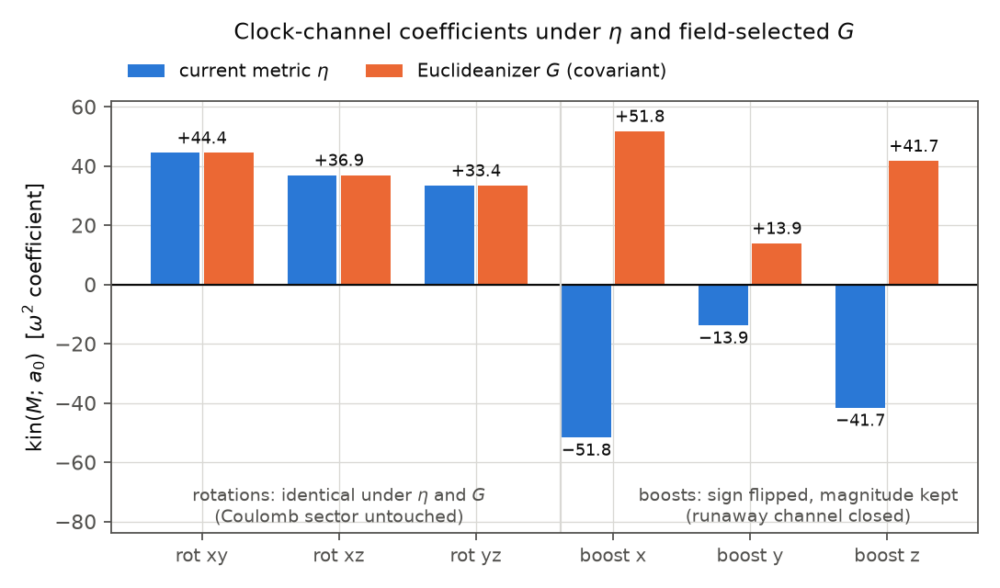
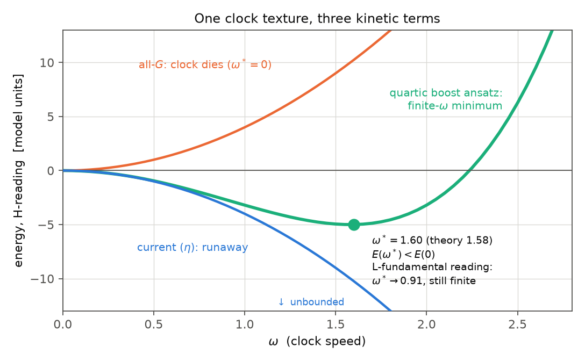

# Report 002 — A covariant rot/boost split and a finite-frequency clock candidate

*2026-08-20 · Maciej J. Mikulski (AI-assisted, see [METHOD](../../METHOD.md)) ·
rev. 3 after external review · stage result; pointwise algebra only — no
lattice solitons, no equations of motion yet (§8)*

## Context and results

Report 001 ended with a verified no-go: no constant-coefficient combination
of the six quadratic invariants can repair the negative clock channel while
preserving the 3×3 sector. Any repair must be field-dependent, higher order,
or constrained. This report takes the field-dependent route. All claims are
at the level of exact pointwise algebra (float64, scripted):

1. **Given an isolated timelike spectral branch of $\eta M$, the field
   defines a Lorentz-covariant local split** of both index pairs of $F$
   into rotation-like and boost-like sectors (three gated constructions,
   trade-off table in §2; analytic covariance argument in §2b).
2. **A one-line covariant sign fix for the quadratic boost channel**:
   contracting with the field-selected Euclideanizer $G$ flips the boost
   channels positive with rotations untouched; the full $6\times6$ kinetic
   matrix including mixed generator directions is positive (Gram argument +
   measured eigenvalues, §3).
3. **A literal negative-square $R^2-(g^2\tilde R)^2$ energy density worsens
   the runaway $\sim g^4$** in the tested realization — the desired
   attractive Newton sign cannot be implemented in this naive way (§3).
4. **Linear-in-velocity clock terms cannot tilt the energy**: they cancel
   exactly in the Legendre transform (honest negative, §4).
5. **A quartic boost-channel term produces a finite-frequency minimum on the
   tested clock family — in both Legendre readings.** With
   $\mathcal L_C\supset-a\,\mathrm{boost}^2+b(\mathrm{boost}^2)^2$: treating
   the polynomial as the energy gives $\omega^*=\sqrt{a/(2bk_2)}$ (measured
   1.600 vs 1.581 analytic); treating it as the Lagrangian and passing
   through the Legendre transform gives $H=-ak_2\omega^2+3bk_2^2\omega^4$
   with $\omega^*=\sqrt{a/(6bk_2)}$ (measured 0.900 vs 0.913) — shifted by
   $\sqrt3$, still finite and below $E(0)$ (§5).
6. **The nonzero-velocity energy minimum sits exactly at the Legendre
   caustic** ($dH/d\omega=\omega\,dp/d\omega$, verified numerically): this
   is the defining structure of classical time crystals (cf.
   Shapere–Wilczek 2012, branched Hamiltonians), so it is intrinsic to the
   mechanism, not an artifact — and it is the reason dynamical
   (equation-of-motion) analysis is mandatory before physical claims (§6).

This is a **promising pointwise algebraic construction and finite-frequency
clock candidate** — not yet a demonstrated bounded time-crystal field
theory. §8 lists what is not shown; §9 gives the ordered consistency
program (canonical analysis before any lattice soliton).

## 1. The field-selected split

Near the vacuum $M_{\rm vac}=\mathrm{diag}(-sg,1,\delta,0)$ the spectrum of
$\eta M$ is $(sg,1,\delta,0)$ with an isolated timelike branch.
**Assumption (spectral gap):** all constructions below require
$\mathrm{gap}=\min_{j\neq t}|\lambda_t-\lambda_j|>0$; the spectral projector
$P_t(M)$ is a smooth function of $M$ only on that domain, and since
$G=G(M)$ enters the action, this is a mathematical assumption of the model,
not an implementation detail.

With $u^\mu$ the unit timelike eigenvector ($u^\mu u_\mu=-1$), the indexed
definitions are

```math
(P_t)^\mu{}_\nu=-u^\mu u_\nu,
\qquad
G^{\mu\nu}=\eta^{\mu\nu}+2u^\mu u^\nu ,
```

positive definite ($\mathrm{diag}(1,1,1,1)$ in the $u$-frame); the matrix
formula used in code, $G=\eta-2P_t\eta$ with $P_t=q(\eta M)$, is this same
object (checked at the vacuum and by the covariance gate). Channel norms:

```math
\mathrm{rot}^2=\tfrac12\big(\langle F,F\rangle_G+\langle F,F\rangle_\eta\big),
\qquad
\mathrm{boost}^2=\tfrac12\big(\langle F,F\rangle_G-\langle F,F\rangle_\eta\big),
```

both nonnegative when the derivative pair is contracted with $G$ as well
(the "H-reading": energy in the $M$-selected frame). Using $G$ on both
pairs versus the matrix pair only is a modeling choice; the sign
conclusions of §3 were obtained in both variants (matrix-pair-only in
`proto.py`, both-pairs in `clock_tests.py`) and agree — a systematic
ablation is listed in §9.

**Covariance vs. symmetry breaking.** The construction is Lorentz covariant
because $P_t$ is built from $M$ rather than from an externally fixed time
vector. Individual vacuum configurations nevertheless select a timelike
direction, so the *state* is not invariant: the physics is that of
spontaneous breaking $SO(1,3)\to SO(3)$ for the state, with covariant
equations. (Review point; adopted.)

## 2. Three constructions of $P_t$, gated

| route | $P_t$ | covariance gate | 3×3 reduction | smooth / complex-step |
|---|---|---|---|---|
| exact spectral projector | timelike eigenvector of $\eta M$ | $7\cdot10^{-12}$ | **exact (0.0) on arbitrary spatial fields** | smooth iff gap > 0; CS unsafe |
| soft spectral **filter** | $(\eta M)^n/\mathrm{tr}(\eta M)^n$ | $6\cdot10^{-14}$ | $\sim(\lambda_{\rm sp}/sg)^n$: $5\cdot10^3\,(n{=}2)\to2.4\cdot10^{-2}\,(n{=}8)$ under the $g^4$ weight | fully safe ($9\cdot10^{-16}$) |
| Lagrange polynomial | $q(\eta M)$, fixed cubic, $q(sg){=}1$, $q(1){=}q(\delta){=}q(0){=}0$ | $3.4\cdot10^{-13}$ | exact ($9\cdot10^{-16}$) **on on-target spectra only**; $O(10)$ off shell | fully safe |

Terminology follows the review: only the exact route yields a genuine
projector and exact rot/boost channels; the soft route is an approximate
spectral filter ($P_t^2\neq P_t$). The Lagrange route is exact where the
potential's targets hold — but a finite potential only *prefers* those
eigenvalues, and particle cores are precisely where $M$ leaves the vacuum
spectrum, so the Lagrange route is **not** a global candidate without a
core test (measured $O(10)$ contamination far off shell).

### 2b. Analytic covariance (so the gate is verification, not evidence)

Under $M\to\Lambda M\Lambda^{\!\top}$ with $\Lambda^{\!\top}\eta\Lambda=\eta$:
$\eta M\to\Lambda^{-\top}(\eta M)\Lambda^{\!\top}$, a similarity. Hence any
polynomial $q(\eta M)$, any power ratio, and any spectral projector of an
isolated eigenvalue transform by the same similarity, and $G=\eta-2P_t\eta$
transforms so that all contractions built from $F$, $\eta$, $G$ are
scalars. The numerical gates (with $O(1)$-failing negative controls) verify
the implementation of exactly this statement.

## 3. The clock-channel table (Fig. B)

kin$(M;a_0)$ = the $\omega^2$ coefficient of the H-reading energy for
velocity direction $a_0$ (conjugation tangents of the generator catalog),
on a random spatial background:

| channel | $\eta$ (current) | $G$ |
|---|---|---|
| rot xy / xz / yz | +44.4 / +36.9 / +33.4 | identical to $\eta$ |
| boost x / y / z | −51.8 / −13.9 / −41.7 | **+51.8 / +13.9 / +41.7** |

Beyond the six basis directions (review point): for the all-$G$ quadratic
sector the full kinetic matrix
$K_{ij}=\sum_k\langle[a_i,A_k],[a_j,A_k]\rangle_G$ is a Gram matrix in a
positive-definite product, hence $K\succeq0$ analytically; measured
eigenvalues on a random background: $8.4\ldots65.7$, all positive,
mixed rotation–boost directions included (`results/clock_results.json`).

Taking $R^2-(g^2\tilde R)^2$ literally as the contraction metric gives
boost channels at $-2.1\cdot10^5$: a literal negative-square contribution
in this realization worsens the instability $\sim g^4$; the attractive
Newton sign cannot be implemented this way (other realizations —
cross-couplings, constraints, auxiliary fields — are not excluded).



## 4. Honest negative: linear clock terms drop out of the energy

For $L=K(q)\dot q^2+\kappa B(q)\dot q-V$: $p=2K\dot q+\kappa B$ and
$H=p\dot q-L=K\dot q^2+V$ — the $\kappa$ term cancels exactly (numerically
$2.7\cdot10^{-15}$). Berry/Wess–Zumino terms change dynamics (precession,
symplectic structure) — and may still be essential to a rotating solution —
but cannot by themselves create a minimum of the ordinary energy at
$\dot q\neq0$.

## 5. The quartic boost term: a finite clock in both Legendre readings

```math
\mathcal L_C \;=\; \mathrm{rot}^2 \;-\; a\,\mathrm{boost}^2
\;+\; b\,\big(\mathrm{boost}^2\big)^2 , \qquad a,b>0 .
```

The review correctly observed that a quartic velocity term does not carry
its Lagrangian coefficient into the Hamiltonian. Both readings are
therefore computed (`results/clock_results.json`):

| reading | energy polynomial | $\omega^{*2}$ | measured $\omega^*$ | depth |
|---|---|---|---|---|
| energy-functional ($\mathcal L_C$ *is* the H-density; the convention of the relaxation stack this program uses) | $-ak_2\omega^2+bk_2^2\omega^4$ | $a/(2bk_2)$ | 1.600 (analytic 1.581) | $-a^2/4b$ |
| L-fundamental (Legendre: $p=\partial L/\partial\dot q$, $H=p\dot q-L$) | $-ak_2\omega^2+3bk_2^2\omega^4$ | $a/(6bk_2)$ | 0.900 (analytic 0.913) | $-a^2/12b$ |

**The finite nonzero minimum survives the Legendre transform** (shifted by
$\sqrt3$, depth by 3) — the qualitative conclusion is reading-independent;
quantitative anchoring must declare the fundamental object. Further
measured properties:

- the reduced pointwise polynomial in $B=\mathrm{boost}^2\ge0$ is bounded
  below by $-a^2/4b$ (energy reading; $-a^2/12b$ after Legendre); a
  1000-direction random scan found no violation (numerical sanity check —
  **not** a proof of field-theoretic boundedness, see §8);
- $\mathrm{boost}^2$ vanishes identically on spatial fields (measured 0.0):
  the added *density* is exactly zero on the embedded 3×3 sector and on the
  vacuum — the clock is a property of particle textures, not of empty
  space. Whether the spatial sector remains a *dynamically consistent
  truncation* requires the first variation in transverse directions (§9);
- dimensional note (review point): $F\sim(\partial M)^2$, so the condensate
  term is $F^4\sim(\partial M)^8$ — a genuinely higher-power operator, and
  $b$ carries a new scale. Since $\omega^*\propto\sqrt{a/bk_2}$, the
  central open physics problem is why this scale should track the soliton
  mass ($\omega^*=mc^2/\hbar$) rather than being a free dial.



## 5b. Relation to the $\varepsilon$-family (report 001's scope limit)

Verified identities (`dual_identity.py`, both to $3\cdot10^{-16}$):

```math
\mathrm{boost}^2 = 2\lVert E\rVert^2,\ \ E_{\mu\nu|\beta}=u^\alpha F_{\mu\nu\alpha\beta};
\qquad
\mathrm{rot}^2 = 2\lVert B\rVert^2,\ \ B^{\mu\nu|\gamma}=\tfrac12\varepsilon^{\gamma\alpha\beta\delta}u_\delta F_{\mu\nu\alpha\beta}.
```

The split is the electric/magnetic decomposition of the matrix-pair 2-form
w.r.t. the field-selected observer; the dual part carries an $\varepsilon$
— but squared, and two $\varepsilon$'s collapse to metrics, so both
channels are parity-even. None of the four genuine one-$\varepsilon$
pseudoscalars is used ($E\!\cdot\!B$-type witness nonzero and unused).
Relative to report 001's three exclusions, this report occupies two
(field-dependent contractions; quartic order in $F$) as forced by the
no-go; the parity-odd family remains untouched.

## 6. The Legendre caustic is the mechanism, and the warning

For any $L(\dot q)$: $dH/d\dot q=\dot q\,(dp/d\dot q)$, so **every**
nonzero-velocity minimum of the energy sits exactly where the
velocity–momentum map degenerates (verified numerically: caustic and
$H$-minimum coincide at $\omega=0.913$). This is not a defect of this
particular ansatz — it is the defining structure of classical time
crystals (cf. Shapere & Wilczek, PRL 2012: energy minima at cusps of the
$p(\dot q)$ relation, branched Hamiltonians). Consequences adopted from
the review: the kinetic Hessian and the equations of motion on the rotating
ansatz must be analyzed (the minimum lives on the singular locus of the
Legendre map, where constrained/branched dynamics takes over) **before**
any dynamical or stability claim; this is scheduled first in §9.

## 7. What the figures show

Fig. A: one clock texture, three kinetic terms — current $\eta$ (runaway),
all-$G$ (bounded, $\omega^*=0$), quartic boost ansatz (finite-$\omega$
minimum; both Legendre readings quoted). Fig. B: the channel coefficients
under $\eta$ and $G$. Both figures passed two rounds of measured
readability review (collision-free at the pixel level).

## 8. What this report does not show

- **No canonical field-theoretic Hamiltonian has been derived** for the
  full tensorial $\mathcal L_C(M,\partial M)$ with $G=G(M)$: the table in
  §5 covers the reduced one-parameter family only. Variation also produces
  $\partial G/\partial M$ force terms invisible to pointwise channel
  values.
- **No equations of motion, no stability, no dynamics**: "finite-frequency
  clock candidate", not "time crystal". A time crystal claim additionally
  requires a stationary rotating solution of the EOM, its stability, and
  minimality at fixed conserved charges (this program's own rigor bar).
- **Field-theoretic boundedness is not proven**: the algebraic floor is for
  the reduced polynomial; the Legendre map degeneracy (§6), gradients,
  and $P_t$ smoothness limits are open.
- **Newton's sign is not measured** (two-body read; a bench is being built
  independently in substrate-framework P239).
- The $s=-1$ branch, the anchoring of $a,b$ (author-gated), and the choice
  among the three $P_t$ routes (author-gated) are open.

## 9. Ordered next steps (adopted from the review)

1. exact canonical Hamiltonian of the tensorial $\mathcal L_C$ (no
   coefficient reuse from $L$);
2. kinetic Hessian / Legendre-map Jacobian spectrum at vacuum, static
   hedgehog, clock texture, and the finite-$\omega$ state;
3. EOM on the rotating ansatz $M(t)=e^{t\omega K}M_0e^{t\omega K^\top}$:
   does the energy-minimizing $\omega^*$ satisfy them;
4. consistent 3×3 truncation at the level of first variation;
5. spectral-gap measurement on representative particle profiles;
6. ablation: $G$ on matrix pair only vs both pairs;
7. dimensional analysis of $a,b$ (the $\omega^*\leftrightarrow mc^2/\hbar$
   anchoring question);
8. only then: full lattice hedgehog relaxation.

## Reproduction

```bash
pip install sympy torch
./reproduce.sh          # ~1 min CPU
```

Asserts: covariance gates + negative controls, exact-route 3×3 reduction
= 0, kin sign flips, $K\succeq0$ (min eigenvalue), Legendre drop-out (B1),
both-readings $\omega^*$ vs analytic, caustic/minimum coincidence, dive
floor, spatial guard, E/B dual identities. Regenerates both figures.

## Equation-to-code map

| object | code |
|---|---|
| $G$ exact / soft / Lagrange | `proto.py::G_exact/G_soft`, `clock_tests.py::G_lagrange` |
| covariance gates + negative controls | `proto.py` gates 1, 6 |
| 3×3 reduction measurements | `proto.py` gates 2, 6 |
| kin channel table | `proto.py` gate 3 (`kinH`) |
| literal $-g^4$ variant | `proto.py` gates 3–4 (`X_B`) |
| Legendre drop-out (linear terms) | `clock_tests.py` B1 block |
| channel densities (H-reading) | `clock_tests.py::channels` |
| $E(\omega)$ both readings, caustic, dive scan, spatial guard | `clock_tests.py` B3 + Legendre blocks |
| full $6\times6$ kinetic matrix | `clock_tests.py` kinetic-matrix block |
| E/B dual identities (§5b) | `dual_identity.py` |
| figures | `make_figures.py` |

## Provenance

- Conventions and the no-go baseline: [report 001](../001-quadratic-contractions/).
- The idea family (incl. the condensate and the frozen-spectrum projector)
  originates from an internal AI ideas round (2026-08-20); the positive
  field-dependent internal metric is independently the direction of
  substrate-framework P239 ("spectral-Cartan", PR #148). The constructions,
  trade-off measurements, the $-g^4$ warning, the Legendre negatives and
  both-readings analysis, and the caustic identification are this report's
  own. Rev. 3 incorporates an external critical review (2026-08-20).
- Physics targets: J. Duda, e-mails and messages of 2026-08-13/20.
- Classical time-crystal caustic structure: A. Shapere, F. Wilczek,
  "Classical Time Crystals", PRL 109, 160402 (2012).
