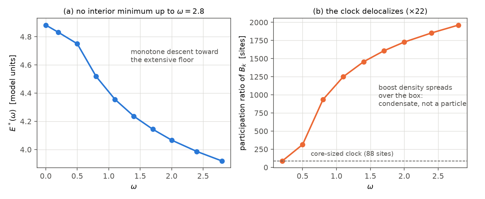

# Report 004 — The lattice hedgehog under the covariant $G$ action: statics survive, the local-quartic clock delocalizes

*2026-08-21 · Maciej J. Mikulski (AI-assisted, see [METHOD](../../METHOD.md)) ·
lattice stage of the program of [report 002](../002-covariant-split-and-clock/) §9;
first report through the PR-review workflow*

## Results

A torch/autograd lattice instrument ($32^3$, $h=1.5$, pinned vacuum shell,
symmetrized stencils, float64, GPU) was gated against the independent
FIRE-based reference stack: the single-evaluation energy of the shared
3×3-electron seed matches the reference record (persisted as
`gate.oracle_seed_E` with relative error asserted $<10^{-6}$ against
9.263660060; the baseline energy trajectory is likewise persisted and
asserted monotone), and the $\eta$ baseline
relaxes monotonically $9.26\to4.90$ with block-diagonality exact
(the reference endpoints were "contained-not-converged"; Adam descends
deeper at comparable budget). On this instrument:

1. **The hedgehog survives the covariant $G$ statics.** Relaxed energy
   4.882 with $|E_G-E_\eta|/E=1.4\cdot10^{-4}$ on the same field (the
   statics-equivalence guard), block-diagonality exact, and the spectral
   gap of $\eta M$ on the whole relaxed profile is **6.98** — far from the
   projector's smoothness boundary (report 002's domain assumption holds
   on real particle profiles).
2. **The one-line sign fix holds on the real profile.** All six generator
   kin channels are positive on the relaxed hedgehog (rot: 0.296, 0.732,
   0.075; boost: 0.179, 0.074, 0.082).
3. **Q1 of the P240 validation request: no saddle on our representation
   — now at a gradient-gated point with a certified eigenvalue.** The
   first relaxation endpoint was *not* stationary (free-bulk
   $\lVert g\rVert_\infty=1.87$; caught in review), so it was polished
   (annealed Adam + LBFGS) to $E=4.8347$,
   $\lVert g\rVert_\infty=1.13\cdot10^{-4}$,
   $\lVert g\rVert=1.0\cdot10^{-3}$, off-block exactly 0. At that point a
   500-step fully reorthogonalized Lanczos on the autograd HVP gives
   $\lambda_{\min}=+1.11\cdot10^{-3}$ with residual bound
   $9.7\cdot10^{-6}$ (87× below the value — **sign certified**), next
   Ritz values $+3.7\cdot10^{-3}$, $+7.9\cdot10^{-3}$, no negative Ritz
   value in the 500-dim Krylov space, $\lambda_{\max}=2.07\cdot10^4$.
   The earlier uncertified estimate ($+0.24$ by shifted power iteration at
   the unpolished point) is retracted as method noise. Caveat stated
   plainly: the bottom of the spectrum is soft — $\lambda_{\min}$ is of
   the same order as the residual gradient norm, so the claim is
   "no negative mode at the achieved stationarity", strengthened by the
   absence of any negative Ritz value; a deeper polish tightens it further.
   Still in contrast with the $-2.87$ tangential-split mode of P240's
   spherical-chart root.
4. **The honest negative: the local-density quartic clock delocalizes.**
   With the C3 condensate implemented as a *local* density
   $\sum_x[-aB_k(x)+3bB_k(x)^2]$ and $b$ calibrated for
   $\omega^*_{\rm frozen}=0.8$, the profile-re-relaxed ladder is monotone
   decreasing through $\omega=2.8$ — no interior minimum. The mechanism is
   visible in the participation ratio of $B_k$: **88 → 1962 sites**
   ($\times22$) — the boost density spreads over the box instead of
   staying on the particle. A local Mexican hat has an *extensive* floor
   ($N_{\rm sites}\cdot(-a^2/12b)$), and the field evades confinement by
   dilution: the pointwise/reduced finite $\omega^*$ of reports 002–003
   does **not** survive this implementation of backreaction.



## Interpretation and outlook

The delocalization result sharpens, in kinetic form, the static-condensate
flag of report 003 (C1): a clock term built from a *local* quartic density
rewards spreading. Candidate repairs, in order of appeal — none run here:
an *intensive/global* quartic $\big(\sum_xB_k\big)^2$-type (which is what
the reduced analysis of reports 002–003 effectively described), a
normalized form, or tying the condensate to the topological density
(spin–charge, the B2 idea) so only the particle core can carry the clock.
Fixed-$J$ remains the constrained alternative. The choice is physics, not
numerics, and is author-gated.

## What this report does not show

- Q2 of P240 (two-defect mutual inertia $C(r)$) was not run.
- The Coulomb-tail fit at $n=32$ is boundary-dominated (flat density in
  the fit window under the frozen textured shell) and is reported as
  inconclusive; the statics guard here is the algebraic 3×3 reduction plus
  the measured $E_G$-vs-$E_\eta$ equivalence.
- One clock generator (largest-$K_1$ boost), 500 Adam steps per rung,
  frozen $a_0$ (the reference protocol); no global-quartic ablation yet.
  The ladder started from the pre-polish endpoint; each rung re-relaxes,
  and the delocalization mechanism is insensitive to the starting polish.
- Single branch $s=+1$, single grid size.

## Reproduction

```bash
pip install torch numpy
./reproduce.sh    # ~45 min on a CUDA GPU (float64); CPU much slower
```

Asserts: vacuum zeros, baseline monotone character and exact
block-diagonality, statics equivalence and spectral gap, all-positive kin
table, $\lambda_{\min}>0$ (Q1), and the honest negative itself (no interior
minimum + participation growth). The 3×3 seed is included
(`results/seed_3x3_electron.npz`, regenerated deterministically from the
openwave M5.21.2b recipe; provenance in report 001/002 chain).

## Equation-to-code map

| object | code |
|---|---|
| lattice energies $\eta$/$G$, stencils, potential | `lattice.py::e_static` (+ helpers) |
| oracle gate vs FIRE reference | `lattice.py::stage_gate` |
| $G$ statics, spectral gap, tails | `lattice.py::stage_statG` |
| kin table on the profile | `lattice.py::stage_kin` |
| C3 ladder (local quartic) | `lattice.py::stage_ladder`, `ladder_ext.py` |
| participation-ratio diagnostic | `ladder_ext.py` |
| gradient-gated polish (review P1a) | `polish_hess.py` |
| certified $\lambda_{\min}$, Lanczos + residual bound (review P1b) | `lanczos_min.py` |
| Q1 Hessian, superseded first estimate | `lattice.py::stage_hessq1` |

## Provenance

Program and constructions: reports [002](../002-covariant-split-and-clock/)
and [003](../003-canonical-analysis/). P240 validation request:
substrate-framework issue #146, comment of 2026-08-20 (17:57 UTC).
Reference stack for the oracle: the FIRE reproduction of openwave M5.21.3
(report 002 provenance chain).
