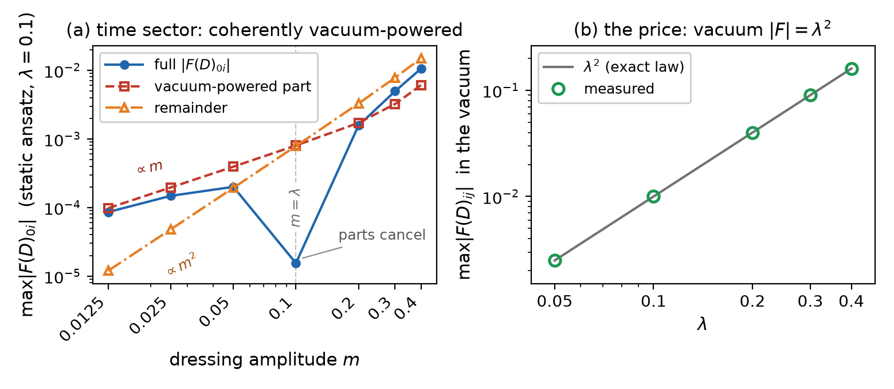

# Appendix — no connection from M alone: the blindness theorem for endomorphisms

*Added 2026-08-28 under METHOD §7 (new material extending the report).
This appendix changes no conclusion of report 007; it extends §1's
closure of field-dependent **coefficients** to field-dependent
**connections** $D_\mu = \partial_\mu + C_\mu(M)$. All numbers
regenerate from `appendix_no_connection.py` (numpy + scipy, seconds on
CPU; committed record `results/appendix_no_connection.json`); the figure
regenerates from the committed JSON via `make_appendix_figure.py`.*

## 0. Why §1 does not settle this

A coefficient **multiplies**; a connection **adds**. For a multiplier,
"constant on the ansatz" (§1) is the harmless case. For an additive
$C_\mu$, a constant added to a small $\partial M$ *dominates* — §1's
conclusion does not transfer, and a separate argument is needed. The
argument below exists and is stronger: not "constant", but
**nonexistent**.

## 1. Theorem: no connection value can be built from M alone

Pointwise and Lorentz-covariantly, the only endomorphism-valued objects
available from $M$ and $\eta$ are matrix functions of $A = M\eta$ (any
product string of $M$'s and $\eta$'s with one free upper and one free
lower index reduces to a power of $M\eta$; spectral/matrix functions
reduce to polynomials by Cayley–Hamilton). Then, in four steps:

1. $M$ symmetric $\Rightarrow$ both index lowerings give the same
   $A = M\eta$.
2. $A^\top\eta = \eta M \eta = \eta A$: $A$ is **$\eta$-symmetric**
   (self-adjoint in the $\eta$ form).
3. Powers of $A$ commute, so every polynomial $p(A)$ is
   $\eta$-symmetric.
4. $so(1,3)$ requires $\eta$-**anti**symmetry, $C^\top\eta = -\eta C$.
   Both at once force $\eta\,p(A) = -\eta\,p(A)$, i.e. $p(A) = 0$. ∎

So there is no nonzero $so(1,3)$-valued $C_\mu(M)$ at all — the
connection analogue of §1, by an independent mechanism (signature of the
$\eta$-form, where §1 used invariance of the spectrum under similarity).

Measured (generic random symmetric $M$): $\eta$-symmetry residual of
$A, A^2, A^3, A^4$ and of a generic polynomial $\le 1.4\cdot10^{-14}$;
$so(1,3)$ residual of the polynomial $195$ ($O(1)$ — not in the
algebra). **Negative control** (the test is not an artifact): allowing
one derivative immediately unblocks the construction —
$[M\eta, (\partial_\mu M)\eta]$ is in $so(1,3)$ (residual $0.0$ exactly:
the commutator of two $\eta$-symmetric matrices is
$\eta$-antisymmetric) and nonzero on report 006's ansatz (norm $0.25$).
The blockade is specific to building from $M$ *alone*.

## 2. The pointwise escape — index mixing — and its vacuum cost

The theorem leaves exactly one pointwise loophole: mixing the derivative
slot $\mu$ with the matrix slots ($\delta^a_\mu$ is Lorentz-invariant).
The $\eta$-realization, built on the timelike eigen-axis $u(M)$ of
$M\eta$ (the object report 002's $G$-metric is built from), normalized
**covariantly** — unit timelike, $u^\top\eta u = -1$, future-oriented
(review round 1 correction: the first committed version normalized by
the frame-dependent $v/|v^0|$, which is not equivariant):

```math
C_{\mu ab} = \lambda\,(\eta_{\mu a}\,u_b - \eta_{\mu b}\,u_a),
\qquad
D_\mu M = \partial_\mu M + C_\mu M + M C_\mu^\top ,
```

antisymmetric in $(ab)$, hence $C_\mu \in so(1,3)$ for any $u$
(measured residual $10^{-16}$-level; in the vacuum $C_i = -\lambda K_i$,
a boost). Equivariance of $u$ has a second route: on the ansatz the
eigen-axis *is* the boosted frame vector, $u = o\,e_0$, already unit
timelike — measured $u^\top\eta u = -1$ to $10^{-16}$ and
$|u_{\mathrm{eig}} - o\,e_0| = 4\cdot10^{-17}$. §2c below shows this
realization is one of exactly **two** equivariant structures, and the
only active one. On report 006's **static** ansatz ($m = 0.2$) it does
open the time sector that the structure theorem of 006 §2 forbids at
$\lambda=0$:

| $\lambda$ | $\max\lvert F(D)_{0i}\rvert$ | $\max\lvert F(D)_{ij}\rvert$ |
|---|---|---|
| 0 (control) | 0 exactly | $3.09\cdot10^{-2}$ |
| 0.05 | $1.18\cdot10^{-3}$ | $1.56\cdot10^{-2}$ |
| 0.1 | $1.56\cdot10^{-3}$ | $5.36\cdot10^{-3}$ |
| 0.2 | $9.33\cdot10^{-5}$ | $2.89\cdot10^{-4}$ |
| 0.3 | $4.97\cdot10^{-3}$ | $2.10\cdot10^{-2}$ |
| 0.4 | $1.31\cdot10^{-2}$ | $6.24\cdot10^{-2}$ |

(The collapse of both columns near $\lambda = 0.2$ is an isolated
interference zero: both sectors are linear in the spatial leg $D_i$, and
at $\lambda \sim m f(r)$ the connection locally cancels the dressing
gradient at the probe point — position-dependent, not an identity; see
(b).)

But the construction pays twice, and the two payments are the same term:

**(a) The vacuum breaks.** In the vacuum $D_iM_0 =
-\lambda g\,(e_ie_0^\top + e_0e_i^\top)$, hence (three lines)

```math
F(D)_{ij}\big|_{\mathrm{vac}} = \lambda^2\,(e_je_i^\top - e_ie_j^\top)
\neq 0 :
```

a **uniform, nonzero field strength filling empty space** — energy
density $\propto$ volume for any quadratic-in-$F$ energy. Measured:
$\max|F| = \lambda^2$ **exactly** over the scan (figure, panel b);
negative control $\lambda = 0$ gives $0$ exactly.

**(b) The opened sector is coherently powered by the vacuum-breaking
term.** $F(D)_{0i}$ is bilinear, so the split
$D_i = D_i^{\mathrm{vac}} + (D_i - D_i^{\mathrm{vac}})$ — with
$D_i^{\mathrm{vac}}$ the very term of (a) — decomposes it **exactly**
(measured linearity residual $3.5\cdot10^{-18}$):

```math
F_{0i} = \underbrace{F(D_0, D_i^{\mathrm{vac}})}_{\sim\,\lambda^2 m}
\;+\; \underbrace{F(D_0, D_i - D_i^{\mathrm{vac}})}_{\sim\,\lambda m^2}.
```

Measured at $\lambda = 0.1$ (figure, panel a): the vacuum-powered part
scales with slope $1.00$ in $m$ and **exactly** $2.000$ in $\lambda$;
the remainder with slope $2.01$ in $m$; their ratio at $m = 0.0125$ is
$0.12 \approx m/\lambda$. The full signal is their coherent (signed)
sum: at $m = \lambda$ the two parts **annihilate** (full
$1.5\cdot10^{-5}$, a factor $\sim 50$ below either part) — the same
interference produces the $\lambda \approx 0.2$ dip in the table above.
So there is **no regime in which the time sector works and the vacuum
does not pay**: at small amplitude the sector *is* the vacuum term, and
everywhere else it interferes coherently with it.

**(c) A scalar switch cannot rescue it.** Multiplying $C$ by $s(M)$
vanishing in the vacuum runs into §1's blindness: on the ansatz every
algebraic scalar of $M$ equals its vacuum value pointwise (replicated
here: max relative drift $3.5\cdot10^{-13}$ over 500 random local
Lorentz dressings of report 004's vacuum; negative control with
orthogonal dressings: drift $2.0$). If $s(\mathrm{vac}) = 0$, then
$s \equiv 0$ on the whole ansatz and $C \equiv 0$.

## 2c. Classification: the equivariant family is two-dimensional, and only the $\eta$-form acts

Raised by review round 1 (which exhibited the $\varepsilon$-structure
below as a counterexample to promoting (a) beyond the tested
realization): the closure needs a quantifier over *all* pointwise
connections, not one realization. On the canonical orbit the quantifier
is available in full. There $M = g\,uu^\top$, so the only pointwise
covariant data is $(g, u)$, and an equivariant $C_{\mu ab}$
(antisymmetric in $ab$) is determined by its value at $M_0$, which must
be invariant under the stabilizer $SO(3)$ of $u = e_0$. Two routes:

- *Algebra:* the candidate space decomposes under $SO(3)$ as
  $(\mathrm{scalar}\oplus\mathrm{vector})_\mu \otimes
  (\mathrm{vector}\oplus\mathrm{vector})_{[ab]}$; exactly two singlets
  survive ($\delta_{ij}$ and $\varepsilon_{ijk}$), spanned by

```math
C^{(\eta)}_{\mu ab} = \eta_{\mu a}u_b - \eta_{\mu b}u_a,
\qquad
C^{(\varepsilon)}_{\mu ab} = \varepsilon_{\mu ab\nu}\,u^\nu
\quad (\varepsilon_{0123} = +1).
```

- *Numeric:* the joint fixed subspace of the three rotation actions on
  the 24-dimensional space $\{T_{\mu ab}\}$ has dimension **2** (SVD;
  both tensors above lie in it to $1.7\cdot10^{-16}$).

**The $\varepsilon$-component is inert on the whole orbit.** One line:
$(C^{(\varepsilon)}_\mu)_{ab}u^b = \varepsilon_{\mu ab\nu}u^bu^\nu = 0$
by antisymmetry, and $M = g\,uu^\top$, so
$C^{(\varepsilon)}_\mu M + M C^{(\varepsilon)\top}_\mu = 0$
identically: $D = \partial$, $F(D) = F(\partial)$, no vacuum cost, no
time sector, no effect at all. Measured: $F|_{\mathrm{vac}} = 0$
exactly and $\max|D_\mu M - \partial_\mu M| = 1.4\cdot10^{-17}$ on the
dressed ansatz.

**Consequence of the classification.** Every pointwise connection on
the canonical family is $A\,C^{(\eta)} + B\,C^{(\varepsilon)}$ with
$A, B$ functions of the algebraic invariants of $M$ — constant on the
ansatz by §1's blindness. The $\varepsilon$-part does nothing; the
$\eta$-part is the tested realization of §2. Hence **any pointwise
connection that opens the canonical time sector at all is, up to an
inert component, the tested one — and pays the $\lambda^2$ vacuum cost
of (a).** The quantifier gap flagged by the review is closed on the
orbit.

*Boundary of the claim:* the classification is a statement about the
rank-1 orbit (the canonical ansatz family, where report 006's no-go
lives). Off the orbit — rank-rich vacua, defect cores — the pointwise
data is larger and no classification is claimed.



*Figure: (a) the exact bilinear decomposition of the opened time sector
on the static ansatz at $\lambda = 0.1$: vacuum-powered part
($\propto \lambda^2 m$), remainder ($\propto \lambda m^2$), and their
coherent sum (full), which collapses at $m = \lambda$ where the parts
cancel; (b) the price: uniform vacuum field strength, measured points on
the exact $\lambda^2$ law.*

## 3. Outlook lemmas: derivative-built connections are shut too

The negative control of §1 above, promoted to a definition —
$C_\mu = \lambda\,[M\eta, (\partial_\mu M)\eta]$ — is the natural
*derivative-built* connection: it lies in $so(1,3)$ exactly and is
vacuum-safe by construction ($\partial M = 0 \Rightarrow C = 0$;
measured: $F(D) = 0$ exactly in the vacuum).

**Lemma 1 (time sector).** On **any static field**
$\partial_0 M = 0 \Rightarrow C_0 = 0 \Rightarrow D_0M = 0$, hence

```math
F(D)_{0i} \equiv 0 \quad \text{exactly}
```

(measured: $0.0$ to the bit).

**Lemma 2 (sign map).** In $\eta$-lowered variables $X_\mu =
(\partial_\mu M)\eta$, $A = M\eta$, the substitution is
$\tilde X_\mu = X_\mu - \lambda\,[A,[A,X_\mu]]$ and
$F(D)_{\mu\nu}\eta = [\tilde X_\mu, \tilde X_\nu]$. On report 006's
canonical ansatz the vacuum is rank-1, $A_0 = M_0\eta = -g\,e_0e_0^\top$,
and $\mathrm{ad}_{P}^2 = \mathrm{id}$ on commutators $[\kappa, P]$
(measured residual $0.0$ exactly for generic $\kappa \in so(1,3)$);
by the transport identity of 006's companion appendix
(`APPENDIX-flat-connection.md`) every $X_i$ of the ansatz *is* such a
commutator. Hence, exactly on the whole canonical family,

```math
\tilde X = (1 - \lambda g^2)\,X
\quad\Rightarrow\quad
F(D) = (1 - \lambda g^2)^2\, F(\partial)
```

(measured: $\lvert\tilde X - (1-\lambda)X\rvert \le 4\cdot10^{-12}$ at
$g=1$, $\lambda = 0.37$): every constant-coefficient quadratic energy in
$F(D)$ is $(1-\lambda g^2)^4 \ge 0$ times its baseline, so **report
006's tails, virial identity and sign map are invariant on this family**
(leading frozen order, degenerate only at the isolated point
$\lambda g^2 = 1$). The variant's genuine content is confined to
non-pure-gauge configurations (defect cores, the rank-rich model
vacuum) — the higher-order program of 006 §7 (working-repo
`newton_ho` / `connection_dev` line), outside this appendix's scope.

## Consequence

Within pointwise constructions from $M$, on the canonical family:
**endomorphism-valued connections do not exist (§1); the equivariant
index-mixed family is exactly two-dimensional (§2c); its
$\varepsilon$-component is inert; and its only active component — the
$\eta$-realization of §2 — opens the time sector only at the $\lambda^2$
vacuum cost, which coherently powers the opened sector itself.** Every
remaining door out of report 006's no-go requires $\partial M$ in the
coefficient or connection — i.e. leaves the field-dependent-coefficient
family entirely and enters the higher-order program, where the natural
derivative-built representative keeps the time sector shut *and* leaves
the 006 sign map invariant on the whole canonical family (§3).

## What this appendix does not claim

- No change to report 007's results (§§1–5 stand as merged); the clock
  mechanism and ladder results are untouched.
- The classification of §2c holds on the rank-1 orbit; off the orbit
  (rank-rich vacua, defect cores) the pointwise data is larger and no
  classification is claimed. No statement about connections built from
  $\partial M$ beyond the two lemmas of §3 — their behavior on
  non-pure-gauge configurations is open.
- The interference zeros of §2 (table, $\lambda \approx 0.2$; figure,
  $m = \lambda$) are pointwise features of the probe location, not
  identities; only their existence and the decomposition scalings are
  claimed.
- The crossover constants $c_1, c_2$ are realization- and
  normalization-dependent; only the structure ($\lambda^2 m$ vs
  $\lambda m^2$, ratios and slopes above) is claimed.

## Reproduction

```bash
python appendix_no_connection.py     # asserts all numbers; ~seconds, CPU
python make_appendix_figure.py       # figure from the committed JSON
```

## Provenance

- Question (raised while discussing §1's blindness theorem) and first
  derivations: working repo `duda-particle-model`,
  `notes/notatka_koneksja_kowariantna_2026-08-27.md` (revised
  2026-08-28, commits `cdba6c2`, `74523e7`, `060a969` — the last one
  the review-round-1 revision), probe `notes/connection_probe.py`;
  rescaling lemma and part-B gates: `connection_dev/`.
- Covariance of $u$, the classification requirement, and the
  $\varepsilon$-structure of §2c: PR #8 review round 1 (Codex critic,
  comment in the PR thread).
- Ansatz and conventions: report 006 §1; $u(M)$ / $G$-metric lineage:
  report 002; blindness theorem: this report §1.
