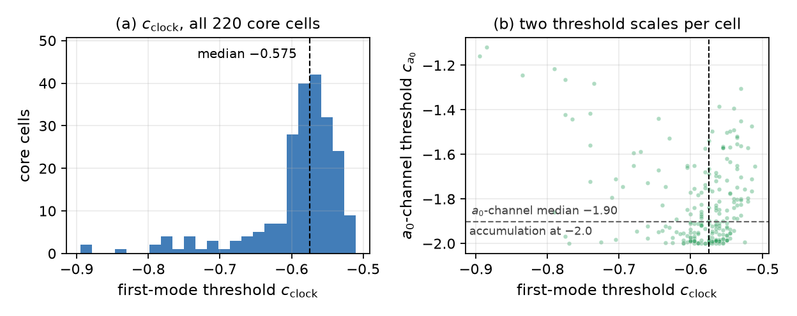
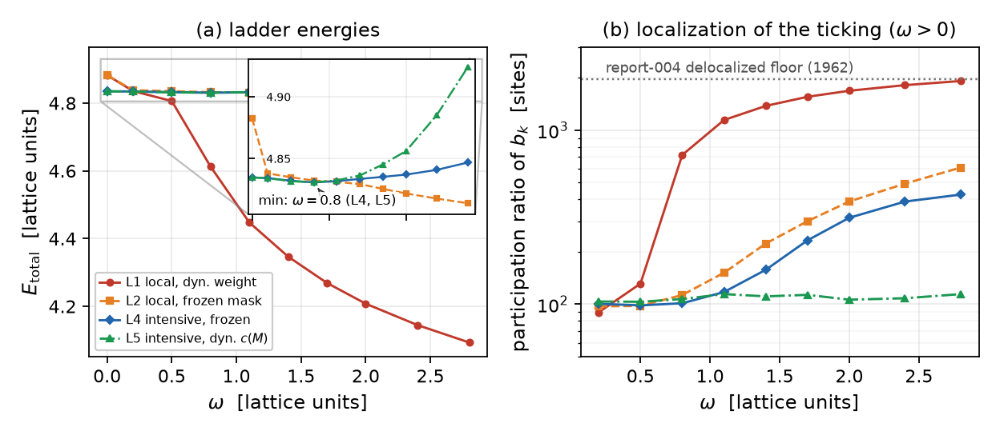

# Report 007 — Core-weighted coefficients: blind to Newton, and a working localized clock via the intensive quartic

*2026-08-25 · Maciej J. Mikulski (AI-assisted, see [METHOD](../../METHOD.md)) ·
clock-repair stage of the program; the coefficient mechanism proposed by
MJ (correspondence of 2026-08-23), forms and protocol choices flagged
author-gated below*

## Context and result

Report 004 measured the clock defect honestly: the local quartic
condensate delocalizes — the boost density spreads over the box
(participation ratio 88 → 1962 sites) instead of ticking on the particle,
because a local Mexican-hat density has an *extensive* floor. The
proposed repair studied here: make Lagrangian coefficients depend on the
field, $c = c(M)$ (e.g. a flat or sigmoid function of the potential
density), so that clock terms only pay off on the defect core.

**Results.**

1. **Blindness theorem (§1):** any coefficient built pointwise from
   algebraic invariants of $M$ (traces of powers of $M\eta$, hence the
   potential and eigenvalues) is *identically constant* — an **exact**
   statement — along boost-dressed configurations
   $M = o(x)M_0o(x)^\top$, by the $\eta$-similarity
   $M'\eta = o(M\eta)o^{-1}$; report 006's constant-coefficient no-go
   then applies verbatim to $c(M)$. For *topological* coefficients the
   statement is **perturbative**: every smooth topological density
   scales as the cube of the dressing amplitude, so
   $c(q) = c(0) + O(m^3)$ is blind at the leading frozen order that 006
   tests (a finite-amplitude topological coefficient is not excluded by
   this argument). Either way: **this mechanism is for the clock, not
   for Newton at leading order.**
2. **Canonical structure (§2, exact):** in the reduced clock sector the
   theory is $L = \tfrac K2\omega^2 + \tfrac B4\omega^4$ with
   $K = K_1 + cK_4$; the interior clock
   $\omega_*^2 = -K/(3B)$, $E_* = -K^2/(12B)$ exists iff $K<0$ and
   $B>0$, with the fold (branched-inverse) structure of report 003. A
   core-supported $c$ localizes the condition $K<0$.
3. **Kinetic windows (§3, two routes, full-core sweep):** the
   velocity-space quadratic form vanishes identically in vacuum for
   every $c$ (safe) and is PSD on the hedgehog at $c=0$ under the
   working $G$ metric (consistent with 004). Sweeping **all 220 core
   cells**: the first negative direction opens at
   $c_{\rm clock} \in [-0.895, -0.510]$ (median $-0.575$), with the
   negative count **exactly one** just past threshold on every cell —
   but that first mode is *not* the boost tangent $a_0$ (median raw
   overlap 0.14); the $a_0$ channel itself turns negative deeper, at
   $c_{a_0} \in [-2.00, -1.12]$ (median $-1.90$), on every cell. This
   is a map for a future pure $c\cdot I_4$ realization of the
   condensate, not a pillar of the ladder result (the ladders add the
   condensate explicitly).
4. **Ladder series (§4, the decisive measurement):** with the local
   quartic, a core weight does NOT cure delocalization — neither dynamic
   (the field *widens its own weight support*) nor frozen-and-sharp
   (dilution operates inside any fixed mask). With the **intensive
   (global) quartic** $E_c = -aB + 3bB^2$, $B = \int c_w\,b_k$ — the
   first repair candidate on report 004's list — the fresh-start ladder
   produces a clean interior well **bracketed at the $\omega = 0.8$
   rung** ($E(0.5)>E(0.8)<E(1.1)$; quadratic vertex of the sampled
   totals $\approx 0.82$, consistent with the $\omega_t = 0.8$
   calibration), with the boost density localized on $\sim100$ core
   sites. Decisively (review round 1): the same interior well survives
   with the weight recomputed from the **current field at every
   optimization step** (L5 — a genuine functional $c(M)$, no external
   mask), and localization is then even cleaner: PR stays flat at
   $\sim105$ sites across the whole ladder. The intensive form removes
   the self-widening incentive of L1: $B$ is driven to
   $B_* = a/(6b)$, so growing the weight's support past that point is
   penalized, not paid. A by-product
   witness: transfer-ladder relaxations at large $\omega$ reach static
   energies *below* report 004's polished point (4.8250 < 4.8347), so
   that point is **not a global minimum** of the statics — consistent
   with the two-family structure reported by substrate-framework's P243.
   (This does not certify either point as a strict local minimum, and
   the lower-energy field is relaxed under the full objective, not a
   stationary point of the statics alone.)

The physics choice this leaves to the model's author: the working form is
**nonlocal** (a square of an integral). Whether that is acceptable — or
whether a local realization (e.g. a topological-density weight) should be
sought — is author-gated (§5).

## 1. Admissible coefficients and the blindness theorem

A coefficient must be a Lorentz scalar built from the field. The
admissible families and what they can see:

- **Algebraic invariants of $M$** (potential $V_4$, traces
  $\mathrm{tr}(M\eta)^n$, $\det$): under any local dressing
  $M(x) = o(x)M_0o(x)^\top$ with $o^\top\eta o = \eta$,
  $M'\eta = o\,(M\eta)\,o^{-1}$ is a similarity, so every such invariant
  equals its vacuum value **pointwise** (symbolic route: generator
  identity $K^\top\eta+\eta K=0$ for all six generators plus the
  similarity identity; numeric route: 200 random local dressings, max
  relative drift $10^{-13}$). They see defect cores only.
- **Topological densities:** the normalized boost direction of the
  canonical ansatz *is* radial (winding 1 — a trap), but a coefficient
  of the normalized direction is singular where the amplitude vanishes
  and is not an admissible smooth functional; the smooth density tested
  here, $q = \varepsilon^{ijk}u\cdot(\partial_iu\times\partial_ju)$ of
  the raw spatial boost field $u$, scales as $m^3$ (measured ratios
  8.13, 8.03 under amplitude doubling — cubic). Hence
  $c(q) = c(0) + O(m^3)$: **perturbative** blindness at the leading
  frozen order, not an identity — cores only at that order, with the
  finite-amplitude case left open.
- **Scalars of first derivatives** ($I_k$ themselves): these do see
  dressings — but a coefficient built from them is a higher-order
  derivative term, a different program (see report 006 §7 and the
  working-repo `newton_ho` line).

Consequence: on report 006's ansatz any $c(M)$ equals the constant
$c(\text{vacuum})$ exactly, and any smooth topological coefficient does
so to leading order in the dressing amplitude; the quadratic no-go
applies unchanged at that order. The mechanism's value is for the clock.

## 2. Reduced clock sector (exact)

With $L=\tfrac K2\omega^2+\tfrac B4\omega^4$:
$\pi = K\omega + B\omega^3$,
$H = \tfrac K2\omega^2 + \tfrac{3B}4\omega^4$; the inverse
$\omega(\pi)$ folds at $\omega^2 = -K/(3B)$ with fold momentum
$\pi_c = \tfrac{2\sqrt3}{9}K\sqrt{-K/B}$ (report 003's branched
dynamics); the interior clock sits at $\omega_*^2=-K/(3B)$ with
$E_*=-K^2/(12B)$ and $E''(\omega_*)=-2K>0$ — existing iff $K<0<B$.
All statements asserted symbolically (`canonical_reduced.py`). With
$K = K_1 + cK_4$ the clock-on condition is $cK_4 < -K_1$: a
core-supported $c$ makes it hold on the particle and fail in vacuum.

## 3. Pointwise kinetic windows

The $10\times10$ velocity-space form of the working kinetic term
($G$-metric, report 002) plus $c$ times the $\eta$-based $I_4$ channel,
on report 004's polished hedgehog (`kinetic_forms.py`; torch-autograd
Hessians cross-checked against central finite differences to
$5\cdot10^{-16}$ on the five sample cells below):

| cell offset | PSD at $c=0$ | $c_{\rm clock}$ |
|---|---|---|
| (0,0,0) | yes | −0.535 |
| (2,0,0) | yes | −0.595 |
| (0,3,0) | yes | −0.615 |
| (4,4,4) | yes | −0.58 |
| (8,0,0) | yes | −0.645 |

**Full-core sweep** (every cell of the frozen mask, 220 cells; figure
below): first-mode threshold $c_{\rm clock} \in [-0.895, -0.510]$
(median $-0.575$), and just past each cell's threshold the number of
negative directions is **exactly one** — no bundle of unrelated
instabilities. Two clock-direction diagnostics, reported honestly:
the raw overlap of that first eigenvector with the boost tangent $a_0$
is small (median 0.14, min 0.00) — the lowest pointwise mode is *not*
$a_0$; the physically loaded question for a pure $c\cdot I_4$
condensate is instead the **Rayleigh threshold of the $a_0$ channel
itself**, $c_{a_0} = -R_G/R_4$, which is defined (with $R_4>0$) on all
220 cells and lies at $c_{a_0} \in [-2.00, -1.12]$ (median $-1.90$).
So the window map is: at $c \in (c_{a_0}, c_{\rm clock})$ one non-$a_0$
mode is open; the $a_0$ channel joins below $c_{a_0}$. The ladder
mechanism of §4 does not rely on this map (it adds the condensate term
explicitly); the map scopes the future pure-$c I_4$ realization.



Vacuum: both forms vanish identically (the commutator-quartic theory is
kinetically soft in vacuum) — no $c$ endangers it.

## 4. The ladder series

Protocol of report 004 (same stack, generator selection, calibration at
$\omega_t=0.8$, 500 Adam steps per rung, participation ratio
$\mathrm{PR}=(\sum b_k)^2/\sum b_k^2$), four ladders
(`ladder_series.py`, numbers in `results/ladder_series.json`):

| ladder | condensate | weight | verdict |
|---|---|---|---|
| L1 | local quartic | dynamic $c(M)$ sigmoid | monotone E; PR grows to ~1900; the weight's own support grows (~9.3k → ~10.9k sites): the field *buys* condensate everywhere by paying statics |
| L2 | local quartic | frozen sharp mask (211 sites) | monotone E; PR grows to ~600: dilution operates inside a fixed mask — the local Mexican hat has an extensive floor in any allowed region |
| L3 | intensive $-aB+3bB^2$ | frozen mask | condensate behaves as designed (its own minimum near $\omega_t$), but the transferred field finds deeper statics at large $\omega$ (hysteresis; statics 4.8250 < 4.8347) |
| L4 | intensive, fresh-start | frozen mask | **interior well: $E(0.5)>E(0.8)<E(1.1)$, minimum at the 0.8 rung, PR $\approx100$ sites** |
| L5 | intensive, fresh-start | **dynamic $c(M)$ from the current field** | **interior well at the 0.8 rung; PR flat at $\sim105$ sites over the whole ladder — the genuine field-dependent-coefficient mechanism works** |

The fresh-start protocol isolates the $\omega$-dependence from the
statics-relaxation drift; the deeper-statics finding of L3 is reported
as a stand-alone witness that report 004's polished point is not a
global minimum of the statics (no statement about its local character,
and the lower-energy field is not a stationary point of the statics
alone), consistent with the stable/unstable two-family structure that
substrate-framework's P243 found on the clock branch.



**Route 2 for the lattice numbers** (`verify_energies.py`): a from-scratch
numpy re-implementation of the 004-stack energies (differences,
Euclideanizer, potential, boost channel, intensive condensate) evaluated
on the persisted L4 rung fields (`results/fresh_rung_om*.npz`, with the
frozen generator direction `results/a0_frozen.npz` and frozen mask
`results/cw_frozen.npz`) reproduces the recorded totals to $2\cdot10^{-15}$
and confirms the interior well independently.

## 5. What this report does not show

- **The working form is nonlocal** (square of an integral). Its physical
  admissibility — fundamental term, effective description, or a local
  completion to be found — is the author's call. A candidate local
  route left untested on the lattice: a *topological-density* weight
  (conserved charge, harder for the field to manufacture support for).
- The dynamic weight is exploitable in the **local** form (L1); in the
  intensive form it is not (L5), and the *weight* needs no external
  mask. The frozen-mask run (L4) remains as the controlled comparison.
  However the full reduced functional is **not** translation-covariant:
  the clock tangent $a_0$ is frozen from the centered polished field
  (the m5 protocol inherited from report 004's ladders, including its
  origin-centered envelope), so translating the soliton while keeping
  that tensor fixed would change $B$. L5 is therefore a dynamic-weight
  result **on one fixed, centered clock tangent**; an equivariant
  tangent recomputed from the current field (with a field-defined
  center) and a translated/moving-soliton test remain open.
- One configuration (the 004 electron hedgehog), one generator (the
  protocol's largest-$K_1$ boost), one grid size, one calibration point;
  the weight scale $v_0$ (here 0.5·max $v_4$) is a new parameter whose
  anchoring is author-gated, as is $\omega_*=mc^2/\hbar$ itself.
- Fresh-start vs transfer is a *protocol* statement about hysteresis,
  not a dynamical-stability statement; the deeper-statics witness is
  reported, not explored.
- Everything on the lattice inherits report 004's instrument caveats;
  the ladder relaxations are 500-step Adam runs, not certified minima.
- No statement about the clock's absolute scale, backreaction of the
  condensate on 3×3 observables (lepton masses), or Newton (closed
  negatively in §1 for this mechanism).

## 6. Reproduction

```bash
pip install sympy torch numpy    # Python >= 3.12; GPU strongly advised
./reproduce.sh
```

`check_blindness.py` and `canonical_reduced.py` are self-contained.
`kinetic_forms.py`, `ladder_series.py` and `verify_energies.py` need
report 004's regenerated fields (`../004-lattice-clock/reproduce.sh`), or
a directory with `M_G.npz`/`M_G_polished.npz` passed via `M5_FIELDS_DIR`;
without them they print an explicit NOT-REPRODUCED-HERE notice and the
committed results (with pinned provenance) stand as the record —
the same external-artifact pattern as report 006's cost figure.

## Equation-to-code map

| object | code |
|---|---|
| similarity/blindness (both routes) | `check_blindness.py` §§1–2 |
| topological $m^3$ scaling | `check_blindness.py` §3 |
| reduced clock: $\pi$, $H$, fold, $\omega_*$ | `canonical_reduced.py` |
| kinetic forms + $c_{\rm clock}$ (autograd/FD) | `kinetic_forms.py` |
| weight $c_w = v_4/(v_4+v_0)$ | `ladder_series.py::sigmoid_w` |
| ladders L1–L5 | `ladder_series.py` |
| independent energy route | `verify_energies.py` |
| figures (from committed JSONs) | `make_figures.py` |

## Provenance

- Mechanism proposal: MJ, WhatsApp exchange with the author 2026-08-23
  (working repo `duda-particle-model`, `jarek_whatsapp/messages.txt` @
  `f013ce9`); the author's reaction ("jeśli zadziała to jak najbardziej",
  vacuum objection) ibid.
- Lattice stack, protocol, fields: report 004 (merged); the committed
  results were produced against the 004-line working fields
  (`covariant_split` @ `0bcea47`); regenerable via 004's reproduce path.
- $G$ metric: report 002; ansatz and no-go context: report 006;
  repair-candidate list: report 004 §Interpretation.
- Development history: working repo `duda-particle-model`,
  `cM_coefficient/` @ `9476d22`.
