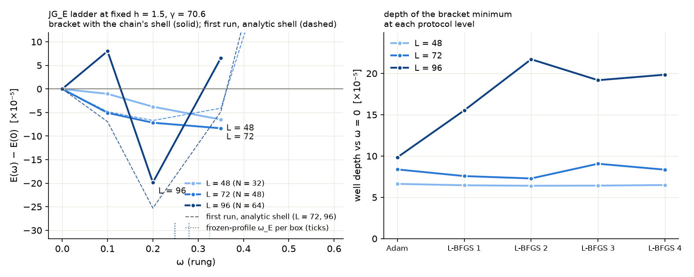

# Appendix — the box ladder at fixed spacing: does the (I₁^G)² well survive a larger box?

*Added 2026-09-14 under METHOD §7 (new material extending the report;
no conclusion of report 008 changes). Requested by
OpenWave's M5.32 ledger (substrate-framework discussion #186,
2026-09-02), which rates the JG_E well of this report as "the only
convergence-certified localized clock on the original 4×4 field" and
asks for the one thing a single 32³ box cannot show: "an L-ladder at
fixed h is cheap and decisive". All numbers regenerate from
`reproduce_appendix_L.sh` (CPU checks in seconds; the full regeneration
is GPU-days and CPU-hours, sentinel-flagged); committed records in
`results/L_ladder/`.*

## What is measured

The report's ladder was run in one box, L = 48 (N = 32, h = 1.5). Here
the same object is built in boxes of L = 48, 72 and 96 (N = 32, 48, 64)
at the same spacing, with the same Lagrangian: γ = 70.61, the coupling
fixed by the 5% statics-deformation budget of the L = 48 box, is kept at
that value on every rung of the ladder (the per-box "5%" value is
recorded but not used). Each box goes through the identical chain that
produced the report's field:

1. the 3×3 electron seed of the M5.21.2b instrument (seed A, term T2,
   symmetrized stencils, pinned shell, 8000 FIRE steps, w₂ = 0.0027581)
   regenerated on the box by the instrument itself (`instrument/`, a
   copy of OpenWave's script with only its output directory changed);
2. the report-004 chain: embedding with M₀₀ = −g, 3000 Adam steps in the
   η statics, 3000 in the G statics, the gradient-gated polish (Adam
   annealed, then L-BFGS towards ‖g‖∞ < 10⁻⁴, capped at twelve cycles;
   the attained residuals, 1–3·10⁻⁴, are in the chain records);
3. the report's JG_E ladder: rungs ω ∈ {0, 0.1, 0.2, 0.35, 0.5, 0.8,
   1.2}, every rung relaxed by the fixed-depth protocol (500 Adam steps
   and four L-BFGS cycles), energies recorded after every level, the
   frozen tangent a₀ = boost-x conjugation tangent with the envelope
   exp(−(r/10)⁴) — a physical radius, so the same object in every box.

`lattice_L.py` is the report-004/008 stack with N as a parameter; two
checks pin it to the record. On the committed rung fields of this
report the energies are reproduced to 10⁻⁹ (`validate.json`); from the
committed 004 seed the chain reproduces the committed polished field
**bitwise** (E_stat 4.834717814 to every printed digit, max |ΔM| = 0),
and the instrument reproduces the committed seed bitwise at N = 32.
One inconsistency of the first ladder run is recorded rather than
hidden: its rung stacks froze the shell at the analytic ansatz in
float64 while the chains had used the instrument's float32 seed
(3·10⁻⁸ apart on the shell), which is why that run agreed with the
committed rung energies only to 10⁻⁶; the bracket rungs
ω ∈ {0, 0.1, 0.2, 0.35} of every box were therefore rerun with the
shell of the chain (the record `rungs_N*.json`, fields persisted). With
the shell consistent the full N = 32 ladder reproduces the committed
ladder of this report **bitwise** (all seven rungs and the depth at
every protocol level, difference 0.0) on the recorded stack — the same
machine, GPU and library versions; the first-run N = 32 record, which
differed from it by about 10⁻⁶, is replaced by this run, while the
first-run seven-rung records at N = 48 and 64 are kept as the
exploration. The independent route below evaluates the persisted
bracket fields of every box. A
shortcut tried first — the analytic hedgehog ansatz relaxed directly,
skipping the instrument — lands in a different static minimum (E_stat
0.1% higher, max |ΔM| = 0.75, C₁ thirteen times larger, ω_E = 0.20
instead of 0.33; `chain_N32_analytic_seed.json`), which is why the seed
is regenerated rather than approximated.

## Results

The table gives, per box, the statics of the chain, the frozen-profile
prediction, and the bracket ω ∈ {0, 0.1, 0.2, 0.35} rerun with the
chain's shell (the certified record: fields persisted, evaluated
independently below); the outer rungs 0.5, 0.8, 1.2 come from the
first seven-rung run and are far above ω = 0 in every box.

| L (N) | E_stat | ω_E = √(C₁/C₂) | bracket minimum, per protocol level | E − E(0) at ω = 0.1, 0.2, 0.35 (10⁻⁵) | depth of the minimum per level (10⁻⁵) | ticking density: sites, r½ | ‖g‖∞ on the bracket |
|---|---|---|---|---|---|---|---|
| 48 (32) | 4.835 | 0.326 | 0.35 at all five levels | −1.0, −3.8, −6.5 | 6.6, 6.5, 6.4, 6.4, 6.5 | 101, 6.8 | 7·10⁻³ |
| 72 (48) | 4.548 | 0.280 | 0.2 at levels 1–3, 0.35 at levels 4–5 | −5.1, −7.2, −8.3 | 8.4, 7.6, 7.3, 9.1, 8.3 | 314, 7.8 | 7·10⁻² |
| 96 (64) | 4.377 | 0.249 | 0.2 at all five levels | +8.0, −19.9, +6.6 | 9.8, 15.5, 21.7, 19.2, 19.9 | 277, 6.1 | 3·10⁻² |



*Left: E(ω) − E(0) of the bracket rerun with the chain's shell, per
box at the final protocol level (solid), and of the preserved first
runs with the analytic ansatz on the shell (dashed, L = 72 and 96),
with the frozen-profile prediction ω_E marked on the axis. Right: the
depth of the bracket minimum at each protocol level.*

1. **The static electron changes with the box.** Moving the pinned
   shell from 24 to 36 and 48 lowers the polished static energy by 6%
   and then 4%, the tail-fit slope on the shells r ∈ [8, 16] changes
   sign (+0.5 → −0.7 → −0.8: at L = 48 those shells still feel the
   boundary), and the clock-channel coefficients grow (C₁: 0.9, 2.0,
   2.6·10⁻⁵; C₂: 0.9, 2.6, 4.3·10⁻⁴), so the frozen-profile prediction
   of §2 falls, 0.326 → 0.280 → 0.249.
2. **The well survives the larger boxes and its rung follows the
   prediction.** In every box a rung sits below ω = 0: by 7·10⁻⁵ at
   L = 48 (the report's well, reproduced bitwise), by 8·10⁻⁵ at L = 72,
   by 2·10⁻⁴ at L = 96. The sampled minimum is at 0.35 in the report's
   box, at L = 72 it lies between the 0.2 and 0.35 rungs — they differ
   by 1·10⁻⁵ and swap order between protocol levels — and at L = 96 it
   is 0.2 at every level and in both runs, with the neighbours 0.1 and
   0.35 above ω = 0; the prediction 0.326 → 0.280 → 0.249 tracks this
   drift. The ticking density stays inside the envelope (r½ 6–8) but
   spreads over about three times as many sites as in the report's box.
3. **In the larger boxes the protocol resolves the rung, not the
   depth.** Two runs of the same protocol whose boundary values differ
   by 3·10⁻⁸ (the first run with the analytic shell and the bracket
   rerun with the chain's shell) differ in E(ω) − E(0) by about 10⁻⁶
   at L = 48, by up to 4·10⁻⁵ at L = 72 (the 0.35 rung) and by up to
   1.5·10⁻⁴ at L = 96 (the 0.1 and 0.35 rungs, which change sign),
   while agreeing on which rung is lowest except for the L = 72 pair;
   the depth per level is non-monotone in both larger boxes, and the
   residuals are ten times the report's. §6's plateau criterion is
   formally met by the reruns (final change 9% and 3.5% of the depth),
   but that spread is the observed two-run sensitivity to the boundary
   change, and the remaining relaxation error common to both runs is
   not quantified: the depths quoted for L = 72 and 96 are the values
   observed after the stated protocol, and nothing more.

## Independent route on the persisted bracket

`verify_L_ladder_energies.py` is the report's numpy energy route
(route 2 of §2) extended to any box, with the frozen tangent rebuilt
in numpy from the box's polished field. On the twelve persisted
bracket fields it reproduces every recorded energy to 10⁻¹⁵ relative
(`results/L_ladder/independent_route.json`) and, evaluated on its own,
finds the same minima: 0.35 at L = 48, 0.35 at L = 72 (0.2 within
1.2·10⁻⁵), 0.2 at L = 96, each below ω = 0 by the depths of the table.
The route certifies the energies of the persisted endpoints; what the
relaxation protocol left unresolved (point 3) it cannot resolve. The
bracket record `rungs_N*.json` is always written by the run that
persisted the fields (the `rungs` mode, or the bracket subset of a
full ladder), so a regeneration keeps the two in step; the structural
checks in `verify_L_ladder.py` tell the preserved first-run records
(key `shell`) from regenerated ones and apply the appendix's statements
to each.

## What this appendix does not show

- No continuum extrapolation (h fixed) and no protocol deepening: the
  L = 72 and L = 96 depths and neighbouring rungs are not converged at
  four L-BFGS cycles, and whether more cycles settle the L = 72 pair
  or move the L = 96 minimum is not measured; the rung grid is the
  report's, so "0.2" means that rung, not a continuous ω*.
- The frozen tangent and the boost-x generator are those of the report;
  no equivariant tangent.
- γ is fixed at the L = 48 value; the per-box 5% coupling (87.9 at
  L = 72, 93.5 at L = 96) would rescale the depth by that ratio and is
  not run.
- Whether the energy-functional reading is the H of a well-posed L
  remains the author-gated question of the report.

## Artifacts and reproduction

`lattice_L.py` (the stack with N as a parameter), `appendix_L_ladder.py`
(`validate` / `chain N` / `ladder N` / `rungs N ω…` / `all`; `all`
resumes from the stage records by default and regenerates every stage
with `--fresh`, `--dry-run` prints the plan), `instrument/m5_21_2b_a_instrument.py`
(the OpenWave seed instrument, output directory changed), the seeds
(`results/L_ladder/seeds/`, float32, with the instrument's row JSONs),
`make_appendix_L_figure.py`, `verify_L_ladder.py` (structure of the
records), `verify_L_ladder_energies.py` (the independent numpy route on
the persisted bracket fields). Fields: the polished fields of N = 32
and 48 and the persisted bracket rungs ω ∈ {0, 0.1, 0.2, 0.35} of
every box; the N = 32 fields are committed, the 48³ rungs (5 MB each)
and all 64³ fields (13 MB each) are attached to the repository release
`appendix-008-L-ladder-fields` and downloaded by
`reproduce_appendix_L.sh` when absent.

```bash
pip install torch numpy matplotlib
bash reproduce_appendix_L.sh                  # CPU: fetches the 64^3 fields if absent, runs the numpy route on every box, checks the records, redraws the figure
M5_RUN_LADDER=1 bash reproduce_appendix_L.sh  # seeds (CPU hours) + chains, ladders and bracket reruns regenerated with --fresh (GPU, about a day)
```

Provenance: development in `duda-particle-model/i1sq_L_ladder/`
(2026-09-13/14; the run took 1, 5 and 8 GPU-hours for the three ladders
and 4 h for the N = 64 chain); the request in discussion #186, comment
18254268; the
seed recipe from OpenWave `research/scripts/m5_21_2b_a_instrument.py`
(w₂ identified by the gradient residual of the committed seed, 8·10⁻⁵).
