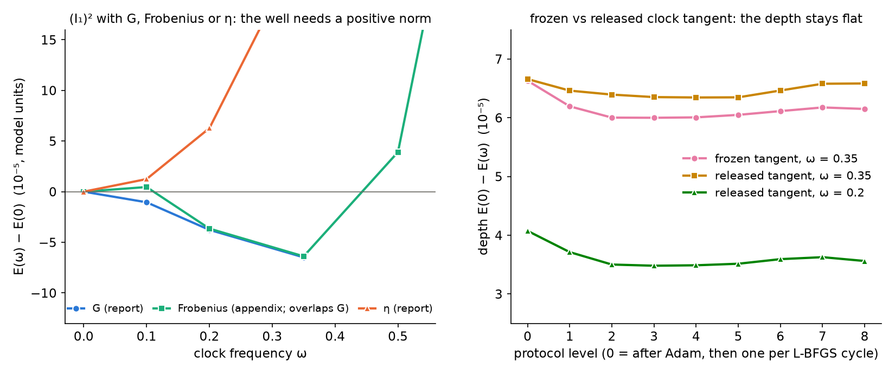

# Appendix — the well on a positive contraction, and with the clock tangent released

*Added 2026-09-24 under METHOD §7 (new material extending the report;
no conclusion of report 008 changes). Requested by the model's author on
substrate-framework discussion #186 (2026-09-19), who read the JG_E well
as a possible artefact: "E(ω) < E(0) means rotation lowers the energy …
on the η-contraction the rotation–boost block … has no floor. Two tests,
both cheap: (i) rerun one rung on the positive (H-adjoint / Frobenius)
contraction — if the well is the negative block, it disappears; (ii) at
the well's ω, release the profile and see whether E keeps falling."
Both tests are run here in the report's box (N = 32, L = 48, the
polished field and shell of the L-ladder appendix, γ = 70.61).
`reproduce_appendix_contraction.sh` checks the committed records in
about a minute on a CPU; `M5_RUN=1` regenerates them on a GPU (about an
hour).*

## (i) The contraction: the well needs a positive matrix norm; η removes it

**Structure of the sector (exact).** On every field of the report —
the polished electron and the persisted bracket rungs — the time–space
entries M₀ᵢ vanish identically (the energy is even in them, so the
relaxation never leaves M₀ᵢ = 0), and the clock tangent is the boost
conjugation of a block-diagonal field, so it has time–space entries
only. Then:

- every static commutator F_ij = [∂ᵢM, ∂ⱼM]_η is purely space–space;
- every clock commutator F₀ᵢ = [ωa₀, ∂ᵢM]_η is purely time–space (its
  space–space part is exactly 0 on all five fields,
  `results/contraction_release/structure.json`).

A matrix-slot contraction therefore sees only the sign it assigns to
time–space entries. The Frobenius norm and η give identical magnitudes
(equal to the last digit in the record), and the report's G differs
from the identity by at most 4·10⁻⁴ on these fields. With the outer
η^{00}η^{ii} = −1 of the time pairs:

| matrix-slot contraction | I₁ on a clock | cross term in γ(I₁)² | report / appendix |
|---|---|---|---|
| G (≈ Frobenius here) | i₁ˢᵗᵃᵗ − k | −2γ i₁ˢᵗᵃᵗ k (drive) | JG_E: well at 0.35 |
| Frobenius | i₁ˢᵗᵃᵗ − k | −2γ i₁ˢᵗᵃᵗ k (drive) | this appendix: well at 0.35 |
| η | i₁ˢᵗᵃᵗ + k | +2γ i₁ˢᵗᵃᵗ k | J_ETA: minimum at ω = 0 |

The negative time–space block of the η contraction is what *removes*
the drive: it flips the sign of k and cancels the outer η^{00}. The drive
is the Lorentzian sign of the time pairs, and it survives any positive
matrix norm. (The report's control J0, which flips the cross sign by
hand, is the fully Euclidean case and has no well either.)

**Measured.** The Frobenius ladder (statics in G as in every ladder of
the report, only the (I₁)² term changed, fixed-depth protocol, rungs
0 to 0.8) has its minimum at ω = 0.35 at every protocol level. Its depth
is 6.4–6.6·10⁻⁵, the same as the report's G well (6.4–6.6·10⁻⁵). The
frozen-profile prediction is ω_E = 0.326 in both. The 0.2 rung lies
3.7·10⁻⁵ below ω = 0 (G: 3.8·10⁻⁵); 0.5 and 0.8 lie above. The 0.1 rung
sits 0.5·10⁻⁵ *above* ω = 0 (G: 1.0·10⁻⁵ below). Its relaxation took a
different path: a lower energy after Adam, then L-BFGS stopped with the
smallest residual of the ladder. A difference of that size is within
the protocol's resolution at this rung. Figure, left.

## (ii) Releasing the clock tangent: the depth does not run away

**What is released.** The report freezes the tangent a₀ at its value on
the polished field. Here a₀ is recomputed from the current field inside
the energy (same boost generator, envelope and normalisation), so the
clock always rigidly boosts the field actually being relaxed. The rungs
ω = 0.2 and 0.35 are run with eight L-BFGS cycles instead of four. The
reference is the frozen-tangent rungs 0 and 0.35 with the same eight
cycles.

**Measured** (figure, right). The released-tangent depth at ω = 0.35 is
6.3–6.7·10⁻⁵ at every one of the nine protocol levels. At ω = 0.2 it is
3.5–4.1·10⁻⁵. The frozen tangent at 0.35 gives 6.0–6.6·10⁻⁵. The ω = 0
energy keeps creeping by 1–2·10⁻⁶ per cycle after the first cycles, as
§6 of the report records, and the released rungs creep in parallel: the
depth is flat, not growing. The recomputed tangent differs from the
frozen one by 2·10⁻⁴ in norm, because the relaxed fields differ from the
polished one by at most 0.03. Releasing it changes the depth by at most 7%.
Within this protocol the depth relative to
ω = 0 stays about constant while both absolute energies keep creeping
downward together; no run-away of the well's depth is seen.

*Left: E(ω) − E(0) at the final protocol level with the (I₁)² term
contracted by G (the report's bracket record), Frobenius (this appendix)
and η (the report's J_ETA ladder); G and Frobenius overlap except at
ω = 0.1. Right: the depth E(0) − E(ω) at every protocol level (Adam,
then one point per L-BFGS cycle) for the frozen and the released
tangent.*

## Checks and reproducibility

- `verify_appendix_contraction.py` asserts the structure (M₀ᵢ = 0,
  clock channel time–space only, Frobenius = η in magnitude,
  |G − 1| < 10⁻³), the Frobenius bracket at every level, and the flat
  depths.
- `verify_appendix_contraction_route2.py` is the report's from-scratch
  numpy route, without torch. It evaluates all ten persisted fields
  (float32, `results/contraction_release/*.npz`) and reproduces every
  energy difference of the records to 2·10⁻⁷ (the float32 storage shifts
  all energies by the same 1.7·10⁻⁵). In this route the 0.35 rung lies
  more than 5·10⁻⁵ below ω = 0 for the Frobenius ladder, the frozen
  tangent and the released tangent.
- The first protocol level (after Adam) of the frozen-tangent rungs
  reproduces the committed bracket record bitwise. The L-BFGS levels
  differ from it by up to 3.5·10⁻⁶ (these runs shared the GPU with a
  second job; bitwise reproduction was not achieved here). The depths
  compared above all come from this appendix's own runs.

## What this does not show

- "Release the profile" is read here as releasing the clock tangent to
  follow the field. A tangent with a free spatial profile at fixed ω is
  not tested. In that problem only ωa₀ enters, so ω loses its meaning;
  this is the reason for the author's fixed-charge (Q-ball) proposal.
- The (Q, E, dE/dQ) record proposed with the tests is not given. The
  energy-functional reading has no Lagrangian and so no Noether charge,
  and the fundamental reading is unstable (§4 of the report). Defining Q
  through dE/dQ = ω from E(ω) would be a definition, not a measurement.
- One box, one spacing, the report's fixed-depth protocol. The larger
  boxes of the L-ladder appendix, where the protocol resolves the rung
  but not the depth, are not rerun.
- Reports 016 and 017 show that the frozen sector (M₀ᵢ = 0), where this
  whole clock lives, is a saddle once the time sector is free, and that
  the η norm makes the kinetic form indefinite. Neither is addressed by
  these two tests.
