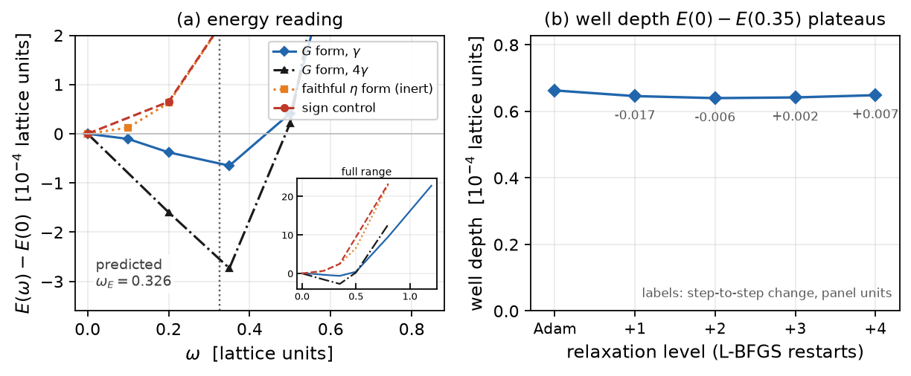
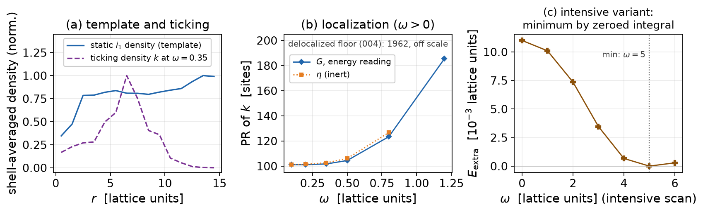

# Report 008 — The simplest quartic ticks only in the repaired metric: $(I_1)^2$ is inert in the raw $\eta$ theory and drives a localized clock in the $G$ theory

*2026-08-27 · Maciej J. Mikulski (AI-assisted, see [METHOD](../../METHOD.md)) ·
answers the model author's direct question (correspondence 2026-08-26):
"does the simplest fourth-order term, $(F_{abcd}F^{abcd})^2$, work?" —
his candidate for the article-1 Lagrangian. Revised in review rounds
1-2, which identified the decisive form distinction (§1), the fate of
the two readings (§4) and the convergence criterion (§6).*

## Context and result

Report 007 built a working localized clock with hand-added structure
(an intensive quartic and a core weight). The model author's preference
for the article is the *simplest* fourth-order term,
$\gamma\,(I_1)^2$ with $I_1 = F_{\mu\nu\alpha\beta}F^{\mu\nu\alpha\beta}$.

**The answer splits on the metric used in the contraction — the same
$\eta \to G$ repair that fixed the statics in report 004 decides
whether the simplest quartic can tick:**

1. **The raw $\eta$ form (report 001's $I_1$) is inert.** On a clock
   configuration ($\dot M = \omega a_0$) the time pairs carry the outer
   $\eta^{00} = -1$, but the matrix-slot $\eta$ contraction of
   $F_{0i}$ is itself negative on the field, so the **net time part of
   $I_1^\eta$ is positive** (measured on the committed $\omega = 0.35$
   field: $+0.0208318$, pointwise correlation $1.0000$ with the channel
   density). Hence $I_1^\eta = i_1^{\rm stat} + k$ with $k \ge 0$: the
   square has no negative cross term, and the faithful
   $(I_1^\eta)^2$ ladder (J_ETA) has its minimum at $\omega = 0$ —
   **no clock**, in either reading (the fundamental-Lagrangian reading
   only triples the brake).
2. **The $G$ form ticks.** With the working Euclideanizer $G$ (reports
   002/004) on the matrix slots and the outer indices raised by
   $\eta$, the matrix-slot contraction of $F_{0i}$ is positive and the
   outer $\eta^{00}$ survives: $I_1^G = i_1^{\rm stat} - k$ with
   $k \ge 0$, and

$$\gamma (I_1^G)^2 = \underbrace{\gamma\,(i_1^{\rm stat})^2}_{\text{statics
deformation}}\; \underbrace{-\,2\gamma\, i_1^{\rm stat}\,k}_{\text{clock
drive}}\; +\; \underbrace{\gamma\,k^2}_{\text{quartic brake}}.$$

   The measured wells (below) sit at the frozen-profile predictions of
   this expansion, in both readings of the term.

Why this local quartic does *not* delocalize, when every plain local
quartic tried in 004/007 did, is a **convexity** fact: the Mexican-hat
form $-a\,k + 3b\,k^2$ is concave in its linear drive, so spreading the
ticking density at fixed integral lowers the quartic cost (dilution
pays); the completed square $(i_1^{\rm stat}-k)^2$ is convex in $k$
with its pointwise minimum at the static template — any spreading away
from the template only costs. (Honest measurement: $i_1^{\rm stat}$ is
nearly flat across shells — max/min contrast $\sim$1.8 — so the
localization does NOT come from a concentrated static weight; it comes
from the convex template structure plus the kinematics of the clock
channel.)

**Measurements** (report-004 lattice stack; fresh-start ladders; every
rung, including $\omega = 0$, relaxed by one fixed-depth protocol —
Adam + two L-BFGS cycles — with bracket stability across protocol
levels as the convergence criterion, §6):

1. **Energy reading of the $G$ form** (§2): frozen-profile prediction
   $\omega_E = \sqrt{C_1/C_2} = 0.326$, $\gamma$-independent; the
   ladder's interior minimum sits at the sampled rung $\omega = 0.35$,
   ticking localized at $\sim$100 sites.
2. **The fundamental-Lagrangian reading is statically unstable —
   measured** (§4): the correct Legendre image of
   $L_{\rm extra} = \gamma(s-k)^2$ carries $-\gamma s^2$ (the static
   square flips sign in $H = \sum p\dot q - L$; review round 2), which
   is unbounded below — relaxation blows through the
   $s \sim 1/\gamma$ threshold immediately (energy $\to -7\cdot10^{13}$,
   max density $0.01 \to 3.8\cdot10^4$ in 1000 steps, documented in
   `fundamental_runaway.py`). Flipping the overall Lagrangian sign
   removes the drive analytically. **The term works as an
   energy-functional ansatz (JG_E), not as a naive fundamental-$L$
   term** — an earlier $\sqrt3$-shifted "JG_H well" rested on a
   sign error caught in review and is withdrawn.
3. **Faithful $\eta$ ladder** (§3): minimum at $\omega = 0$ — the
   measured no-go of point 1 above.
4. **Sign control** (§3): the $G$ form with the cross term flipped —
   minimum at $\omega = 0$ (this control also caught a run-1 endpoint
   artifact; the protocol now relaxes every rung).
5. **$\gamma$-scaling** (§5): at $4\gamma$ the minimum position is
   unmoved and the depth scales by the predicted factor 4.
6. **The $\gamma$-budget boundary** (§5): at $16\gamma$ (80% statics
   deformation) the regime breaks into a runaway — the sampled minimum
   migrates with the relaxation level (0.35 → 0.8 → 1.2), the energy
   descends monotonically toward high $\omega$ and PR grows to 432:
   the frozen-profile prediction no longer applies and the field
   backreacts strongly. Bracket stability is measured up to
   $4\gamma$; the clean clock has a **bounded $\gamma$ budget**.
7. **The intensive variant is degenerate** (§5): $(\int I_1^G)^2$
   minimizes by zeroing its integral — the local density squared is
   the physical form. No nonlocality is needed.

**Caveats, stated plainly:** the tick is established in the
energy-functional reading only (the fundamental reading is unstable,
§4 — which reading is physical stays author-gated per 002/003, but the
naive fundamental option is now measured out); the wells are shallow
(depth
$\propto\gamma$, bounded by the statics-deformation budget: 5% →
$\sim7\cdot10^{-5}$ at $\gamma$, and the budget itself is bounded —
the $16\gamma$ regime breaks, §5); the clock tangent is frozen (the
004/007 protocol); and the tick lives in the $G$-metric realization —
for the article this means the quartic must be written with the same
working metric as the kinetic sector, not with raw $\eta$.

## 1. Setup and the two forms

Report 004's stack: $32^3$ lattice, polished hedgehog, working metric
$G$, frozen clock tangent $a_0$ (boost-x). For a spatial-derivative
pair the density contraction is
$\tfrac12\cdot4\,\langle F_{ij},F_{ij}\rangle_{XX}$ summed over both
one-sided stencils and $i<j$; for time pairs
$\langle F_{0i},F_{0i}\rangle_{XX}$ with the outer $\eta^{00}\eta^{ii}
= -1$, $F_{0i} = [\dot M, \partial_i M]_\eta$, $X \in \{\eta, G\}$ on
the matrix slots. Measured on the committed $\omega=0.35$ field
(review round 1's numbers, reproduced independently):

| quantity | value |
|---|---|
| $\int i_1^{\rm stat}$ ($\eta$ slots) | 4.150300 |
| $\int i_1^{\rm stat}$ ($G$ slots) | 4.150984 |
| net time part, $\eta$ form | **+0.0208318** (positive → inert) |
| net time part, $G$ form | **−0.0208343** (negative → drive) |

$\gamma = 70.61$ fixes the statics deformation at 5% of
$E_{\rm stat}$.

## 2. Energy reading of the $G$ form (JG_E)

Frozen-profile expansion: $E(\omega) \simeq -2\gamma C_1\omega^2 +
\gamma C_2\omega^4$, $C_1 = \int i_1^{\rm stat}k_1$,
$C_2 = \int k_1^2$, minimum at $\omega_E = \sqrt{C_1/C_2} = 0.326$
independent of $\gamma$. Ladder (converged rungs): interior minimum at
the sampled rung $\omega = 0.35$, bracketed at the $10^{-4}$ level,
ticking localized at $\sim$100 sites (report 004's delocalized floor:
1962).

**Route 2** (`verify_energies.py`): a from-scratch numpy
re-implementation evaluated on the persisted JG_E rung fields
reproduces the recorded totals to $10^{-9}$ relative and confirms the
sampled well independently.

**Depth plateau (review round 2):** the JG_E bracket runs a deep
protocol (Adam + four L-BFGS cycles) and the JSON records the well
depth at every level (`depth_per_level`, `depth_changes`);
`reproduce.sh` asserts the successive depth changes shrink and the
last is below 10% of the depth. Measured: the depth settles at
$6.4$–$6.5\cdot10^{-5}$ with residual oscillation $\sim\pm1\%$
(changes $-1.7, -0.6, +0.2, +0.7 \cdot 10^{-6}$ across the four
L-BFGS levels) — the well's magnitude itself plateaus, not just its
location.

## 3. The measured no-go ($\eta$ form) and the sign control

- **J_ETA** (faithful report-001 contraction, both densities
  all-$\eta$): minimum at $\omega = 0$, no interior well — the
  simplest quartic in its raw form does not tick. In the
  fundamental-$L$ reading the cross term keeps its positive sign and
  the brake triples: inert a fortiori (analytic).
- **J0** ($G$ form, cross sign flipped): minimum at $\omega = 0$ —
  the JG_E well is the cross term's physics, not protocol noise.

## 4. The fundamental-Lagrangian reading: a measured no-go

Review round 2 identified a sign error: our first "fundamental"
functional kept $+\gamma s^2$ from the energy ansatz, but the correct
Legendre image of $L_{\rm extra} = \gamma(s-k)^2$ is

$$H_{\rm extra} = -\gamma s^2 - 2\gamma s k + 3\gamma k^2$$

(Euler homogeneity on $k\sim\dot q^2$; the velocity-independent square
flips sign). The $-\gamma s^2$ term makes $H$ unbounded below once the
static density beats the linear $e_{\rm static}$ cost at
$s \sim 1/\gamma = 0.0142$ — and the lattice maximum already sits at
$0.0102$. Measured (`fundamental_runaway.py`, 1000 Adam steps at
$\omega = 0$ and $0.19$): the energy dives to $-7\cdot10^{13}$ with
max $s \to 3.8\cdot10^4$. Choosing $-\gamma$ instead flips drive and
brake and removes the clock analytically. The earlier
"$\sqrt3$-shifted JG_H well" was an artifact of the sign error and is
withdrawn; the report's claims are scoped to the energy-functional
reading.

## 5. Scaling, deep-well and intensive checks

- $4\gamma$: minimum position unmoved, depth ratio $\approx 4$
  (`confirm_gamma_scaling.py`).
- $16\gamma$ (80% statics deformation, `gamma16_localization.py`):
  the deep-relaxation probe shows the regime **breaking into a
  runaway**: the sampled minimum migrates with the relaxation level
  (0.35 at the Adam level → 0.8 → 1.2 after the L-BFGS cycles), the
  energy descends monotonically toward the highest sampled rungs with
  PR growing 107 → 432 and residuals $\sim0.1$. At this deformation
  the frozen-profile expansion no longer describes the relaxed field
  — the honest conclusion is a bounded $\gamma$ budget for the clean
  clock (bracket stability measured up to $4\gamma$), not
  localization at any depth.
- Intensive $(\int I_1^G)^2/V$: minimizes by zeroing its integral
  (near $\omega \approx 5$ the kinetic integral cancels the static
  one) — a degenerate global cancellation, not a localized clock.

## 6. Convergence: measured non-stationarity and bracket stability

A hard residual threshold turned out not to be honest on this
landscape, and we say so plainly: after Adam + repeated L-BFGS cycles
the energy keeps *creeping* by $\sim1.5\cdot10^{-6}$ per further
200-iteration cycle with $\lVert g\rVert_\infty$ stuck at a few
$10^{-3}$ (a long flat valley of the 327k-dof problem; measured
explicitly at the $\omega=0$ endpoint over five cycles). Absolute
stationarity is therefore **not claimed**. The asserted criterion is
what the physics claim actually needs: every rung runs the SAME
fixed-depth protocol (500 Adam + two L-BFGS cycles), the energy is
recorded after each level (`E_levels` per rung), and the **location of
the well's minimum must be identical at every protocol level**
(`min_omega_per_level`, asserted in `reproduce.sh`) — the common creep
mode cancels in energy differences across rungs. Final
$\lVert g\rVert_\infty$ per rung is recorded for transparency
(`grad_inf`).

## 7. Relation to reports 001/002/004/007

- 001 enumerated the contractions with $\eta$; this report shows the
  $\eta$-contracted $(I_1)^2$ is inert for the clock, and that the
  minimal repair is the same one the program already made for the
  statics: contract the matrix slots with the working metric $G$
  (002's Euclideanizer, 004's sign-fix).
- 007 repaired the Mexican-hat concavity by hand (intensive form +
  core weight); 008 shows the simplest covariant square avoids the
  concavity altogether. Two independent clock mechanisms now exist;
  the $(I_1^G)^2$ one is simpler and local.

## Limitations

- **Frozen clock tangent** (004/007 protocol): the reduced functional
  is not translation-covariant; an equivariant tangent remains open.
- **Shallow wells**: depth bounded by the statics-deformation budget;
  stability against perturbations untested.
- **Sampled minima**: bracketed by rungs, not continuously resolved.
- **One generator** (boost-x); rotations are a separate line (working
  repo: the rotational channel ticks too, with its own sign control).
- $32^3$ box, one lattice spacing; no continuum extrapolation.

## Author-gated physics choices

- The reading of the quartic term: the clock is established in the
  energy-functional ansatz; the naive fundamental-$L$ reading is
  measured unstable (§4). Whether another well-posed fundamental
  completion exists (e.g. with a stabilizing higher static term) is an
  open physics choice.
- The statics-deformation budget for $\gamma$ (depth vs 3×3-sector
  purity) — ties into scale anchoring.
- Writing the article Lagrangian's quartic with the working metric $G$
  (required for the tick) rather than raw $\eta$.

## Equation-to-artifact map

| object | artifact |
|---|---|
| ladders JG_E/J_ETA/J0/J2, prediction $\omega_E$, depth-plateau record | `ladder_i1sq.py` → `results/i1sq_ladders.json` |
| fundamental-reading runaway (measured no-go) | `fundamental_runaway.py` → `results/fundamental_runaway.json` |
| shared densities/relaxation for the checks | `ladder_i1sq_defs.py` |
| $\gamma$-scaling confirmation | `confirm_gamma_scaling.py` → `results/gamma_scaling.json` |
| deep-well localization check | `gamma16_localization.py` → `results/gamma16_localization.json` |
| independent energy route (both readings) | `verify_energies.py` |
| persisted rung fields, frozen tangent | `results/jge_rung_om*.npz`, `results/a0_frozen.npz` |
| figures (from committed artifacts) | `make_figures.py` |

## Reproduction

`bash reproduce.sh` — with report 004's fields available (or
`M5_FIELDS_DIR`) it reruns all lattice producers (sentinel-flagged),
the independent route and the figures, and asserts the wells, the two
no-gos, the scaling ratio, the convergence residuals and the route-2
match; without fields it verifies the committed artifacts' internal
consistency and reports NOT-REPRODUCED for the lattice legs.
