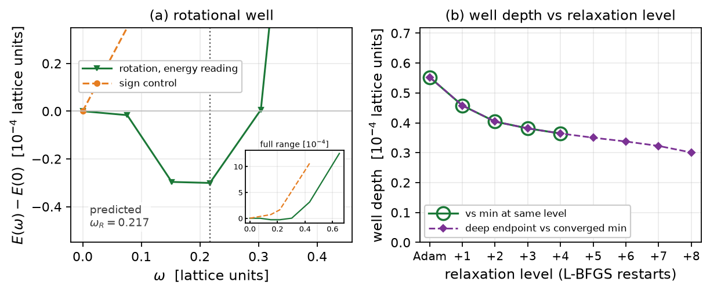
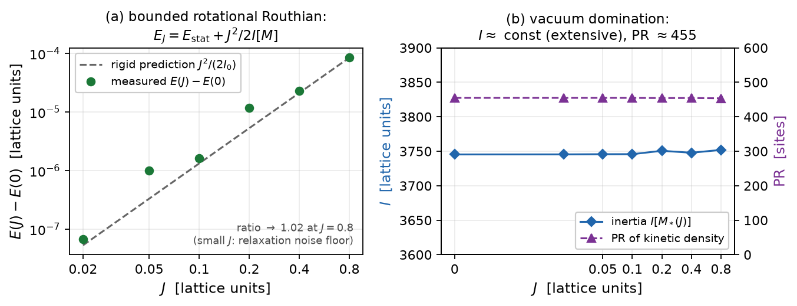

# Report 009 — The rotational sector: a protocol-limited ladder, a vacuum-dominated channel, and the well-posed fixed-J route

*2026-08-28 · Maciej J. Mikulski (AI-assisted, see [METHOD](../../METHOD.md)) ·
the angular-momentum half of the article-1 program. Substantially
revised after review round 1, whose two findings both survived
deeper measurement and **reversed the original claims**: this report
now documents two measured obstructions and the formalism that the
rotational sector actually needs.*

## Context and result

Report 008 established the localized clock in the boost channel. The
electron's defining property, however, is angular momentum: the model
must rotate. This report's first version transplanted 008's ladder to
the frozen rotation tangent and claimed an interior well at the
predicted rung; review round 1 found (a) the bracket was not
converged, and (b) the reported "angular momentum" was not a charge.
Both findings are confirmed here by deeper measurement, and the
honest picture is:

1. **The env-frozen rotational ladder is not protocol-convergent —
   its well claim is withdrawn** (§2, §4). Continuing the relaxation
   of the persisted rungs (up to 24 L-BFGS cycles, tol $10^{-7}$)
   *reorders the bracket*: the energies after the budget order as
   $E(0.304) < E(0.152) < E(0.217) < E(0)$, with the non-stiff rungs
   still descending at $\sim 10^{-6}$/cycle without saturation while
   the $0.217$ rung alone is fully converged. The interior-minimum
   structure seen at fixed protocol depth does not survive; the
   ladder can only bound, not locate, any rotational well.
2. **The pure internal rotation channel is vacuum-dominated —
   measured in a well-posed fixed-J formulation** (§5). With the
   collective coordinate on the *pure* interior generator
   $\dot M = \dot\theta\,(WM - MW)$ (no envelope, no normalization —
   removing exactly the conventions review round 1 objected to), the
   bounded Routhian $E_J = E_{\rm stat} + J^2/(2 I[M])$ is well posed
   and its measurements are clean: $E(J) - E(0) \to J^2/(2I_0)$
   (ratio $\to 1.02$), $I$ constant to $0.2\%$. But the inertia is
   **extensive**: $I_0 = 3.75\cdot10^3$ with the kinetic density
   spread over the whole interior (PR $\approx 455$ sites), because
   the internal rotation is *not a symmetry of the anisotropic vacuum*
   (it mixes the spatial axes with eigenvalues $1$ and $\delta$). In
   the infinite-volume limit $\omega = J/I \to 0$: **no isolated
   finite-frequency rotating object exists in this channel.**
3. **The natural repair was also tested and also fails — recorded
   honestly** (§6): the Skyrme-like combined space–internal generator
   $\zeta = -(x\partial_y - y\partial_x) + [W, \cdot\,]$ would be an
   asymptotic symmetry of a *uniaxial* hedgehog, but our hedgehog is
   **biaxial** (transverse eigenvalues $\delta = 0.3$ and $0$
   differ), and the measurement (working-repo dev,
   `paper1_dev/fixedJ/combined_generator.py`) shows
   $|\zeta M|(r)$ *flat* ($\approx 1.13$ on every shell),
   $I_{\rm comb} = 3.4\cdot10^3$, PR $= 312$: the biaxial radial
   texture breaks every continuous axial rotation out to the
   boundary, so **no rigid collective rotation of this defect has
   finite inertia**. The spin question therefore needs a different
   structure — a localized transverse-precession mode (a rotational
   analog of the 008 boost clock), or the near-uniaxial limit
   ($\delta \to 0$ restores the axial symmetry; note the
   $\delta = 1/8$ vacuum probe in the working repo) — and stays open.
   The fixed-J Routhian remains the well-posed Lagrangian-reading
   formalism for whichever channel is found.
4. The proxy $\tilde J = I_R\,\omega$ of the first version is retained
   in the JSON for the record but carries **no physical claim** (§3):
   it is convention-dependent (tangent normalization and envelope).

**What survives from the first version:** the raw ladder record and
its independent route-2 verification (the *energies* are correct; it
is their convergence status that changed), the sign-control result,
and the methodological correction about report 004's channel
construct (which cancels rotational densities, $G \approx \eta$ on
rotation tangents).

## 1. Setup

As in report 008 (`ladder_i1sq_defs.py` via runpy): working metric
$G$, $\gamma = 70.61$, fresh-start rungs, Adam + L-BFGS cycles with
recorded `E_levels`. Ladder tangent: frozen
$a_{\rm rot} = \mathrm{env}\cdot(WM - MW)/\lVert\cdot\rVert$. Fixed-J
scan tangent: pure interior generator, no envelope/normalization.

## 2. The ladder and its non-convergence

At fixed protocol depth the ladder showed an interior minimum at the
predicted rung $\omega_R = \sqrt{C_1^r/C_2^r} = 0.217$ (all recorded
levels), with the sign control clean at $\omega = 0$ — see
`results/rot_ladders.json` and the figure. Review round 1 tested the
persisted $0.152$ field with continued relaxation and found it
dropping below the claimed minimum; the deep run of §4 confirms and
extends this. **The well-location claim is withdrawn.** What remains
established: (i) the $0.217$ configuration is a genuinely converged
stationary point ($\lVert g\rVert_\infty = 2.7\cdot10^{-4}$, five
levels identical to $10^{-6}$); (ii) the other rungs are *not*
converged and keep descending — most plausibly toward the deeper
static family known from report 007 (the two-family structure), at a
rate growing with $\omega$.

**Route 2** (`verify_energies.py`): the persisted bracket energies
are reproduced from scratch to $10^{-9}$ relative — the *numbers*
are right; the *interpretation* changed.

## 3. The proxy, retained without claims

$\tilde J = I_R\,\omega$ with $I_R = 2\int k_1^r = 0.547$ (frozen-
tangent channel scale) is recorded in the JSON. It is not a canonical
momentum or Noether charge: rescaling the frozen tangent
$a \to \lambda a$ sends $\tilde J \to \lambda \tilde J$. No conclusion
rests on it.

## 4. Deep convergence: the bracket reorders

`deep_converge.py` continues the persisted rung fields (and a fresh
$\omega = 0$) for up to 24 L-BFGS cycles (tol $10^{-7}$):

| $\omega$ | 0.0 | 0.152 | **0.217** | 0.304 |
|---|---|---|---|---|
| $E$ start | 5.070782 | 5.070727 | 5.070726 | 5.070757 |
| $E$ after budget | 5.070735 | 5.070679 | **5.070726 (converged)** | 5.070655 |
| cycles / last change | 24 / $-1.1\cdot10^{-6}$ | 24 / $-1.2\cdot10^{-6}$ | 1 / $-3\cdot10^{-9}$ | 24 / $-1.4\cdot10^{-6}$ |

The post-budget ordering is $0.304 < 0.152 < 0.217 < 0.0$, still
descending — no statement about a rotational interior minimum
survives. Contrast with the boost channel: the identical deep run on
report 008's persisted bracket keeps its ordering
$E(0.35) < E(0.2) < E(0)$ under the same common creep (stable
differences there; unstable here).

## 5. Fixed-J: well-posed, and a measured no-go for the pure channel

The Routhian $E_J[M] = E_{\rm stat}[M] + J^2/(2 I[M])$ with
$I[M] = 2\int k_1[\zeta_{\rm int}(M)]$, $\zeta_{\rm int} =
(1-\text{shell})\,(WM - MW)$, minimized over $M$ at prescribed $J$
(`fixedj_scan.py`): bounded, no runaway, rigid-profile scaling
verified ($[E(J)-E(0)]/[J^2/2I_0] \to 1.02$ at $J = 0.8$; small-$J$
points sit at the relaxation noise floor), $\omega = J/I$ an output.
Measured: $I \approx 3.75\cdot10^3$, constant to $0.2\%$ over
$J \in [0, 0.8]$, kinetic-density PR $\approx 455$ — the channel
turns the whole (anisotropic-vacuum) interior, not the defect. This
is the quantitative obstruction: extensive inertia, no isolated
rotor in the pure internal channel.

## 6. Limitations and the road forward

- Rigid collective rotation is exhausted: pure internal (§5) and
  combined space–internal (Context, point 3) generators are both
  measured vacuum-dominated. Open spin candidates: localized
  transverse precession; the near-uniaxial ($\delta \to 0$) regime.
- The deep-convergence budget (24 cycles) bounds but does not close
  the creep; the boost-channel contrast (§4) is protocol-matched.
- $32^3$, one spacing; frozen-shell boundary as in 004–008.

## Equation-to-artifact map

| object | artifact |
|---|---|
| ladder record (fixed protocol depth) + proxy | `ladder_rot.py` → `results/rot_ladders.json` |
| deep-convergence run (the reordering) | `deep_converge.py` → `results/deep_converge.json` |
| fixed-J scan (pure internal channel) | `fixedj_scan.py` → `results/fixedj.json` |
| independent energy route | `verify_energies.py` |
| persisted bracket fields, frozen tangent | `results/rot_rung_om*.npz`, `results/a0r_frozen.npz` |
| figures (committed artifacts) | `make_figures.py` |

## Reproduction

`bash reproduce.sh` — with report 004's fields (or `M5_FIELDS_DIR`)
reruns all producers (sentinel-flagged) and asserts: the ladder
record's internal consistency, the deep-run reordering (the withdrawn
claim stays withdrawn), the fixed-J rigid-scaling ratio and the
extensive-inertia signature, and the route-2 match; without fields it
checks the committed artifacts.
