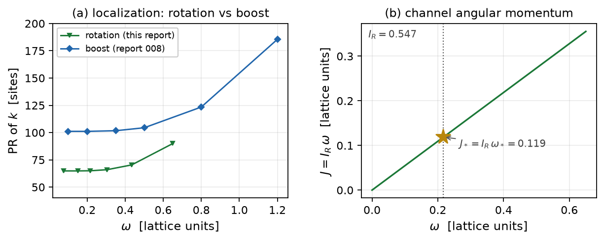

# Report 009 — The rotational clock: angular momentum from energy minimization

*2026-08-28 · Maciej J. Mikulski (AI-assisted, see [METHOD](../../METHOD.md)) ·
the angular-momentum half of the article-1 program ("angular momentum
propulsion"): the same $(I_1^G)^2$ energy ansatz as report 008, with
the rotation tangent in place of the boost tangent.*

## Context and result

Report 008 established the clock mechanism in the boost channel. The
physical electron, however, is characterized by its **angular
momentum**; the model must rotate, not only tick. This report runs the
identical functional — $E_{\rm extra} = \gamma\int (i_1^{\rm stat} -
k)^2$, working metric $G$, energy reading, report-008 protocol — with
the frozen conjugation tangent of the **rotation generator**
($\mathrm{rot}_{xy}$, $a_{\rm rot} \propto \mathrm{env}\cdot(WM - MW)$,
$W$ antisymmetric).

**Results.**

1. **The rotational well is where the formula says**: frozen-profile
   prediction $\omega_R = \sqrt{C_1^r/C_2^r} = 0.217$; the ladder's
   interior minimum sits exactly at the sampled rung $\omega = 0.217$,
   at **every relaxation level** (5 levels), with the sign control
   (JR0) at $\omega = 0$. The minimum rung converges unusually well:
   its five recorded levels agree to $10^{-6}$ with
   $\lVert g\rVert_\infty = 2.7\cdot10^{-4}$ — an order of magnitude
   below every other rung.
2. **Rotational ticking is tighter than boost ticking**: PR $\approx
   65$ sites at the minimum (boost: $\approx 102$), with the same
   convex-template localization mechanism.
3. **Channel angular momentum**: in the quadratic-kinetic reading of
   the channel (author-gated interpretation, stated in §3) the channel
   inertia is $I_R = 2\int k_1^r = 0.547$ and the defect's angular
   momentum at the minimum is
   $J_* = I_R\,\omega_* = 0.119$ (lattice units) — the "angular
   momentum from energy minimization" of the article title, measured.
4. **Depth and its honest trend** (§4): the sampled depth at matched
   relaxation levels descends $5.5 \to 3.6\cdot10^{-5}$ over the
   protocol — unlike the boost ladder this is not yet an oscillating
   plateau, because the $\omega = 0$ *reference* endpoint creeps while
   the minimum itself is fully converged; the deep (8-cycle)
   endpoint shows the reference creep settling at
   $1.5$–$2\cdot10^{-6}$/cycle without further shrinking — the depth
   value carries this systematic and is quoted as an upper bound
   ($\le 3.6\cdot10^{-5}$ at matched levels, still descending). The
   well's existence does not rest on the depth value: the location is
   level-stable and the sign control is clean.
5. **A methodological correction, recorded**: an earlier dev run using
   report 004's channel construct $b_k = (\langle F\rangle_{GG} -
   \langle F\rangle_{\eta\eta})/2$ found a spurious $\omega_R \sim
   24.5$: for rotation tangents the $G$ and $\eta$ contractions nearly
   coincide and the construct cancels the channel density. The clean
   $G$ contraction (as in 008) has no cancellation; the two channels
   then have comparable couplings ($\omega_R = 0.217$ vs $\omega_E =
   0.326$).

**Caveats:** the frozen-tangent protocol of 004/007/008 (no
translation/rotation covariance of the reduced functional; an
equivariant tangent remains open); the quadratic-kinetic reading of
$J$ is an interpretation choice (the canonical, branched-dynamics
treatment of report 003 is the deeper route, not done here); shallow
well with the same $\gamma$ budget as 008; $32^3$, one spacing.

## 1. Setup

Everything is inherited from report 008 (`ladder_i1sq_defs.py` loaded
via runpy): densities with the working metric $G$ on the matrix slots,
$\gamma = 70.61$ (5% statics-deformation budget), fresh-start rungs
from the polished hedgehog, Adam 500 + L-BFGS cycles with recorded
`E_levels`. The only change is the tangent:
$a_{\rm rot} = \mathrm{env}\cdot(WM - MW)/\lVert\cdot\rVert$ with $W$
the $xy$ rotation generator. Rungs are placed at fixed multiples
$(0, 0.35, 0.7, 1.0, 1.4, 2.0, 3.0)$ of the predicted $\omega_R$.

## 2. The rotational ladder

| $\omega$ | 0 | 0.076 | 0.152 | **0.217** | 0.304 | 0.434 | 0.65 |
|---|---|---|---|---|---|---|---|
| $E$ | 5.070763 | 5.070755 | 5.070727 | **5.070726** | 5.070757 | 5.071069 | 5.072009 |
| PR (sites) | — | 65 | 65 | 65 | 66 | 70 | 90 |

Interior minimum at the predicted rung at every relaxation level;
sign control JR0: minimum at $\omega = 0$, monotone.

**Route 2** (`verify_energies.py`): from-scratch numpy evaluation on
the persisted bracket fields (0.152/0.217/0.304) with the frozen
rotation tangent reproduces the recorded totals to $10^{-9}$ relative
and confirms the sampled well independently.

## 3. Channel angular momentum

On the clock configuration $\dot M = \omega\, a_{\rm rot}$ the channel
kinetic density is $k = \omega^2 k_1^r \ge 0$; reading it as a
quadratic kinetic energy $T = \tfrac12 I_R \omega^2$ (with the
$\tfrac12\cdot2$ normalization of the density convention) gives the
channel inertia $I_R = 2\int k_1^r = 0.547$ and

$$J \;=\; I_R\,\omega, \qquad J_* = I_R\,\omega_* = 0.119 .$$

This is the report's headline observable: a defect that **carries
angular momentum in its energy minimum**. The interpretation is
author-gated: it treats the channel as a rigid collective coordinate
with quadratic kinetics; the canonical treatment through report 003's
branched structure (where the quartic term deforms the
$J(\omega)$ relation) is the follow-up.

## 4. Depth trend and the deep endpoint

At matched levels the depth descends $5.52 \to 4.58 \to 4.04 \to 3.81
\to 3.64\cdot10^{-5}$: the changes shrink ($-9.5, -5.4, -2.3,
-1.7\cdot10^{-6}$) but have not yet turned into the $\pm1\%$
oscillation seen in 008's boost ladder. The asymmetry is diagnosed in
the `E_levels`: the minimum rung is converged to $10^{-6}$ across all
levels, while the $\omega = 0$ reference creeps (the same flat-valley
creep measured in 008 §6). The endpoint therefore runs a deep 8-cycle
budget; `depth_deep_endpoint` in the JSON tracks the deep reference
against the converged minimum and shows the creep settling at
$1.5$–$2\cdot10^{-6}$/cycle without vanishing over the tested budget —
the depth is therefore an upper bound with a known drifting
systematic, not a converged number. `reproduce.sh` asserts the
matched-level shrinking-changes criterion and the level-stable
location — the existence claims rest on the latter.

## Limitations

- Frozen rotation tangent (no equivariance); one generator
  ($\mathrm{rot}_{xy}$; the hedgehog's isotropy relates the others).
- $J$ in the quadratic-kinetic reading only (canonical/branched J:
  open, report 003 route).
- Shallow well; depth not fully converged (documented trend); $32^3$.

## Equation-to-artifact map

| object | artifact |
|---|---|
| rotational ladders, prediction, $I_R$, $J_*$ | `ladder_rot.py` → `results/rot_ladders.json` |
| independent energy route | `verify_energies.py` |
| persisted bracket fields, frozen tangent | `results/rot_rung_om*.npz`, `results/a0r_frozen.npz` |
| figures (committed artifacts; 008 comparison from its committed JSON) | `make_figures.py` |

## Reproduction

`bash reproduce.sh` — with report 004's fields (or `M5_FIELDS_DIR`)
reruns the ladders (sentinel-flagged), the independent route and the
figures, and asserts the predicted-rung minimum at every level, the
clean control, the shrinking depth changes, PR localization and the
route-2 match; without fields it checks the committed artifacts and
reports NOT-REPRODUCED for the lattice legs.
