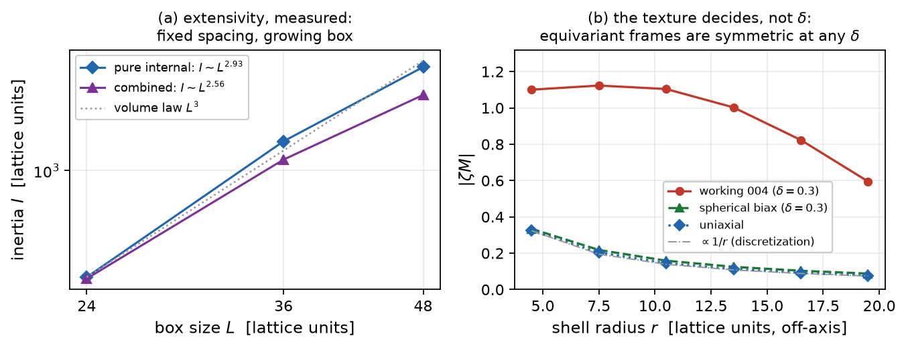

# Report 009 — The rotational sector: a protocol-limited ladder, extensive rigid rotations, and a constrained fixed-J surrogate

*2026-08-28 · Maciej J. Mikulski (AI-assisted, see [METHOD](../../METHOD.md)) ·
the angular-momentum half of the article-1 program. Substantially
revised after review round 1, whose two findings both survived
deeper measurement and **reversed the original claims**: this report
now documents two measured obstructions and the formalism that the
rotational sector actually needs.*

## Context and result

Report 008 established the localized clock in the boost channel. The
electron's defining property, however, is angular momentum: the model
must rotate. This report's first version transplanted 008's ladder to
the frozen rotation tangent and claimed an interior well at the
predicted rung; review round 1 found (a) the bracket was not
converged, and (b) the reported "angular momentum" was not a charge.
Both findings are confirmed here by deeper measurement, and the
honest picture is:

1. **The env-frozen rotational ladder is not protocol-convergent —
   its well claim is withdrawn** (§2, §4). Continuing the relaxation
   of the persisted rungs (up to 24 L-BFGS cycles, tol $10^{-7}$)
   *reorders the bracket*: the energies after the budget order as
   $E(0.304) < E(0.152) < E(0.217) < E(0)$, with the non-stiff rungs
   still descending at $\sim 10^{-6}$/cycle without saturation while
   the $0.217$ rung alone is fully converged. The interior-minimum
   structure seen at fixed protocol depth does not survive; the
   ladder can only bound, not locate, any rotational well.
2. **The pure internal rotation channel is broad-and-stiff on this
   box — measured in a bounded constrained surrogate** (§5; scope
   corrected in review round 2). The functional
   $E_J = E_{\rm stat} + J^2/(2 I[M])$ with the interior conjugation
   tangent is bounded, minimizes cleanly, and matches the
   rigid-profile scaling ($[E(J)-E(0)]/[J^2/2I_0] \to 1.02$, $I$
   constant to $0.2\%$). Two honest scope limits, both from round 2:
   (i) this is **not a derived Routh reduction** for the
   pinned-boundary problem — the masked tangent's flow
   $M_\theta = e^{\theta m(x)W} M e^{-\theta m(x)W}$ carries an
   interface term $\propto (\partial_i m)[W, M]$ across the frozen
   shell, so the angle is not cyclic, $J$ is a *prescribed parameter*
   (not a Noether charge), and the interior mask is itself a sharp
   envelope; a genuine reduction needs the boundary rotated by the
   global generator (or the interface potential included). (ii) The
   single-box measurement ($I_0 = 3.75\cdot10^3$, kinetic-density
   PR $\approx 455$ on $32^3$) shows only that the channel is broad
   on this box, so the extensivity claim is now backed by the
   **measured box-size scaling** (§5a): at fixed spacing, boxes
   $L = 24, 36, 48$ give $I_{\rm pure} \sim L^{2.93}$ — the volume
   law, measured.
3. **The Skyrme-like combined generator was measured on this field
   and does not help — with the claim's scope corrected in round 2**
   (§6): for $\zeta = -(x\partial_y - y\partial_x) + [W, \cdot\,]$
   the residual $|\zeta M|(r)$ is *flat* ($\approx 1.13$ on every
   shell) and $I_{\rm comb} = 3.4\cdot10^3$, PR $= 312$
   (`combined_texture.py` producer in this report): **this hedgehog's
   radial texture is not axially equivariant**, so the combined
   rotation buys nothing *on this configuration*. Round 2's
   counterexample is accepted and recorded as constructive: unequal
   transverse eigenvalues do **not** by themselves forbid
   equivariance — the $\varphi$-wound texture
   $M = R_z(\varphi)\,B(\rho, z)\,R_z(\varphi)^\top$ has three
   distinct eigenvalues yet $\zeta M \equiv 0$ exactly. The
   measured obstruction is therefore a property of the *radial
   hedgehog texture*, not of biaxiality per se — confirmed
   analytically in §6: the uniaxial hedgehog AND a spherical-frame
   biaxial hedgehog at full $\delta = 0.3$ (the counterexample class)
   both show only a $\propto 1/r$ discretization residual, while the
   working texture's residual is $O(1)$ and flat. (A naive
   "shrink $\delta$ in the potential" route was also probed in the
   working repo and *backfires* — the breaking grows as
   $\delta \to 0$ at fixed texture, since the $(1, \delta)$ pair
   splitting grows and the seed texture does not become equivariant
   by itself.) Review round 3 then closed a loophole in the
   *proposed repair itself*: for an exactly equivariant configuration
   $\zeta M \equiv 0$, so $\zeta$ lies in the **stabilizer** — it
   does not parameterize a collective orbit, the implemented inertia
   $I[\zeta]$ vanishes in the continuum (the analytic controls'
   $I_{\rm comb} \sim 6\cdot10^2$ is pure discretization residual,
   $\propto 1/r$ pointwise, vanishing as $h \to 0$), and $J^2/(2I)$
   is singular. Round 4 then showed that the two measured endpoints
   do **not** exhaust the rigid-rotation possibilities, and its
   counterexample class was measured here (§6a): a configuration
   **asymptotically equivariant with a non-equivariant core**,
   $M = M_{\rm eq} + \chi(r) D$ with compactly supported $\chi$ and
   $\zeta D \neq 0$, has $\zeta M = \chi\,\zeta D$ compactly
   supported — and the measurement gives a **finite, box-independent,
   core-localized inertia** ($I \sim L^{0.14}$ over $L = 24/36/48$,
   kinetic-density PR $\approx 60$). So the honest classification is
   a trichotomy: globally non-equivariant textures are *extensive*
   ($\sim L^{2.93}$), exactly equivariant textures are *trivial*
   (stabilizer), and **core-breaking configurations on an equivariant
   background carry a genuine rigid collective orbit with finite
   inertia** — the physically standard rigid-rotor situation, and the
   concrete spin candidate. Because the global combined rotation
   preserves the (equivariant) asymptotics while acting nontrivially
   on the core, it is a bona fide global symmetry direction there —
   the route to a Noether $J$ — subject to the follow-up checklist:
   an energetically relaxed configuration of this class, its charge
   and boundary behavior, and the $h \to 0$, $L \to \infty$ limits.
   (A profile-multiplied generator $f(x)\,W$ is *not* by itself a
   symmetry — its finite transformation produces bulk terms
   $\propto (\partial_i f)[W, M]$, the smooth version of §5's
   interface obstruction — so the flow route would need a separately
   derived conserved charge; the core-breaking rigid route above does
   not have this problem.)
4. The proxy $\tilde J = I_R\,\omega$ of the first version is retained
   in the JSON for the record but carries **no physical claim** (§3):
   it is convention-dependent (tangent normalization and envelope).

**What survives from the first version:** the raw ladder record and
its independent route-2 verification (the *energies* are correct; it
is their convergence status that changed), the sign-control result,
and the methodological correction about report 004's channel
construct (which cancels rotational densities, $G \approx \eta$ on
rotation tangents).

## 1. Setup

As in report 008 (`ladder_i1sq_defs.py` via runpy): working metric
$G$, $\gamma = 70.61$, fresh-start rungs, Adam + L-BFGS cycles with
recorded `E_levels`. Ladder tangent: frozen
$a_{\rm rot} = \mathrm{env}\cdot(WM - MW)/\lVert\cdot\rVert$. Fixed-J
scan tangent: the interior conjugation generator
$(1-\text{shell})(WM - MW)$ — unnormalized, but the sharp interior
mask is itself an envelope (see the caveat in Context 2).

## 2. The ladder and its non-convergence

At fixed protocol depth the ladder showed an interior minimum at the
predicted rung $\omega_R = \sqrt{C_1^r/C_2^r} = 0.217$ (all recorded
levels), with the sign control clean at $\omega = 0$ — see
`results/rot_ladders.json` and the figure. Review round 1 tested the
persisted $0.152$ field with continued relaxation and found it
dropping below the claimed minimum; the deep run of §4 confirms and
extends this. **The well-location claim is withdrawn.** What remains
established: (i) the $0.217$ configuration is a genuinely converged
stationary point ($\lVert g\rVert_\infty = 2.7\cdot10^{-4}$, five
levels identical to $10^{-6}$); (ii) the other rungs are *not*
converged and keep descending — most plausibly toward the deeper
static family known from report 007 (the two-family structure), at a
rate growing with $\omega$.

**Route 2** (`verify_energies.py`): the persisted bracket energies
are reproduced from scratch to $10^{-9}$ relative — the *numbers*
are right; the *interpretation* changed.

## 3. The proxy, retained without claims

$\tilde J = I_R\,\omega$ with $I_R = 2\int k_1^r = 0.547$ (frozen-
tangent channel scale) is recorded in the JSON. It is not a canonical
momentum or Noether charge: rescaling the frozen tangent
$a \to \lambda a$ sends $\tilde J \to \lambda \tilde J$. No conclusion
rests on it.

## 4. Deep convergence: the bracket reorders

`deep_converge.py` continues the persisted rung fields (and a fresh
$\omega = 0$) for up to 24 L-BFGS cycles (tol $10^{-7}$):

| $\omega$ | 0.0 | 0.152 | **0.217** | 0.304 |
|---|---|---|---|---|
| $E$ start | 5.070782 | 5.070727 | 5.070726 | 5.070757 |
| $E$ after budget | 5.070735 | 5.070679 | **5.070726 (converged)** | 5.070655 |
| cycles / last change | 24 / $-1.1\cdot10^{-6}$ | 24 / $-1.2\cdot10^{-6}$ | 1 / $-3\cdot10^{-9}$ | 24 / $-1.4\cdot10^{-6}$ |

The post-budget ordering is $0.304 < 0.152 < 0.217 < 0.0$, still
descending — no statement about a rotational interior minimum
survives. Contrast with the boost channel: the identical deep run on
report 008's persisted bracket keeps its ordering
$E(0.35) < E(0.2) < E(0)$ under the same common creep (stable
differences there; unstable here).

## 5. The constrained fixed-J surrogate, and the pure channel's no-go

The bounded constrained surrogate
$E_J[M] = E_{\rm stat}[M] + J^2/(2 I[M])$ (not a derived Routh
reduction — Context 2) with
$I[M] = 2\int k_1[\zeta_{\rm int}(M)]$, $\zeta_{\rm int} =
(1-\text{shell})\,(WM - MW)$, minimized over $M$ at prescribed $J$
(`fixedj_scan.py`): bounded, no runaway, rigid-profile scaling
verified ($[E(J)-E(0)]/[J^2/2I_0] \to 1.02$ at $J = 0.8$; small-$J$
points sit at the relaxation noise floor); $\omega = J/I$ is the
surrogate's stationarity ratio, not a derived physical frequency.
Measured: $I \approx 3.75\cdot10^3$, constant to $0.2\%$ over
$J \in [0, 0.8]$, kinetic-density PR $\approx 455$ — the channel
turns the whole (anisotropic-vacuum) interior, not the defect. This
is the quantitative obstruction on this box; the scaling below makes
it extensivity.

### 5a. Box-size scaling: the volume law, measured

`inertia_scaling.py` repeats the inertia measurement in three boxes at
fixed spacing $H = 1.5$ (central crops of the seed, same texture
pinned at a smaller radius; short static relax per box):

| $L$ | 24 | 36 | 48 | fit |
|---|---|---|---|---|
| $I_{\rm pure}$ | $3.59\cdot10^2$ | $1.33\cdot10^3$ | $2.71\cdot10^3$ | $\sim L^{2.93}$ |
| $I_{\rm comb}$ | $3.54\cdot10^2$ | $1.11\cdot10^3$ | $2.07\cdot10^3$ | $\sim L^{2.56}$ |

$I_{\rm pure}$ follows the volume law: the pure internal channel's
inertia is extensive, and $\omega = J/I \to 0$ at fixed $J$ as the
box grows — the isolated-rotor no-go for this channel, now with the
scaling evidence review round 2 asked for. ($I_{\rm comb}$ also grows
strongly on these sizes; its sub-volume exponent reflects the partial
cancellation and boundary effects, not finiteness.)

## 6. The texture test: what actually breaks the symmetry

`combined_texture.py` measures the off-axis shell profile of the
axial-symmetry residual $|\zeta M|(r)$ on three configurations:

| configuration | $|\zeta M|$ at $r = 4.5$ | at $r = 19.5$ | $I_{\rm comb}$ |
|---|---|---|---|
| working 004 field ($\delta = 0.3$) | 1.10 | 0.59 | $3.4\cdot10^3$ |
| uniaxial hedgehog (analytic) | 0.32 | 0.077 | $5.7\cdot10^2$ |
| spherical-frame biaxial, $\delta = 0.3$ (analytic) | 0.33 | 0.088 | $6.9\cdot10^2$ |

The two equivariant textures fall off as $\propto 1/r$ — the pure
discretization residual (exact symmetry in the continuum) — **at both
$\delta = 0$ and $\delta = 0.3$**, while the working texture stays
$O(1)$ out to the boundary. The symmetry breaking is a property of
the texture choice, not of the biaxial spectrum. Two consequences,
stated precisely (review round 3): the equivariant textures'
$I_{\rm comb} \sim 6\cdot10^2$ is *itself* discretization residual
and vanishes in the continuum limit — it is **not** a finite core
inertia; and because $\zeta M \equiv 0$ on them exactly, $\zeta$ is
a stabilizer direction on that class — a symmetry of the action that
annihilates the configuration supplies no rotational zero mode, so
the equivariant class has a *trivial*, not finite, $\zeta$-channel. (The spherical-frame
texture pays for its equivariance with a frame singularity on the $z$
axis — the well-known linear defect of biaxial hedgehogs — whose cost
scales with the transverse amplitude $\delta$; this is where a small
$\delta$ genuinely helps.)

### 6a. The third class, measured: finite inertia from a core-breaking texture

Review round 4 exhibited the class this report's dichotomy missed;
`combined_texture.py` now measures it. The configuration is
$M = M_{\rm sph} + \varepsilon\,\chi(r)\,D$ with
$D = \hat x\hat x^\top - \hat y\hat y^\top$ (constant, so the
orbital part of $\zeta$ annihilates it), $\chi = e^{-(r/r_0)^2}$,
$\varepsilon = 0.3$, $r_0 = 6$: asymptotically equivariant,
non-equivariant in the core, $\zeta M = \varepsilon\chi\,[W, D]_c$
compactly supported. On its own analytic lattice at three box sizes
(fixed spacing $h = 1.5$):

| $L$ | 24 | 36 | 48 | fit |
|---|---|---|---|---|
| $I_{\rm comb}$ | $9.86\cdot10^2$ | $1.04\cdot10^3$ | $1.08\cdot10^3$ | $\sim L^{0.14}$ |
| PR of the density | 57 | 64 | 69 | core-localized |

Finite, box-independent, core-localized — neither extensive nor
trivial. The residual slow growth is consistent with the equivariant
background's own $1/r$ discretization residual (§6); the class is the
concrete rigid-rotor spin candidate for the follow-up.

## 7. Limitations and the road forward

- **Rigid rotation splits into three measured classes** (the round-4
  trichotomy): extensive (globally non-equivariant texture,
  $\sim L^{2.93}$), trivial (exactly equivariant texture,
  stabilizer), and **finite** (core-breaking texture on an
  equivariant background, $\sim L^{0.14}$, PR $\approx 60$ — §6a).
  The follow-up program is the third class made dynamical: relax an
  asymptotically equivariant configuration whose core breaks the
  axial symmetry (the relaxed field, not a hand-built ansatz), derive
  the Noether charge of the global combined rotation on it (with an
  equivariant boundary the angle is cyclic), and establish the
  $h \to 0$ and $L \to \infty$ limits before any spin claim. A
  profile-multiplied flow $f(x)W$ is not a symmetry (bulk
  $(\partial_i f)[W,M]$ terms) and would need a separately derived
  conserved charge — the rigid third-class route avoids this.
- The deep-convergence budget (24 cycles) bounds but does not close
  the creep; the boost-channel contrast (§4) is protocol-matched.
- $32^3$, one spacing; frozen-shell boundary as in 004–008.

## Equation-to-artifact map

| object | artifact |
|---|---|
| ladder record (fixed protocol depth) + proxy | `ladder_rot.py` → `results/rot_ladders.json` |
| deep-convergence run (the reordering) | `deep_converge.py` → `results/deep_converge.json` |
| fixed-J scan (pure internal channel) | `fixedj_scan.py` → `results/fixedj.json` |
| box-size scaling of the inertia | `inertia_scaling.py` → `results/inertia_scaling.json` |
| texture test (working vs equivariant analytic) | `combined_texture.py` → `results/combined_texture.json` |
| independent energy route | `verify_energies.py` |
| persisted bracket fields, frozen tangent | `results/rot_rung_om*.npz`, `results/a0r_frozen.npz` |
| figures (committed artifacts) | `make_figures.py` |

## Reproduction

`bash reproduce.sh` — with report 004's fields (or `M5_FIELDS_DIR`)
reruns all producers (sentinel-flagged) and asserts: the ladder
record's internal consistency, the deep-run reordering (the withdrawn
claim stays withdrawn), the fixed-J rigid-scaling ratio and the
extensive-inertia signature, and the route-2 match; without fields it
checks the committed artifacts.
