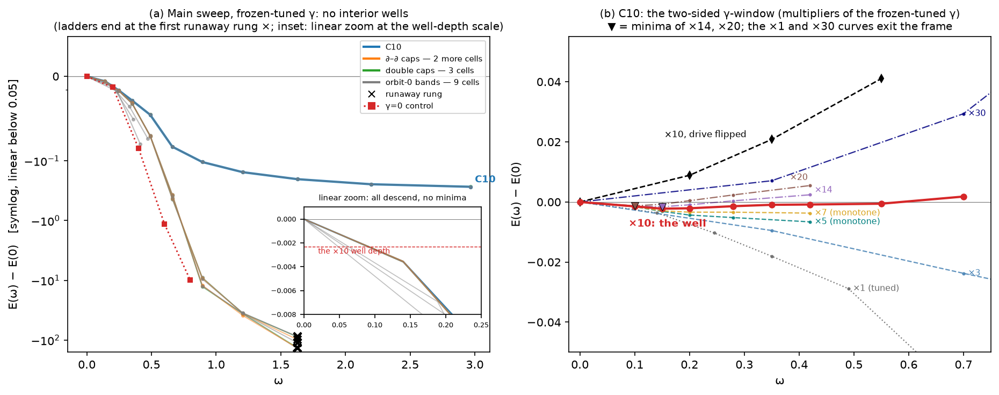
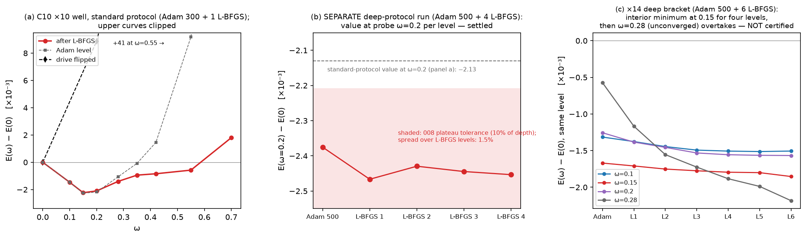

# Report 010 — The fundamental-reading clock grid: the u-decorated family, the Legendre filter, and fixed-depth candidate wells inside a two-sided γ-window

*2026-08-29 · Maciej J. Mikulski (AI-assisted, see [METHOD](../../METHOD.md)) ·
stage result of the extended-kinetic-term program; answers the program
question left open by reports 003/008: "the energy reading ticks, the
fundamental reading is unstable" — can a Lagrangian be written so the clock
is read directly from the canonical H?*

## Context and result

Report 008 established that the simplest quartic ticks as an *energy
functional* but its naive fundamental (Legendre) reading is unstable
(−γs² runaway); report 003's healthy C3 candidate was never lattice-tested.
This report systematically scans the Lagrangian grid

```math
L \;=\; \alpha\, I_i \;+\; \gamma\,(I_j)^2 \;-\; V(M),
\qquad \alpha\in\{-1,+1\},\ \gamma>0,
```

over a complete basis of quadratic invariants and measures which cells give
a canonical Hamiltonian with an interior clock well. Results, in order:

1. **The u-decorated family (the grid's alphabet).** All complete
   contractions of $F\otimes F$ with slots either $\eta$-paired or capped by
   the field-selected clock axis $u(M)$ (the object behind reports 002/004's
   metric $G=\eta+2uu$): 735 diagrams, 387 structural zeros, **21
   proportionality classes, rank 18 over $\mathbb{Q}$** (3 exact integer
   identities), identical on generic and realizable ensembles. The $\eta/G$
   grammar sits strictly inside: $I_1^{G\text{-deriv}}=I_1+4\,C10$,
   $I_1^{G\text{-matrix}}=I_1+4\,C16$ (exact); report 003's $B_k$ is the
   single diagram C10.
2. **The grid Legendre theorem.** Every family member splits by velocity
   degree, $I=s+m+k$, and exactly (proven symbolically on the full
   10-component $\dot M$):

   $$H=\alpha(-s_i+k_i)+\gamma\left(-s_j^2+m_j^2+2s_jk_j+4m_jk_j+3k_j^2\right)+V .$$

   Degree-0 terms flip (the $-\gamma s_j^2$ disease of 008 §4), degree-1
   terms cancel (and are real: $I_3$ has $m\not\equiv0$), the brake arrives
   tripled. On the frozen-tangent family
   $H=H_0+A\omega^2+B\omega^3+C\omega^4$ with $A<0,C>0$ giving exactly one
   interior minimum, below $H(0)$, for **every** sign of the chirality
   term $B$ — always on the Legendre caustic (002 §6).
3. **No exact pure-kinetic invariant exists — at the span level** (T1′,
   corrected in review round 1): the original check covered only the 21
   individual representatives; the reviewer exhibited
   $P=I_2-4I_5+I_6$ ($=C0-4C2+C5$) with $s(P)\equiv0$ in the span. The
   span-level computation (`static_kernel_exact.py`, exact over
   $\mathbb{Q}$) confirms the counterexample and settles the question: the
   static-part map on the 18-dimensional span has a **one-dimensional
   kernel** modulo the three family identities, spanned by exactly this
   $P$ — which is **purely linear in the velocity** ($k(P)\equiv0$ too),
   so its Legendre image vanishes identically (degree-1 terms cancel, E0).
   $\ker s=\ker(s,k)$ exactly: **no invariant with $s\equiv0$ and
   $k\not\equiv0$ exists anywhere in the span** — the kernel direction
   cannot supply an $\omega^4$ brake. It is not inert under *squaring*,
   however (review round 2): $\gamma P^2$ contributes $\gamma m_P^2$ to
   $H$, and mixtures $Q+\lambda P$ form one-parameter j-families — treated
   in result 5. The
   quantitative side stands: static leaks on the physical hedgehog orbit
   are suppressed with measured orders $\ell\propto m_d^{2}$ (single caps)
   and $m_d^{4}$ (double caps).
4. **Matrix-cap orbit zeros (exact theorem).** On the rank-1 canonical orbit
   $M=vv^\top$: $F_{ij}=w_jw_i^\top-w_iw_j^\top$ carries no $v$-component,
   the exact eigen-axis is $u=-\eta v$, and $w_i^\top\eta v=0$ — so **every
   diagram with at least one matrix cap vanishes identically on the orbit**
   (12 classes; confirmed over $\mathbb{Q}$), while the derivative-capped
   C9–C11 are the only capped survivors. Same mechanism as the
   $\varepsilon$-connection inertness of the 007 appendix.
5. **The ray-grid factorizes and then almost dies.** The statics filter
   forces $\alpha=-1$, $I_i=I_1$ — the record term, uniquely; 16 j-cells
   survive the analytic filters. The scan is over the 21 diagram rays; the
   span additionally contains, per cell, the one-parameter family
   $I_j=Q+\lambda P$ built from the gyroscopic kernel direction of result
   3 (review round 2). This family leaves $s_j$, $k_j$ — hence the F4 leak
   and the $\omega^4$ brake — unchanged and moves only the $\omega^2$ and
   $\omega^3$ coefficients: $A(\lambda)=A_Q+\gamma(2\lambda\langle
   m_Qm_P\rangle+\lambda^2\langle m_P^2\rangle)$, an upward parabola,
   and $B(\lambda)=B_Q+4\gamma\lambda\langle m_Pk_Q\rangle$; by the E3
   result the frozen-level well criterion stays $A(\lambda)<0$, $C>0$.
   Measured on the electron channel (`gyro_family_lattice.py`): the
   $s_P=k_P\equiv0$ identity holds on the lattice to $10^{-18}$,
   $\langle m_P^2\rangle=6.8\times10^{-7}$, and $\langle
   m_Qm_P\rangle=0$ for all four candidate cells (C10, C13, C16;
   $2.5\times10^{-11}$ for C19) — for them $\lambda=0$ is the A-optimal
   member of its family. Cells with $m_Q\neq0$ (C6–C8) admit a bounded
   improvement $\gamma\langle m_Qm_P\rangle^2/\langle m_P^2\rangle$;
   the $\lambda$-scan itself is not run (limitation). On the lattice (004 stack, $\eta$-relaxed electron
   profile regenerated to the committed oracle bit-for-bit), with $\gamma$
   tuned on the frozen profile: **no cell has an interior well.** The
   relaxing field evades the brake: the drive $-k_1\omega^2$ is linear in
   density, the brake $3\gamma k_j^2$ quadratic, and dilution pays — the
   naked Mexican-hat concavity of 007/008, now in the fundamental reading.
   The leak suppression that protects the statics (filter F4) also removes
   the convex template ($2\gamma s_jk_j\approx0$) that localized 008's
   energy-reading clock. The $\gamma=0$ control reproduces the record
   disease (monotone descent, dive at $\omega=0.8$).
6. **The γ-window is two-sided, and candidate wells live inside it — at
   fixed relaxation depth; the converged-level certification is open
   (scoped in review round 1).** Increasing $\gamma$ stops the evasion
   (ladders become monotone rising at $100\gamma$) before the
   $-\gamma s_j^2$ instability ignites at extreme $\gamma$
   ($2.6\times10^9$ for C9: caught by the guard). In between — at ×10, ×14
   and ×20 of the frozen-tuned value — four cells (C10 $=B_k$, the
   covariantized 003 mechanism; C19; C13; C16) show **interior,
   level-stable wells at the fixed standard protocol** (Adam 300 + one
   L-BFGS cycle) at $\omega^*\approx0.1$–$0.2$, depth
   $1.3$–$2.5\times10^{-3}$, localized (PR ≈ 30–50 sites), statics
   untouched; the drive-flip control kills the well and the cross-flip
   control is measured inert (working Hamiltonian
   $H=E_{\rm stat}+V-k_1\omega^2+3\gamma k_j^2\omega^4$, arm Q0). **The
   deep-protocol certification fails**: at ×14, six L-BFGS cycles migrate
   the minimum from the interior $\omega=0.15$ (stable through four
   levels) to the top sampled rung $\omega=0.28$ — still unconverged
   ($\lVert g\rVert_\infty=0.15$, per-level change $2.9\times10^{-4}$,
   comparable to the bracket gaps — `e5_deep_bracket.py`, fields
   persisted). The same drift was already visible at the ×10 upper bracket.
   The evasion mechanism of result 5 is therefore *slowed* inside the
   window, not removed: the wells are **protocol-depth-limited
   candidates**, not converged minima.

**Answer to the program question, scoped to the evidence:** the grid's
structure is settled exactly (results 1–5) and the γ-window with its two
measured boundaries is real; inside it the fundamental reading produces
reproducible, control-validated candidate wells at fixed relaxation depth —
but a converged-level interior minimum is **not yet demonstrated**: deeper
relaxation slowly re-opens the dilution channel even inside the window.
Whether any cell has a well at full convergence — or whether the
fundamental clock needs the missing convex template (a same-channel
drive–brake pairing outside this grid's single-invariant grammar) — is the
sharp open question this report leaves.

**The primary Lagrangian (the C10 cell), written out:**

```math
L=-\tfrac12\,F_{\mu\nu\alpha\beta}F^{\mu\nu\alpha\beta}-V(M)
+\gamma\left(u^\mu u^\rho F_{\mu\nu\alpha\beta}F_\rho{}^{\nu\alpha\beta}\right)^2 ,
```

everything except the last term being the model of record. The squared
bracket is the η-norm of the time-leg (electric) component of $F$ seen by
the field's own clock axis, $E_{\nu\alpha\beta}=u^\mu F_{\mu\nu\alpha\beta}$
— report 003's $B_k$ channel, up to normalization. Equivalently, with no
explicit $u$ at all (only the working metric $G=\eta+2uu$ the model already
uses):

```math
L=-\tfrac12 I_1-V+\tfrac{\gamma}{16}\left(I_1^{G\partial}-I_1\right)^2,
\qquad
I_1^{G\partial}\equiv G^{\mu\rho}G^{\nu\sigma}\eta^{\alpha\gamma}
\eta^{\beta\delta}F_{\mu\nu\alpha\beta}F_{\rho\sigma\gamma\delta},
```

the square of the *difference between the derivative-pair-G and
derivative-pair-η contractions of the same* $F^2$. The other three candidate
cells replace the squared invariant by: C16
$=u^\alpha u^\gamma F_{\mu\nu\alpha\beta}F^{\mu\nu}{}_\gamma{}^\beta$
(matrix-slot caps — the G-matrix decoration of 008,
$(I_1^{G\text{-mat}}-I_1)/4$); C13
$=u^\mu u^\gamma F_{\mu\nu\alpha\beta}F^{\nu\alpha}{}_\gamma{}^\beta$
(one derivative cap, one matrix cap); C19
$=u^\mu u^\alpha u^\rho u^\gamma F_{\mu\nu\alpha\beta}
F_\rho{}^\nu{}_\gamma{}^\beta$ (one cap on every antisymmetric pair — the
corner invisible to the η/G grammar).

*Notation used throughout:* **C0–C20** are the 21 proportionality classes of
the enumeration (§2; representatives with slot lists in
`results/u_family_float.json`; named map C3=I₁, C5=I₂, C4=I₃, C1=I₄, C2=I₅,
C0=I₆, C10=$B_k$). **F1–F5** are the pre-registered grid filters (working
repo prereg): F1 statics carried, F2 drive sign, F3 brake exists, **F4 the
static-leak suppression** (the Legendre image of $\gamma(I_j)^2$ contains
$-\gamma s_j^2$, unbounded below — 008 §4 — so $s_j$ must be suppressed;
"the F4 disease" = that instability igniting), F5 chirality bookkeeping.

## 1. Conventions and the family

Inherited from 001/005 (F, η, slots) and 002/004 ($u(M)$, $G$, spectral-gap
assumption). A diagram caps a subset of the 8 slots of $F\otimes F$ with
$u$ and $\eta$-pairs the rest; realizability of $(A_\mu,u)$ as independent
pointwise data is argued in the prereg (working repo). Two evaluation
routes everywhere: float64 einsum and exact Fraction arithmetic with
rational unit-timelike $u$; on the lattice the u-caps enter differentiably
through the working Lagrange Euclideanizer, $uu^\top=(G(M)-\eta)/2$
(deviation from the exact eigen-projector on the profile: max $2.0\times
10^{-4}$, mean $5.6\times10^{-5}$, recorded).

## 2. Enumeration and identities (E1)

`enumerate_u_family.py` + `verify_u_family_exact.py`: counts 735/387/21;
class sizes $4\times32,12\times16,2\times8,3\times4$; value rank 18 on both
ensembles (float SVD with dead-column guard; exact Gaussian elimination);
Jacobian rank 16 (two functional relations — the squares of the family's
two linear invariants $\varphi,\varphi_u$); the three integer identities and
the exact $\eta/G$ decompositions. The named map: $I_1..I_6=$ C3, C5, C4,
C1, C2, C0; $B_k=$ C10.

## 3. Velocity splits, statics filter, leaks, channels (E2)

`velocity_split.py` + `exact_split_checks.py` + `orbit_zeros_exact.py`
+ `static_kernel_exact.py`:
degree ≤ 2 exact for all classes; $m\equiv0$ exactly for C3 and C16 (the
aligned-derivative-pairing proposition); the span-level static kernel of
result 3 (ranks 18/17/17 for the generic, static and joint $(s,k)$ maps
over $\mathbb{Q}$); statics filter: only C3 $=I_1$ is
pointwise proportional to the record static density on the 3×3 sector (001's
$N_1$ nullspace identity re-measured zero); channel validation: the 001
clock counterexample reproduces $\omega^2(4,4,2,2,2,4)$ bit-for-bit, the 005
pseudoscalars vanish there exactly, and 008's η-vs-G sign flip is
reproduced ($k(I_1)=+4$, $k(I_1^{G\text{-mat}})=-4$). $P_{dm}$ dies at the
lattice level: $K_2=0$ exactly on the electron boost channel.

## 4. The lattice runs (E4)

004 stack verbatim (`lattice_grid_defs.py` runs `../004-lattice-clock/
lattice.py`); base profile regenerated from the committed seed (oracle
9.263660060 matched; relaxed $E_{\rm stat}=4.899587$ = 004's recorded
value); statics identity $2H^3\Sigma s_{C3}+V_4=e_{\rm static}^\eta$ exact
(0.0); record drive $D_1=0.18178$ on boost-x (0.079/0.086 on y/z),
matching 004's $K_1$ scale. Ladders: fresh-start rungs, Adam 300 + L-BFGS(80)
(two protocol levels recorded; auto-extension ×1.35 until the energy turns
up, runs away, or hits $\omega=3$), runaway guard.

Main sweep at frozen-tuned γ: 0/15 wells — creep-to-cap (C10, C13, C16,
C19: depth only −0.27 at $\omega=3$ — the brake almost holds) vs dive at
$\omega\approx1.2$–1.6 (depth −35, PR → 300+) vs early dive (C6–C8, the
largest-leak band, $\omega\approx0.7$).

γ-arm: ×100/×10⁴ monotone rising for C10/C19 (evasion stopped, drive dead);
C9 ×10⁴ ignites the $-\gamma s^2$ instability (guard-caught). Bisection:
C10 ×3 creeps, **×10 shows a fixed-depth interior minimum, ×30 is
monotone rising** — with the confirmation arm: fine
rungs sharpen the well to $\omega^*\approx0.2$
($E(0)>E(0.2)<E(0.28)$, level-stable, depth $-2.1\times10^{-3}$), and
C19/C13/C16 at their ×10 show nearly identical fixed-depth wells — consistent with
the mechanism: the well is carved by the shared record drive against a
normalized brake; the j-choice sets the brake scale and the window position.

Controls: γ=0 (record disease), drive-flip (well killed — the well is the
drive's physics), cross-flip (inert — the cross terms are measured
negligible at the suppressed leaks, as the theorem predicts).





Deep-protocol probes and the finer window map (`e5_arms.py`,
`e5_deep_bracket.py`):

- **Depth plateau (008 criterion): settled.** Adam + four L-BFGS cycles at
  $\omega\in\{0,0.2,0.28\}$: the ×10 well depth per level is
  $(-2.38,-2.47,-2.43,-2.44,-2.45)\times10^{-3}$ — final change
  $9\times10^{-6}$, under 0.4% of the depth.
- **Window map:** ×5 still descends (min at the top rung), ×7 is the
  boundary (flat, level-unstable), **×10: fixed-depth interior minimum at
  $\omega^*\approx0.15$**
  (with the extra fine rungs: $E(0.1)>E(0.15)<E(0.2)$), **×14 at
  $\omega^*=0.15$** (depth $-1.6\times10^{-3}$, level-stable), **×20 at
  $\omega^*=0.1$** ($-1.3\times10^{-3}$, level-stable), ×30 monotone
  rising. $\omega^*(\gamma)$ decreases across the window, as the frozen
  formula $\omega^{*2}\propto\gamma^{-1}$ predicts qualitatively.
- **The deep-bracket run at ×14 (review round 1) settles the position
  question negatively for now**: with Adam 500 + six L-BFGS cycles on
  rungs $\{0,0.1,0.15,0.2,0.28\}$ (per-level energies and gradients
  recorded, final fields persisted as `results/deep14_om*.npz`), the
  minimum sits at the interior $\omega=0.15$ through four levels and then
  migrates to the top rung 0.28, which is still descending
  ($\lVert g\rVert_\infty=0.15$). The ×10 upper-bracket reversal seen
  earlier is the same drift. Conclusion: within the window the evasion is
  slowed, not removed — the wells are fixed-depth candidates and the
  converged-level existence question is open.

## 5. What this report does not show

- **No dynamics**: the wells sit on the Legendre caustic by theorem (E3);
  branched-Hamiltonian evolution and stability against perturbations are
  not constructed (002 §6 / 003 caveats carry over verbatim).
- **Frozen clock tangent** (004/007/008 protocol); one generator (boost-x);
  $32^3$ box, one spacing, no continuum extrapolation.
- **The headline wells are fixed-depth candidates.** The sweep protocol is
  Adam 300 + one L-BFGS cycle (two levels); deep-protocol runs exist for
  ×10 (depth plateaus at a probe point, upper bracket reverses) and ×14
  (six cycles: interior minimum for four levels, then migration to the
  still-descending top rung) — no converged interior minimum is
  demonstrated anywhere yet. Deep-bracket rung fields are persisted; an
  independent route-2 energy verification on them remains open.
- The γ-window is mapped coarsely (×3/×5/×7/×10/×14/×20/×30/×100); no
  claim about its exact boundaries or their scaling with the leak order.
- $\omega^*$ is rung-resolved (0.1–0.2 across the window; no continuum
  minimum between the sampled rungs); depths are shallow
  ($1.3$–$2.5\times10^{-3}$ on $E_{\rm stat}\approx4.9$).
- The u-caps on the lattice are the working Lagrange realization of
  $uu^\top$ (exact on-spectrum; $2\times10^{-4}$ off); the exact-eigen
  variant is not run.
- The j-scan runs over the 21 diagram rays; the span's gyroscopic
  $\lambda$-families (result 5) are characterized analytically and their
  lattice coefficients measured, but no $\lambda\neq0$ ladder is run.
- Scope pins of the family: F stays the η-commutator; no ε-decorated
  diagrams (the three 005 pseudoscalars ride along and die); no linear-in-F
  terms.

## 6. Author-gated physics choices

- The physical reading (fundamental vs energy) stays author-gated; this
  report *adds* the measured fact that the fundamental reading has interior
  wells in a bounded γ-window.
- The window position ($\gamma$ anchoring) and the drive channel (boost-x)
  tie into scale anchoring ($\omega^*=mc^2/\hbar$), unresolved as before.
- Whether the article Lagrangian should adopt the C10 cell (the covariant
  $B_k$ quartic — 003's mechanism, now lattice-proven) is the author's
  call; C13/C16/C19 are measured equivalents at this protocol depth.

## Reproduction

```bash
pip install sympy torch numpy scipy matplotlib   # Python >= 3.12
bash reproduce.sh          # CPU: E0-E3 exact suites (~10 min)
                           # GPU (optional): lattice legs, hours
```

`reproduce.sh` asserts the structural claims (counts, ranks, identities,
theorem checks, orbit zeros, split guards) on CPU; with a CUDA device and
`M5_RUN_LATTICE=1` it regenerates the base profile against the 004 oracle
and reruns the lattice legs (`M5_FRESH=1` ignores the cached base profile
and resumable ladder state for a fresh reproduction; hours). Committed JSONs
under `results/` carry every number quoted above; figures regenerate from
the committed JSONs via `make_figures.py`.

## Equation-to-artifact map

| object | artifact |
|---|---|
| grid Legendre theorem (full $\dot M$) | `legendre_theorem_check.py` → `results/legendre_theorem_check.json` |
| 735 diagrams, classes, ranks, named map | `enumerate_u_family.py`, `verify_u_family_exact.py` → `results/u_family_float.json`, `results/u_family_exact.json` |
| velocity splits, statics filter, leaks, channels | `velocity_split.py` → `results/velocity_split.json`; `exact_split_checks.py` |
| reduced quartic well + caustic (E3) | `e3_reduced_legendre.py` → `results/e3_reduced_legendre.json` |
| matrix-cap orbit zeros (exact) | `orbit_zeros_exact.py` → `results/orbit_zeros_exact.json` |
| span-level static kernel (T1′) | `static_kernel_exact.py` → `results/static_kernel_exact.json` |
| gyroscopic λ-family coefficients on the lattice | `gyro_family_lattice.py` → `results/gyro_family_lattice.json` |
| artifact-only headline assertions | `verify_artifacts.py` |
| deep-bracket demonstration (×14) | `e5_deep_bracket.py` → `results/e5_deep_bracket.json`, `results/deep14_om*.npz` |
| lattice port + validations | `lattice_grid_defs.py` (gate: 004 oracle; statics identity; U-vs-eigen) |
| per-cell integrals, γ choice, ranking | `pre_e4.py` → `results/pre_e4.json` |
| ladders, controls, extensions | `e4_ladders.py` → `results/e4_cells.json` |
| γ-robustness + bisection | `e4_gamma_arm.py` → `results/e4_gamma_arm.json`, `results/e4_confirm.json` |
| deep-well plateau + window map | `e5_arms.py` → `results/e5_arms.json` |
| base profile (regenerated, committed) | `results/M_eta_base.npz` |
| figures | `make_figures.py` → `results/fig_*.png` |

## Provenance

- Conventions and prior results: reports 001–008 (this repo); equations of
  record and the Q0/Q1 quartic prereg: working repo `duda-particle-model`
  (`notes/prereg_quartic.md`, `notes/equations_of_record.md`).
- Plan and prereg for this scan (with the deviations register):
  working repo `duda-particle-model`, `notes/plan_hamiltonian_grid.md`,
  `notes/prereg_hamiltonian_grid.md`, `hamiltonian_grid/NOTES.md`
  (commits `eddc4dd`..`c092de1`, 2026-08-29).
- The C2/C3 Legendre dichotomy: report 003; the −γs² runaway measurement:
  report 008 §4; the concavity/dilution mechanism: reports 007/008.
