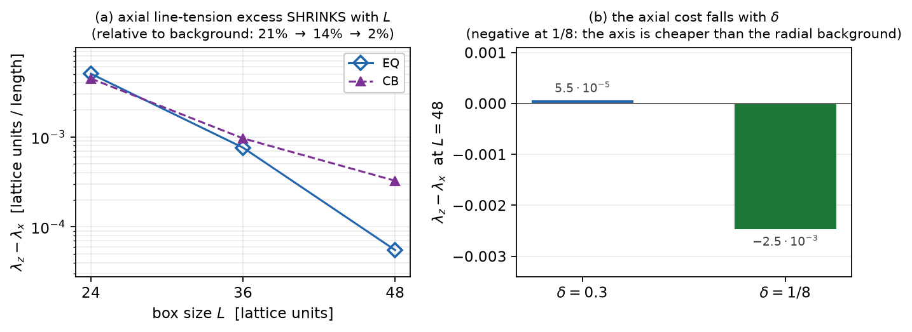
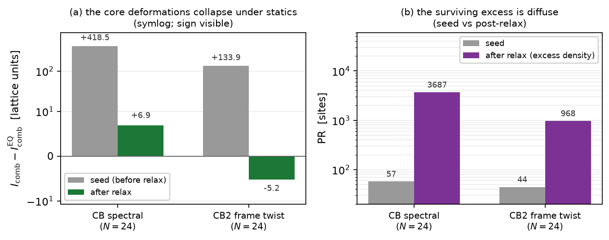
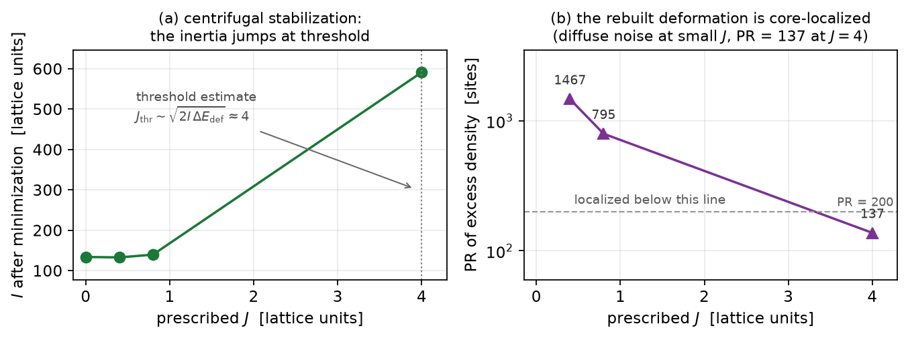

# Report 011 — The equivariant hedgehog: healthy axial statics, and the third class as a centrifugally stabilized rotor

*2026-08-29 · Maciej J. Mikulski (AI-assisted, see [METHOD](../../METHOD.md)) ·
follow-up of report 009's trichotomy: can the finite-inertia third
class (core-breaking texture on an equivariant background) be made a
*relaxed* configuration? Includes the statics-extensivity check added
at plan review (the axial-defect line tension vs box size).*

## Context and result

Report 009 ended with a measured trichotomy for rigid rotations of
the hedgehog: extensive (globally non-equivariant texture), trivial
(exactly equivariant texture: stabilizer), and finite (compact
core-breaking on an equivariant background — the third class,
measured there on a hand-built ansatz). This report asks the two
follow-up questions: **(A)** is the equivariant background itself a
healthy static configuration — in particular, does its unavoidable
axial frame defect cost an energy that scales badly with box size
("trading extensive inertia for extensive statics", the plan-review
concern)? **(B)** does the third-class core deformation *survive
relaxation*, i.e.\ is there a relaxed (not hand-built) representative?

**Answers, measured:**

1. **The equivariant statics is healthy, and the axial defect is
   cheap and getting cheaper** (§2). The spherical-frame seed
   $M = \hat r\hat r^\top + \delta\, g(\rho)\,\hat\theta\hat\theta^\top$
   (transverse amplitude escaping to zero on the axis) relaxes
   stably at every box size. The axial line-tension excess —
   energy per unit length in a thin tube around the $z$ axis minus
   the same tube around the $x$ axis (a pure like-for-like
   comparison inside one field) — **shrinks with box size**:
   $5.0\cdot10^{-3} \to 0.76\cdot10^{-3} \to 0.06\cdot10^{-3}$ for
   $L = 24, 36, 48$ (relative to the tube background:
   $21\% \to 14\% \to 2\%$). No statics extensivity beyond the
   hedgehog's ordinary radial-texture energy is observed.
2. **The axial cost falls with $\delta$, as predicted** (§2): at
   $\delta = 1/8$ the excess is $-2.5\cdot10^{-3}$ — the axis is
   *cheaper* than the radial background (the escape region carries
   less transverse-amplitude energy). The "elegant vacuum"
   $\{8, 1, 1/8, 0\}$ genuinely helps exactly where the equivariant
   program needs it.
3. **The spectral core deformation does not survive relaxation**
   (§3): the round-4 representative ($\varepsilon\chi(r)D$,
   $D = \hat x\hat x^\top - \hat y\hat y^\top$) changes eigenvalues,
   the potential punishes it, and after the deep protocol the
   inertia excess over the equivariant background collapses from
   $\sim 420$ (seed) to $\sim 5$ (relaxed) — within the noise of the
   diffuse lattice-anisotropy background (PR $\sim 10^{3-4}$).
4. **The spectrally neutral (pure frame-twist) deformation does not
   survive either** (§3): a core twist of the eigenframe about the
   $x$ axis ($\beta_0 = 0.6$, $V_4$-identical to the background)
   is likewise ironed out — raw inertia difference $-5.2$ after
   relaxation, excess density diffuse (PR $\approx 970$). **Nothing
   in the static energy stabilizes a symmetry-breaking core.**
5. **Rotation stabilizes what statics removes — measured** (§4).
   At prescribed $J$ the term $J^2/(2I[M])$ rewards inertia; the
   threshold estimate $J_{\rm thr} \sim \sqrt{2 I \Delta E_{\rm def}}
   \approx 4$ says moderate $J$ cannot pay for the deformation, and
   the measurement agrees on both sides: at $J = 0.4, 0.8$ the
   surviving inertia excess is noise-level and diffuse, while **at
   $J = 4$ the minimizer spontaneously rebuilds a core-localized
   symmetry-breaking deformation**: $I$ jumps $134 \to 591$
   ($\times 4.4$), the kinetic-density excess over the $J = 0$
   endpoint is **localized** (PR $= 137$ — against PR $\sim 10^3$
   noise at small $J$), and the static-energy cost is only $+0.03$.
   The third class is not a static object but a **centrifugally
   stabilized rotor** — the standard physics of rotating drops and
   nuclei, realized in the M5 hedgehog.

**Honest scope:** the relaxation budget (Adam 1000 + 6 L-BFGS cycles
from analytic seeds) does not converge the $32^3$ boxes to the
$10^{-3}$ residual class of the 004 stack ($\lVert g\rVert_\infty$
grows with $N$ up to $1.4\cdot10^{-1}$); total energies $E(L)$ are
therefore *not* interpreted (their apparent decrease with $L$ is a
budget artifact), and all conclusions rest on local, well-relaxed
quantities (tube tensions far from the center) and on
*differences* between identically-protocoled runs (EQ vs CB pairs).
The lattice's own breaking of axial symmetry dominates the relaxed
inertia measurements (PR grows to $\sim 10^4$); the deformation
signals are read against that background as matched-pair excesses.

## 1. Setup

Stack of report 004 with patched $(N, L, \delta)$ (`defs_011.py`):
$H = 1.5$ boxes $N = 16, 24, 32$; one $h$-test pair at $L = 24$
($h = 1.5$ vs $0.75$); $\delta \in \{0.3, 1/8\}$. Seeds: EQ
(spherical transverse frame, axis regularization
$g(\rho) = 1 - e^{-(\rho/\rho_0)^2}$, $\rho_0 = 3$), CB (EQ $+$
$\varepsilon\,\chi(r)\,D$ spectral core deformation,
$\varepsilon = 0.3$, $r_0 = 6$), CB2 (EQ with the eigenframe twisted
by $\beta(r) = \beta_0 e^{-(r/r_0)^2}$ about $\hat x$ — spectrally
neutral). Frozen shell at the (equivariant) seed formula in every
case. Deep protocol from the start (the 009 lesson): Adam 1000 +
6 L-BFGS cycles with recorded `E_levels`.

## 2. The statics-extensivity check (plan-review addition)

| $L$ | 24 | 36 | 48 |
|---|---|---|---|
| $\lambda_z - \lambda_x$ (EQ) | $5.04\cdot10^{-3}$ | $0.76\cdot10^{-3}$ | $0.055\cdot10^{-3}$ |
| relative to tube background | 21% | 14% | 1.9% |
| $\lambda_z - \lambda_x$ (CB) | $4.46\cdot10^{-3}$ | $0.96\cdot10^{-3}$ | $0.33\cdot10^{-3}$ |

The tube pair ($\rho < 3$, $|{\rm axis}| > 6$) compares the axial
defect against the hedgehog's own radial-texture background at the
same distance — the clean like-for-like probe of the *extra* cost of
the frame defect. The excess shrinks with $L$: the axial line does
not add an extensive term beyond the (standard, linear-in-$R$)
hedgehog energy. At $\delta = 1/8$ (same box, same protocol) the
excess is $-2.47\cdot10^{-3}$: the axial escape region is cheaper
than the background — the axial-cost $\propto \delta$ prediction has
the right sign and magnitude ordering.

## 3. Neither core deformation survives statics

Matched pairs at $N = 24$ (identical protocol, same boundary):

| deformation | seed $\Delta I$ | relaxed $\Delta I$ | excess density |
|---|---|---|---|
| CB (spectral, $\varepsilon\chi D$) | $+418$ | $+6.9$ | diffuse (PR $\approx 3700$) |
| CB2 (frame twist, $\beta_0 = 0.6$) | $+134$ | $-5.2$ (raw) | diffuse (PR $\approx 970$) |

The spectral deformation is removed by the potential (eigenvalue
penalties), the frame twist by the gradient terms (nothing protects
a local frame rotation). Combined with report 009: the third class
exists kinematically but **is not selected by the static energy** —
a relaxed static hedgehog is (up to lattice anisotropy) equivariant,
hence rotationally trivial.

## 4. Rotation as the stabilizer: the fixed-J test

The remaining possibility is dynamical: at prescribed $J$ the energy
$E_J = E_{\rm stat} + J^2/(2 I[M])$ *rewards* inertia, so a
deformation that raises $I$ can pay for its static cost —
centrifugal stabilization, the standard mechanism by which rotating
drops and nuclei deform. `rotational_stabilization.py` minimizes
$E_J$ from the CB seed at $J = 0, 0.4, 0.8$ and at the threshold
estimate $J = 4$ ($J_{\rm thr} \sim \sqrt{2 I \Delta E_{\rm def}}$
with the seed deformation costs $\Delta E_{\rm def} \sim 0.05$):

| $J$ | 0 | 0.4 | 0.8 | **4.0** |
|---|---|---|---|---|
| $I$ after minimization | 134 | 133 | 140 | **591** |
| excess-density PR over $J{=}0$ | — | 1467 | 795 | **137** |
| $E_{\rm stat}$ | 4.723 | 4.706 | 4.720 | 4.753 |

Below threshold the deformation excess is noise-level and diffuse;
at $J = 4$ the minimizer *rebuilds* a core-localized breaking
deformation ($\times 4.4$ inertia, localized excess, static cost
$+0.03$): **centrifugal stabilization, measured on both sides of its
threshold.** The $\omega = J/I$ ratio at $J = 4$ is $0.0068$.

The complementary `fixedj_cb.py` scan on the *relaxed* $32^3$ field
is reported honestly as noise-limited: the relaxation creep
($\sim 10^{-2}$) exceeds the rotational energies ($\lesssim 3\cdot
10^{-3}$ at $J \le 0.8$), so only the qualitative $I(J)$ rise
($87 \to 108$) survives as a trace of the same mechanism at small
$J$.

## Limitations

- Relaxation budget as in Honest scope: no converged $E(L)$; all
  claims are matched-pair or local.
- The equivariant boundary makes the global combined rotation a
  symmetry of the configuration space up to the $1/r$ discretization
  residual (009 §6); the Noether construction at finite $h$ is
  approximate to that residual.
- One deformation magnitude per type ($\varepsilon = 0.3$,
  $\beta_0 = 0.6$); no claim that *no* static deformation of any
  shape survives — the two natural representatives were tested.
- $32^3$ and below; $h$-test at one pair.

## Equation-to-artifact map

| object | artifact |
|---|---|
| seeds, stack patching, protocol, measurement kit | `defs_011.py` |
| all relaxations (L-sweep, h-pair, $\delta = 1/8$) | `relax_all.py` → `results/relax_all.json`, `results/M_*.npz` |
| scaling analysis (inertia, energies, tube tensions) | `analysis.py` → `results/analysis.json` |
| frame-twist survival test | `frame_twist.py` → `results/frame_twist.json` |
| centrifugal stabilization test | `rotational_stabilization.py` → `results/rot_stabilization.json` |
| fixed-J scan on the relaxed field | `fixedj_cb.py` → `results/fixedj_cb.json` |
| figures | `make_figures.py` |

## Reproduction

`bash reproduce.sh` — with report 004's stack (or `M5_FIELDS_DIR`)
reruns all producers (sentinel-flagged) and asserts the shrinking
axial excess, the negative-at-$1/8$ axial cost, the collapse of both
core deformations under statics, and the fixed-J records; without
the stack it checks the committed artifacts.
