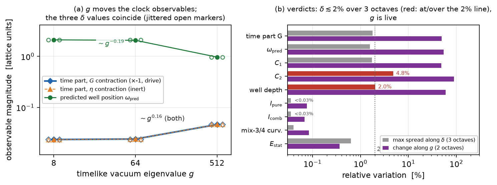
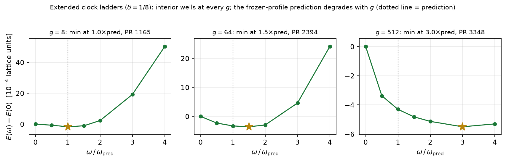

# Report 012 — Scaling toward the proposed vacuum hierarchy: δ is flat at the target scale; g is live and potential-variant-sensitive

*2026-08-30 · Maciej J. Mikulski (AI-assisted, see [METHOD](../../METHOD.md)) ·
pre-registered measurement (PREREG.md, committed in the working
repository before the run) of how the model's observables scale with
the two vacuum eigenvalues that the author's proposal places ten
orders of magnitude away from every simulation so far.*

## Why this measurement exists

The model's vacuum is the diagonal matrix
$M_{\rm vac} = \mathrm{diag}(-g, 1, \delta, 0)$: a large timelike
eigenvalue $g$ (written $\sigma$ in some earlier reports), a spatial
axis of strength $1$, a weaker spatial axis $\delta$, and a zero
axis. The model author's proposal is a symmetric hierarchy
$g \sim 10^{10}$, $\delta \sim 10^{-10}$; every lattice result so
far — in this repository and in the two companion programs — was
measured at $g = 8$ with $\delta = 0.3$ or $1/8$, i.e.\ ten orders
of magnitude away on both axes. A measured sign flip of one
transverse observable between $\delta = 0.3$ and $\delta = 1/8$
(report 011) showed that "the values are close to 1, so hopefully
the physics is the same" is not an argument. This report replaces the
hope with measured scaling exponents: a $3\times3$ grid
$\delta \in \{1/8, 1/64, 1/512\}$ $\times$ $g \in \{8, 64, 512\}$
(factor-8 steps; the diagonal $\delta = 1/g$ is the author's
one-parameter family), with per-observable verdicts on which
quantities may be extrapolated toward the hierarchy and which may
not.

## Notation (self-contained)

$M(x)$ is the model's symmetric $4\times4$ field on a $32^3$ lattice
(box 48, spacing 1.5). $F_{\mu\nu} = \partial_\mu M\,\eta\,
\partial_\nu M - \partial_\nu M\,\eta\,\partial_\mu M$ is the field
strength; $I_1$ is its full square. $G$ is the working metric: the
field-dependent positive metric that repairs the static sector (it
flips the sign of the timelike eigendirection of $M\eta$); a
"$G$ contraction" uses $G$ on the matrix slots of $I_1$, an
"$\eta$ contraction" uses raw $\eta$. The potential $V$ pins the
traces of powers of $M\eta$ to their vacuum targets
$C_p = g^p + 1 + \delta^p$; this report uses the **relative variant**

$$V_{\rm rel} \;=\; \sum_{p=1}^{4}\left(\frac{\mathrm{tr}\,(M\eta)^p}{C_p} - 1\right)^{2},$$

which is dimensionless and avoids the catastrophic cancellation the
absolute variant would suffer at $g = 512$ (where it squares numbers
of order $10^{21}$); the potential weight is unchanged. A clock
configuration is $\dot M = \omega\, a_0$ with $a_0$ the frozen boost
conjugation tangent; on it $I_1$ splits into a static density and a
kinetic density $k$, and the frozen-profile prediction of the
energy-reading clock-well position is $\omega_{\rm pred} =
\sqrt{C_1/C_2}$ with $C_1 = \int i_1^{\rm stat} k_1$, $C_2 = \int
k_1^2$. "Time part" of a contraction means the net kinetic
contribution of the time pairs at unit frequency: negative = an
energetic drive toward oscillation, positive = inert. $I_{\rm pure}$
and $I_{\rm comb}$ are the rotational-channel inertias (internal
rotation generator, and combined space--internal generator,
interior-masked as in report 011). PR is the participation ratio of
a density — its effective site count. Per grid point the field is
relaxed from the standard hedgehog seed (Adam 1000 + four L-BFGS
cycles with recorded per-level energies).

## Results

1. **δ is a flat direction all the way to $10^{-9}$ — one order of
   magnitude from the proposed target.** Along $\delta: 1/8 \to
   1/64 \to 1/512$ at fixed $g$ the maximal relative spread is
   below $2\%$ for every headline observable (rotational inertias
   at $0.03\%$; edge cases $C_2$ at $4.8\%$ and the well depth at
   $2.0\%$). Review round 1 correctly objected that three sampled
   octaves cannot bound an intermediate crossover scale; the
   response is measurement, not argument: further points at
   $\delta = 10^{-6}$ and $10^{-9}$ (`fix_round1.py`) and — after
   round 2 correctly noted that $10^{-9}$ still leaves one decade of
   extrapolation — **at the proposed target itself and below,
   $\delta = 10^{-10}$ and $10^{-11}$** (`fix_round2.py`; every
   quantity remains exactly representable in float64), all reproduce
   the drive and $\omega_{\rm pred}$ to four significant digits of
   the $\delta = 1/8$ values. For the sampled observables the
   $\delta = 10^{-10}$ statement is a **measurement at the target**,
   with no extrapolation left. (The
   transverse-sector observables of report 011, where the $\delta$
   sign flip lives, are deliberately *not* in this grid; they remain
   regime-sensitive.)
2. **The two time-part signs are stable across the whole grid.** The
   $G$-contraction time part is negative (drive) and the
   $\eta$-contraction time part is positive (inert) at all nine
   points — the central qualitative result of report 008 (the clock
   requires the repaired metric) is robust over two octaves in $g$
   and three in $\delta$. The drive magnitude *grows* with $g$
   (measured slope $\sim g^{0.16}$ over the sampled range).
3. **g is the live direction — and its trends are
   potential-variant-sensitive (review round 1's central objection,
   confirmed by the control row).** The grid's relative-potential
   variant rescales the effective pinning stiffness as $g^{-2p}$, so
   its $g$-trends are not automatically those of the original
   fixed-weight theory. The control rows measure the difference — and,
   after round 2 objected that the first control profiles were not
   demonstrated stationary, they were recomputed under an
   **observable-level stopping rule** (`fix_round2.py`: both the
   drive and $\omega_{\rm pred}$ must drift $< 1\%$ over four
   consecutive cycles; both rows stop on the criterion, with full
   trajectories committed): in the **original theory** the drive
   grows with $g$ ($-0.2196 \to -0.2534$ for $g = 8 \to 64$) and
   $\omega_{\rm pred}$ **rises** ($0.444 \to 0.678$), opposite to
   the relative variant's fall ($\sim g^{-0.19}$); the full sign
   structure is measured on the same converged profiles (the
   $\eta$-contraction time part is **positive** — inert — in the
   original theory too: $+0.2195, +0.2534$). What transfers between
   the variants is the sign structure and the direction of the
   drive's growth; the individual slopes belong to their variant,
   and the original-theory comparison uses only $g = 8, 64$. The
   original-theory row is quantitative only up to $g = 64$: at
   $g = 512$ the absolute-potential relaxation does not converge
   ($\lVert g\rVert_\infty = 80$) and the pinning signal sits at
   $13\,\mathrm{ulp}$ of $C_4$ — the cancellation the relative
   variant was introduced to avoid, now measured rather than
   assumed. Within the relative variant the measured slopes at
   $\delta = 1/8$ are: time parts $\sim g^{+0.16}$,
   $\omega_{\rm pred} \sim g^{-0.19}$, $C_2 \sim g^{+0.53}$, well
   depth $\sim g^{+0.22}$; inertias, mixing curvature and static
   energy $g$-flat. Three points per axis: coarse trends, sign
   patterns are the claim.
4. **The clock well exists at every sampled g, but the
   frozen-profile prediction degrades.** Seven-rung extended ladders
   at $\delta = 1/8$ (rungs up to $4\times\omega_{\rm pred}$,
   quartic coupling from the 5\% statics-deformation budget) find an
   interior minimum at every $g$; its position drifts from
   $1.0\times$ the prediction at $g = 8$ to $1.5\times$ at $g = 64$
   and $3.0\times$ at $g = 512$. Extrapolating the *position* of
   the clock well to the hierarchy therefore requires the relaxed
   (not frozen-profile) theory of the well.
5. **The localization of the ticking is not measured by this grid —
   a protocol limitation stated plainly.** The ticking density's PR
   at the well is large at *every* $g$ **including the $g = 8$
   control** (1165 at $g = 8$, vs $\sim100$ sites for the same
   mechanism on the fully polished stack of report 008). The
   delocalization is therefore attributable to this grid's protocol
   (the relative-potential variant and the short from-seed
   relaxation change the static profile and weaken the convex
   template), not to $g$. Whether localization survives large $g$
   is an open question for a polished-stack study; this grid can
   only say that it does not *measure* localization.
6. **The relative-potential variant is numerically clean — by the
   honest diagnostic.** Review round 1 caught a bug in the original
   check (the field was rounded to float32 but the energy was still
   evaluated in float64, measuring input quantization only). The
   corrected test (`fix_round1.py`) re-evaluates the entire static
   energy — derivatives, commutators, the working metric, the
   potential, the sums — in float32 numpy and compares with float64:
   the true degradation is $\le 2\cdot10^{-7}$, i.e.\ at the
   float32 machine-epsilon level, with no catastrophic cancellation,
   at every probed point including $g = 512$. (The absolute variant
   at $g = 512$ is *not* clean: signal at $13$ ulp — result 3.)

**Answer to the regime question:** the missing ten orders of
magnitude split into two very different halves. The $\delta$ half is
*measured at the target*: flatness holds at $\delta = 10^{-10}$ (the
proposal itself) and $10^{-11}$, identical to $\delta = 1/8$ to four
significant digits (transverse-sector quantities excepted). The
$g$ half is *live and harder than it looked*: the trends are
potential-variant-sensitive, the original theory is measured only to
$g = 64$ (beyond which its pinning is ill-conditioned — the
motivation for the relative variant, now documented), and any
statement at $g \sim 10^{10}$ requires either an analytic
$g$-theory or a reformulation that stays conditioned at large $g$
(the relative variant is one, but it is a different theory and its
slopes are its own). What does transfer across variants and the
whole sampled region: the sign structure — the $G$-contraction
drives, the $\eta$-contraction is inert, and the drive grows with
$g$ in both variants. No sign of any measured quantity flips
anywhere.

## Limitations

- Three points per axis: slopes are coarse trends (their signs and
  the flat/live split are the robust content).
- The grid protocol differs from the polished stack of reports
  004–008 (relative potential; four-cycle from-seed relaxation):
  absolute values — notably $\omega_{\rm pred} \approx 2.1$ at
  $g = 8$ vs $0.33$ on the polished stack — are internally
  consistent across the grid but not comparable across protocols;
  the grid measures *scaling*, not absolute physics.
- Localization is not measured (result 5); the transverse sector
  (report 011's $\lambda$-observables) is deliberately excluded.
- Ladder rungs are coarse ($0.5\times\omega_{\rm pred}$ steps) and
  singly-relaxed (Adam 500 + one L-BFGS cycle per rung); the deep
  convergence battery of reports 008–011 was not run here.

## Equation-to-artifact map

| object | artifact |
|---|---|
| pre-registration (before the run) | `PREREG.md` (working-repo commit 9648b14) |
| the 3×3 grid: all observables per point | `grid_scan.py` → `results/grid.json` |
| extended ladders at δ = 1/8, all g | `extended_ladders.py` → `results/extended_ladders_all.json` |
| per-observable verdicts, slopes, sign stability | `analysis.py` → `results/scaling_verdicts.json` |
| persisted relaxed fields (δ = 1/8 row) | `results/M_d0.125000_g*.npz` |
| round-1 fixes: absolute-potential control row, δ = 10⁻⁶/10⁻⁹ extension, true dual-precision test, cancellation diagnostic | `fix_round1.py` → `results/fix_round1.json` |
| round-2 fixes: observable-converged absolute rows (g = 8, 64) with full sign structure; δ = 10⁻¹⁰/10⁻¹¹ at-target points | `fix_round2.py` → `results/fix_round2.json` |
| figures | `make_figures.py` |

## Reproduction

`bash reproduce.sh` — with report 004's stack available (the seed the
producers load) it reruns the grid, the ladders, the analysis and the
figures (sentinel-flagged), and asserts: δ-flatness of the headline
observables, both time-part signs at all nine points, the g-slope
sign pattern, interior ladder minima at every g with the measured
position drift, the g = 8 PR control, and the precision diagnostic;
without the stack it checks the committed artifacts.
