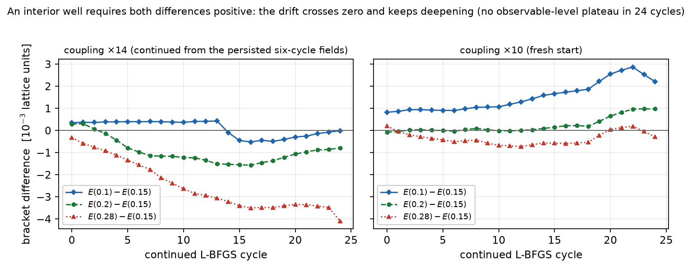

# Report 013 — C10's candidate wells at ×10 and ×14 do not certify within a 24-cycle continuation

*2026-08-31 · Maciej J. Mikulski (AI-assisted, see [METHOD](../../METHOD.md)) ·
a budget-bounded negative on the deepest-probed corner of report
010's open question: the C10 candidate wells at couplings ×10 and
×14 do not certify under a 24-cycle observable-level continuation,
and the drift shows no sign of saturating. The grammar-wide
existence question stays open (scope in the Conclusion).*

## Notation (self-contained)

Report 010 scans fundamental-reading Lagrangians
L = −(1/2) I₁ + γ (I_j)² − V(M) on the report-004 lattice stack
(32³ hedgehog, frozen boost clock tangent a₀, clock configurations
Ṁ = ω a₀) and finds, inside a two-sided window of the quartic
coupling γ, interior minima of the canonical Hamiltonian
E_cell(M; ω) at fixed relaxation depth for four invariant cells; its
deepest probe (six L-BFGS cycles at coupling ×14 of the frozen-tuned
value, cell C10 — the square of the time-leg of F along the field's
clock axis) saw the interior minimum at ω = 0.15 hold for four
levels and then migrate to the still-descending top rung. "Bracket
differences" below are d(ω) = E(ω) − E(0.15) on the rung set
{0, 0.1, 0.15, 0.2, 0.28}: an interior well at 0.15 requires
d(0.1) > 0 and d(0.2) > 0 (and d(0.28) > 0 for the wide bracket).
The observable-level stopping rule (the lesson of reports 011–012)
demands every d drift by < 5% of its magnitude over four consecutive
cycles before the run may stop.

## What was run

`continue_window.py`, functional imported verbatim from report 010's
committed stack:

- **×14, continued**: the five persisted sixth-cycle rung fields of
  report 010 (`deep14_om*.npz`, independently route-2-verified in the
  010 appendix) continued for 24 further L-BFGS(150) cycles per rung
  (30 total), energies and gradients recorded every cycle;
- **×10, fresh**: the same rung set from the base profile
  (Adam 500 + up to 24 cycles), same records;
- final fields persisted (`win_*_om*.npz`).

## Result: no observable-level plateau; both couplings lose the upper bracket

| arm | final d(0.1) | final d(0.2) | final d(0.28) | minimum | stop rule met |
|---|---|---|---|---|---|
| ×14 (+24 cycles) | −1.3·10⁻⁵ | −7.9·10⁻⁴ | −4.1·10⁻³ | top rung 0.28 | no |
| ×10 (24 cycles) | +2.2·10⁻³ | +9.7·10⁻⁴ | −2.9·10⁻⁴ | top rung 0.28 | no |

At ×14 the continuation dismantles the candidate structure: d(0.2)
turns negative within three continued cycles, d(0.28) deepens
roughly linearly throughout (−1.6·10⁻³ at six cycles, −4.1·10⁻³ at
twenty-four, still deepening at −1.4·10⁻⁴ per cycle at the end), and
d(0.1) crosses zero around cycle 14 and ends marginally negative
(−1.3·10⁻⁵). The final sampled ladder is not monotone (E(0.1) dips
just under E(0.15)); what is unambiguous is that both wide-bracket
rungs sit far below the candidate minimum and keep descending. At ×10 the near-bracket structure
survives the budget but never certifies: d(0.1) is positive
throughout and grows; d(0.2) hugs zero for the first half (negative
at seven of the first thirteen recorded levels, e.g. −8.5·10⁻⁵ at
the start) before growing positive; and d(0.28) hovers just below
zero for most of the run, makes one brief positive excursion
(cycles 20–22), and ends negative and deepening — the top rung sits
below the candidate minimum for most of the budget, the same
reversal the shallower ×10 probe of report 010 showed. Neither arm comes near
the observable-level stopping rule.

## Contrast: the energy-reading boost bracket under the identical budget

`boost_contrast.py` applies this report's exact deep protocol
(24 L-BFGS(150) cycles per rung) to the persisted boost-bracket
fields of report 008's merged energy-reading ladder (rungs
{0, 0.2, 0.35, 0.5}, fresh ω = 0 endpoint):

| final difference vs E(0.35) | d(0.0) | d(0.2) | d(0.5) |
|---|---|---|---|
| value | +7.2·10⁻⁵ | +2.3·10⁻⁵ | +8.9·10⁻⁵ |

The interior ordering E(0.2) > E(0.35) < E(0.5), with E(0) also
above the minimum, holds at **every one of the 24 recorded cycles**
(`ordering_held_every_cycle: true` in the JSON). The same budget
that dismantles the fundamental-reading candidate at ×14 and erodes
it at ×10 leaves the energy-reading well's ordering untouched — the
like-for-like record the contrast claim rests on.

**Conclusion, scoped to the evidence.** What this report
establishes: **C10 at ×10 and ×14 does not certify within a
24-cycle observable-level budget**, and the drift trends give no
hint of saturation. What it does not establish (review round 1):
the grammar-wide existence question of report 010 stays open — the
sibling cells C13/C16/C19 and the ×20 regime are untested here, and
because every recorded energy is only an upper bound on the relaxed
infimum (the ×14 top rung ends at ‖g‖∞ = 0.52), even the two tested
orderings are finite-depth statements, not statements about relaxed
solutions. The protocol-matched contrast with the energy-reading
boost clock of report 008 is supplied as a committed record in this
report (`boost_contrast.py`, §Contrast below): the same 24-cycle
continuation applied to 008's persisted boost bracket. Within
everything measured so far, the energy-functional reading remains
the only reading with a convergence-certified localized clock.

## Limitations

- Two couplings (×10, ×14), one cell (C10), one rung set, 24-cycle
  budget: the negative is a budget statement about this corner, not
  a nonexistence theorem for the window or the grammar; C13, C16,
  C19 and the ×20 regime are untested, and a plateau beyond 24
  cycles is not excluded (the ×14 trends give no hint of one).
- Finite-depth energies bound the relaxed infima from above only;
  orderings at nonzero residual can in principle reverse under
  further relaxation in either direction.
- The rung set is inherited from report 010; no rungs above 0.28
  were sampled, so where the drift would terminate is unknown
  (report 010's γ = 0 control dove at ω ≈ 0.8).
- Frozen tangent, single generator, 32³, one spacing — as in
  004–010.

## Equation-to-artifact map

| object | artifact |
|---|---|
| deep continuation, both arms, per-cycle records | `continue_window.py` → `results/window_deep.json` |
| the protocol-matched boost contrast (008's bracket, same budget) | `boost_contrast.py` → `results/boost_contrast.json` |
| digest: final differences, drifts, verdicts | `analysis.py` → `results/verdicts.json` |
| final rung fields | `results/win_*_om*.npz` |
| figure | `make_figures.py` |

## Reproduction

`bash reproduce.sh` — with report 010's stack available it reruns the
continuation (sentinel-flagged; hours on GPU) and asserts the
top-rung verdicts, the sign pattern of the final differences, the
×14 end-of-run deepening, and the absence of the stop-rule flag;
without the stack it checks the committed record.
