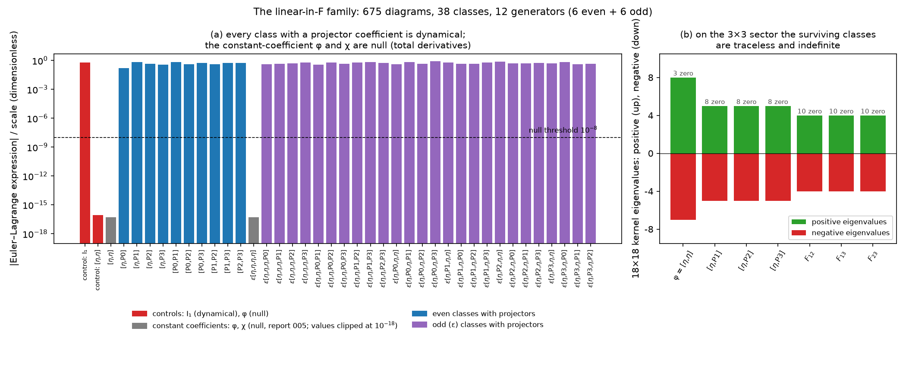
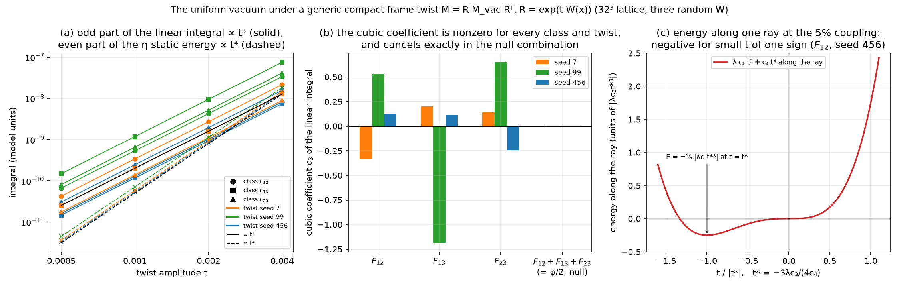
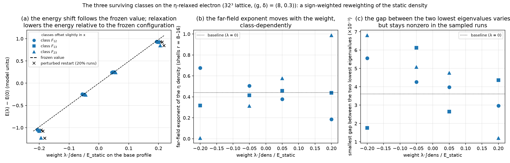
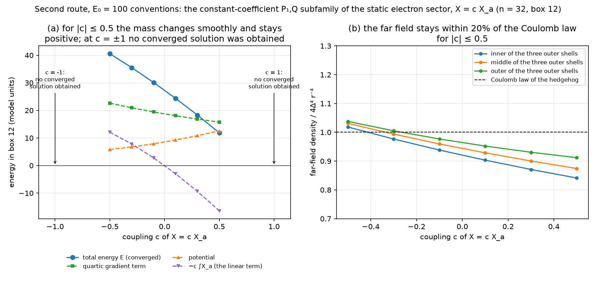

# Report 014 — Terms linear in the field strength: twelve generators, blind to the clock and to Newton, and an unstable vacuum

*2026-09-10 · Maciej J. Mikulski (AI-assisted, see [METHOD](../../METHOD.md)) ·
the one order of the "everything from F" grammar that reports 001–013
never scanned: terms linear in F, quadratic in ∂M. A first version of
this report was closed unmerged (PR #18) because ten review rounds had
turned it into a list of numbers; this is a rewrite of the same
material with the review's corrections built in and the bookkeeping
left in the artifacts.*

## Notation (self-contained)

M is the symmetric 4×4 field, A_μ = ∂_μM, η = diag(−1, 1, 1, 1),
F_{μν} = A_μηA_ν − A_νηA_μ the field strength (antisymmetric in μν
and in its matrix indices αβ; reports 001/005). φ = η^{μα}η^{νβ}F_{μναβ}
and χ = ε^{μναβ}F_{μναβ} are the two linear invariants with constant
coefficients; report 005 proved both are null Lagrangians (total
derivatives). The eigenframe of ηM is {e_a}, a = 0..3, with
e_a·η·e_b = s_aδ_ab, s = (−1, 1, 1, 1); the spectral projectors are
P_a^{μν} = s_a e_a^μ e_a^ν, ΣP_a = η. In the vacuum the spectrum of ηM
is (g, 1, δ, 0) = (8, 1, 0.3, 0): e₀ the timelike axis, e₁ the
eigenvalue-1 (charge) axis, e₂, e₃ the two smallest. I₁ = ⟨F, F⟩_η is
the quadratic invariant of report 001, the kinetic term of record. A
linear class enters the static energy as E_λ = E_static + λ·∫dens with
its own density "dens" and coupling λ; the weight λ·∫dens/E_static on
the base profile is what the scans are labelled by. A **linear class** is a complete
contraction of one F with metrics X ∈ {η, P₀, P₁, P₂, P₃} on its slot
pairs, or with ε and slot insertions; **F_ab** = P_a^{μα}P_b^{νβ}F_{μναβ}.
Lattice: the 32³ stack of report 004 through report 010's
`lattice_grid_defs.py`, base profile the committed η-relaxed electron,
(g, δ) = (8, 0.3). The second route works in the conventions of the
development repository `new-duda-lagrangian` (signature (+,−,−,−),
spectrum (E₀, 1, E₂, E₃) = (100, 1, 0.01, 0.01), Δ = 1 − E₂, the
field's own Euclidean metric δ_M on the matrix indices; box 12,
n = 32).

## Result

1. **Exactly twelve generators.** With projector decorations of the
   675 diagrams (50 even, 625 with ε) 424 vanish; the remaining 251
   fall into 38 proportionality classes spanning a space of rank 12
   over ℚ: six even generators, F_ab with a < b, and six odd, the
   frame components of F with all four indices distinct. Upper bound by tensor algebra (expand η = ΣP_a in every
   slot; ε of four frame vectors is ±det E unless two coincide), lower
   bound by the exact rank of the evaluation matrix at rational points
   (`exact_classification.py`, `exact_linear.py`). With smooth spectral
   scalars as coefficients the family is a rank-12 module over those
   scalars; φ = Σ_{a<b} 2F_ab. Second route: an independent
   enumeration in the E₀ = 100 conventions (145 candidates built from
   η, ε, powers of M, δ_M and the eigenprojectors) finds every candidate
   in the span of the same twelve frame structures to 10⁻¹¹, with two
   null ones (the constant-coefficient φ and χ) and four identically
   zero (`e0_route/candidates.py`).
2. **Every decorated class is dynamical.** An autograd Euler–Lagrange
   test with the projectors' full M-dependence gives |EL|/scale between
   0.15 and 0.9 for all 36 decorated classes, while φ and χ come out
   null to 10⁻¹⁷ and I₁ dynamical: 005's theorem is reproduced and does
   not extend to field-dependent coefficients (figure 1a).
3. **What the sector cannot do.** (a) Every linear class has velocity
   degree ≤ 1, so in the fundamental reading of report 010 it
   contributes neither a drive (ω²) nor a brake (ω⁴) to the
   fixed-velocity Legendre energy; what remains is a gyroscopic
   velocity-linear term in the equations of motion, not studied here.
   (b) On the rank-1 canonical orbit of report 006 the even sector
   reduces to the null φ or vanishes (the timelike axis is η-orthogonal
   to the matrix structure of F there, report 010's matrix-cap theorem),
   and the odd sector vanishes on parity-symmetric configurations: the
   Newton-sign no-go of 006 is not reopened on its hedgehogs. (c) Every
   nonzero class pairs a derivative index with a matrix index, so the
   whole sector exists only under the diagonal Lorentz action of
   report 001 §1 (author-gated).
4. **Statics: three classes survive, and on the electron they reweight
   what F² already builds.** In the 3×3 sector with the vacuum frame
   only F₁₂, F₁₃, F₂₃ survive, with traceless indefinite static kernels
   (figure 1b): a linear term can only be a bounded correction to the
   F² statics. On the η-relaxed electron, with vacuum-pinned projectors,
   each class is scanned at weights of ±5% and ±20% of the static
   energy (13 runs). The energy shift follows the frozen value λ·∫dens
   to within 30%, the relaxed field pulling it back toward zero; the
   far-field exponent moves with the weight, and the core's
   eigenvalue-exchange gap narrows but does not close (figure 3). The
   E₀ = 100 route says the same in its own conventions. There the
   static frozen-time sector keeps three structures, F₁₂, F₁₃, F₂₃
   (rank 3 at a generic static field); with the degenerate vacuum pair
   E₂ = E₃ only F₁₂ + F₁₃ and F₂₃ are defined as functions of M, and
   their constant-coefficient sum is a boundary term, so the
   **constant-coefficient** subfamily is X = c X_a with X_a = F₁₂ + F₁₃.
   A scan over c changes the mass smoothly without changing any static
   verdict for |c| ≤ 0.5 (figure 4). Contractions whose weights are
   functions of the eigenvalues, such as F(ηMη, η) = Σ(m_a + m_b)F_ab,
   are dynamically independent of X_a and are not covered by this scan
   (review round 1).
5. **The uniform vacuum is a saddle at cubic order.** Along a generic
   compact frame twist M = R M_vac Rᵀ, R = exp(tW(x)), the O(t²) part of
   a linear term integrates to zero (it is the null term with vacuum
   coefficients), but the next order does not: the odd part of the
   linear integral is c₃t³ with c₃ constant to five digits over
   t = 5·10⁻⁴–4·10⁻³ and |c₃| between 0.1 and 1.2 over three random
   twists and the three classes, while the η energy is c₄t⁴ with
   c₄ = 53–71. So, along the three twists tested, for every λ ≠ 0 configurations
   of both energy signs exist arbitrarily close to the vacuum
   (figure 2). Null combinations are exempt: c₃ of
   F₁₂ + F₁₃ + F₂₃ = φ/2 cancels to 10⁻⁵ in every twist. Whether the
   instability ends in a condensate is not resolved: the cubic–quartic
   truncation along a ray has its minimum at t* = −3λc₃/(4c₄) ≈ 10⁻⁵ with
   an energy of order 10⁻²⁰, far below anything a relaxation resolves.









## What this means

The linear sector is real and, with spectral coefficients, dynamical,
but it opens no door that the program was looking for: it cannot touch
the clock ladder of 010, it leaves the Newton no-go of 006 in place on
its configurations, on the electron it reweights the existing static
density, and its price is a vacuum that is no longer a minimum. The
only structural novelty is negative: the individual projectors that
make these terms dynamical are non-smooth where eigenvalues collide
(symmetric combinations of them, polynomials in M, are not), and on the
electron texture the smallest gap between the eigenvalue-1 axis and the
small pair is 3·10⁻³, a third of a percent of the eigenvalue.

## What this report does not show

- No dynamics beyond result 3(a): the gyroscopic term's effect on a
  clock through the symplectic structure is recorded, not studied.
- The Newton statement is for the rank-1 ansatz of 006; on the
  rank-rich electron no two-body measurement is made.
- The electron scan uses vacuum-pinned Lagrange projectors, which are
  the exact spectral projectors only away from the cores; a scan with
  exact spectral coefficients was attempted in the first version of
  this report and ran into the eigenvalue-1/small-pair collisions where
  those coefficients are non-smooth, and is not reported here.
- The vacuum instability is established; a condensate is not. The ray
  estimates are not stationary in the transverse directions and three
  twists give no bound over all directions.
- Coefficients are restricted to η, ε and the spectral data of M; both
  scans run constant multiples of their generators; no scan over
  general spectral-scalar weights (polynomials in M included), which
  are dynamically independent of the constant-coefficient family. Single lattice, single spacing in each
  route; the far-field exponent is a shell fit on a 32³ box.
- Author-gated: the diagonal Lorentz action; whether a term that rewards
  eigenvalue splitting is wanted at all.

## Artifacts and reproduction

`enumerate_linear.py`, `exact_linear.py`, `exact_classification.py`
(the family, float and exact), `null_test_linear.py` (Euler–Lagrange
test), `orbit_linear_exact.py`, `orbit1_linear_exact.py` (rank-rich and
rank-1 orbits, exact), `static_kernel_signs.py` (3×3 kernels),
`lattice_linear_v2.py A` and `restart_check.py A` (the electron scan,
GPU, `results/lattice_linear_A.json`, `results/restart_check_A.json`),
`twist_scan_generic.py A` (the vacuum twist, GPU,
`results/twist_generic_A.json`); second route in `e0_route/`
(`candidates.py`, CPU; `run_task4.py` with the model code, GPU,
`e0_route/results/task4_scan.json`). `make_figures.py` draws the four
figures from the JSONs and `verify_artifacts.py` asserts the structure.

```bash
pip install torch numpy scipy sympy matplotlib
bash reproduce.sh                    # CPU, about 20 minutes
M5_RUN_LATTICE=1 bash reproduce.sh   # also the GPU legs (hours; needs ../010-fundamental-grid-clock)
```

Provenance: development in `duda-particle-model/linear_F_terms/`
(plan `notes/plan_linear_F_terms.md`); the first version and its ten
review rounds are PR #18 of this repository, whose round-1 to round-3
findings (the rank-12 module, the exact upper bound, the generic cubic
term, the ray-wise scope of the condensate estimate) are built in
here. The E₀ = 100 route is the development repository
`new-duda-lagrangian`, commit `b757030`, Tasks 3 and 4.
