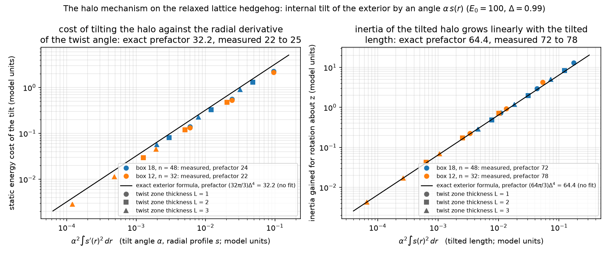
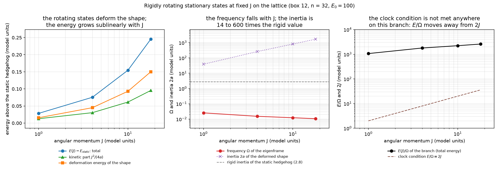

# Report 015 — The halo mechanism: a purely quartic gradient energy gives the hedgehog an unbounded moment of inertia

*2026-09-10 · Maciej J. Mikulski (AI-assisted, see [METHOD](../../METHOD.md)) ·
why the rigidly rotating electron of this model cannot satisfy the
rotor clock condition E/Ω = 2J and carries no spin quantum: its far
field absorbs angular momentum at no cost.*

## Notation (self-contained)

This report works in the conventions of the development repository
`new-duda-lagrangian` (Jarek Duda's "new" Lagrangian): M is a real
symmetric 4×4 field, signature (+,−,−,−), N = ηM its operator form
with η-eigenvalues (e₀, e₁, e₂, e₃) and η-orthonormal eigenframe
(v₀ timelike, v₁ the charge direction). The Lagrangian is
L = −F·F − V(M) with F_{μν} = [∂_μN, ∂_νN], the Euclidean norm on
the matrix indices taken with the field's own metric δ_M = 2v₀v₀ᵀ − η
(the same choice of norm as in reports 002–013), and
V = Σ_a (e_a − E_a)² with (E₀, E₁, E₂, E₃) = (100, 1, 0.01, 0.01);
Δ = E₁ − E₂ = 0.99 is the vacuum gap of the charge direction. The
electron is the hedgehog v₁ → x̂ at infinity, relaxed on a
cell-centred lattice (trilinear interpolant, four tetrahedral
quadrature points per cube; box 12 with n = 32 and box 18 with
n = 48, spacing 0.375) with the time sector frozen at its vacuum
(M₀₀ = E₀, M₀ᵢ = 0, so only the spatial 3×3 block moves, as in every
static of reports 004–013). Units: E₁ = 1, unit coupling of F·F;
E_static = 27.29 in box 12, 29.39 in box 18. **Rigid rotation** means
the rigid-rotor functional L(Ω) = aΩ² + bΩ + c of the tensor field
rotated about the z axis (the Lagrangian is exactly quadratic in
∂ₜM, so a, b, c are exact), with J = 2aΩ + b and the fixed-J energy
H_J = (J − b)²/(4a) − c. The **rotor clock condition** used in this
series is E = ħΩ with ħ := 2J (the tensor field returns to itself
after half a turn, so it oscillates at 2Ω), i.e. E/Ω = 2J. The
tilt amplitude below is called α (`delta` in the scripts); the
parameters (g, δ) = (8, 0.3) of reports 004–013 are not used here.

## Result

1. **Outside the core the model is the Faddeev–Skyrme quartic
   without a sigma term.** On a uniaxial texture with the eigenvalues
   at their vacuum values the static density equals
   4Δ⁴ Σ_{i<j} (n·(∂ᵢn × ∂ⱼn))² for the charge direction n; checked to
   10⁻¹⁵ on random smooth director fields (`exterior_check.py`).
   There is no term quadratic in the derivatives.
2. **Tilting the halo costs a radial derivative only; its inertia
   is a length.** Rotate the exterior internally by an angle θ(r)
   about a fixed axis (the hedgehog is invariant under combined
   spatial and internal rotations, so only the internal one is a
   deformation). Integrating the density over the sphere at fixed r
   gives, exactly (`halo_check.py`, sympy),

   ΔE = (32π/3) Δ⁴ ∫ θ′(r)² dr,   I = (64π/3) Δ⁴ ∫ θ(r)² dr

   for the static cost and for the inertia about an axis
   perpendicular to the tilt axis. Both depend on the profile θ(r)
   and not on where in r it is placed: the r⁻² of the angular
   derivatives cancels against the volume element.
3. **The lattice agrees to 25–30%.** On the relaxed hedgehog, tilted
   by α s(r) with s a smoothstep rising over a zone of thickness
   L = 1, 2, 3 and falling back before the boundary, α = 0.05–0.2:
   cost and inertia gain are quadratic in α (exponents 2.00 and
   2.09), the cost falls with L while the inertia grows with the
   tilted length, and the slopes against α²∫s′² and α²∫s² are

   | | box 12, n = 32 | box 18, n = 48 | exterior formula |
   |---|---|---|---|
   | cost slope | 22 | 24 | 32 |
   | inertia slope | 78 | 72 | 64 |

   (`halo_scaling.py`, figure below). The remainder is the gap being
   below Δ over part of the twist zone.
4. **Consequence: the rotational band is degenerate in infinite
   volume.** A tilt that persists to radius R costs of order Δ⁴α²/R
   and carries an inertia of order Δ⁴α²R, so for every J there are
   rigidly rotating configurations with energy above E_static of
   order J/R, arbitrarily small. Ω = dE/dJ → 0: the rotor clock
   condition E/Ω = 2J cannot be met, and no spin quantum can be
   assigned to a rotating solution. The argument uses only the
   quartic gradient energy and the internal symmetry of the far
   field, so it should carry over to Faber's model of topological
   fermions, whose gradient energy is the same curvature-squared term
   (hep-th/9910221); that is not checked here.
5. **What the lattice finds instead is a localized deformation.**
   Minimizing H_J in box 12 from a symmetry-broken seed at J = 1, 4,
   10, 18 gives states whose energy above E_static = 27.29 is 0.03 at
   J = 1 and 0.25 at J = 18, growing sublinearly and split about
   40/60 between the kinetic part J²/(4a) and the deformation of the
   shape. Between J = 1 and 18 the frequency Ω falls from 0.026 to
   0.011 and the inertia 2a grows from 39 to 1700, against the rigid
   inertia 2.8 of the static lattice hedgehog (`rotor_branch.py`,
   figure below). The clock condition is E/Ω = 2J: at J = 4 the
   branch gives E/Ω ≈ 1800 against 2J = 8, and the ratio grows with
   J. The halo tilt of result 4 would cost J/R ≈ 0.2–3 in this box,
   far above the branch, and undercuts it only for box radii beyond
   about 80–190: the infinite-volume degeneracy is out of the
   lattice's reach, and the box branch is not a measurement of it.





## Relation to reports 009 and 011

Those reports, in the (g, δ) = (8, 0.3) conventions, found the
inertia of a rigidly rotating hedgehog to grow with the box and the
inertia bought by prescribed-J minimization to sit in the periphery;
results 2–4 give a mechanism of exactly that kind. The identification
is proposed, not measured: no run at (g, δ) = (8, 0.3) is made here.

## What this report does not show

- The exterior formula assumes a uniaxial halo with the vacuum gap;
  the lattice slopes differ from it by 25–30% because the measured
  tilt zones (r = 3 to the boundary) overlap the region where e₁ is
  still recovering, and the twist profile is a fixed smoothstep, not
  an optimized one. One tilt axis and one rotation axis (perpendicular)
  are measured; angles α ≤ 0.2 and thicknesses L ≤ 3.
- The finite-box branch is not converged along the soft box-adapted
  translation mode (final gradient norms 3·10⁻³–3.5·10⁻²), so its
  energies are upper bounds; it is a single box (12) and a single
  seed. A box-18 continuation exists in the development repository
  (kinetic part 0.038 at J = 4, against 0.030 here) and is not
  regenerated by this report.
- The time sector is frozen throughout. The frame term K_u of report
  016 vanishes on every rigid rotation of a frozen configuration (a
  spatial rotation does not mix the time axis), so it does not change
  results 1–5; rotating states with a tilted time axis are not
  studied.
- No statement about the internal clock (the soliton's own oscillation
  modes), about the magnetic moment, or about the spin-statistics
  question; the development repository's tests of those are not
  ported here.
- Single lattice spacing; the conventions of reports 001–013 are not
  tested.

## Equation-to-artifact map

| object | artifact |
|---|---|
| exterior reduces to 4Δ⁴ Σ(n·(∂n×∂n))² | `exterior_check.py` → `results/exterior_check.json` |
| exact tilt cost (32π/3)Δ⁴∫θ′² and inertia (64π/3)Δ⁴∫θ² | `halo_check.py` → `results/halo_check.json` |
| lattice tilt scan on the relaxed hedgehog, both boxes (α is `delta` there) | `halo_scaling.py` → `results/halo_scaling_n48_box18.json`, `results/halo_scaling_n32_box12.json` |
| rotating branch at fixed J, re-evaluated exactly from the committed fields; halo-tilt estimate and crossover radius | `rotor_branch.py` → `results/rotor_branch.json` |
| the fields: relaxed hedgehogs (box 12 n = 32, box 18 n = 48) and the four rotating states | `results/fields/*.pt` (found on the GPU by the development repository's `run_static.py` and `run_spinning.py`, the latter included here) |
| figures | `make_figures.py` → `results/fig_halo.png`, `results/fig_rotor.png` |
| artifact-only assertions | `verify_artifacts.py` |

## Reproduction

```bash
pip install torch numpy scipy sympy matplotlib
bash reproduce.sh            # CPU, minutes; M5_RUN_GPU=1 redoes the rotating branch (hours)
```

## Provenance

Development repository `new-duda-lagrangian`, commit `b757030`
(2026-09-09): `lagrangian.py`, `soliton.py`, `halo_check.py`,
`halo_scaling.py`, `run_spinning.py` are taken from there (the scan
script rewritten to record the profile integrals), the fields from
its `results/`; lab notebook `results/report_details.md`, sections
"Point 2 of the work plan: halo mechanism" and "Rigidly rotating
branch". Companion: report 016 (the time sector of the same
electron).
