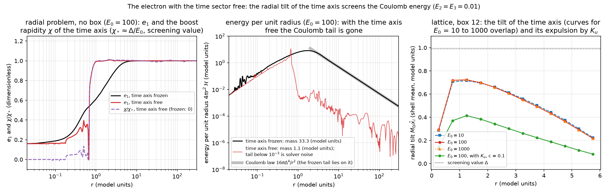
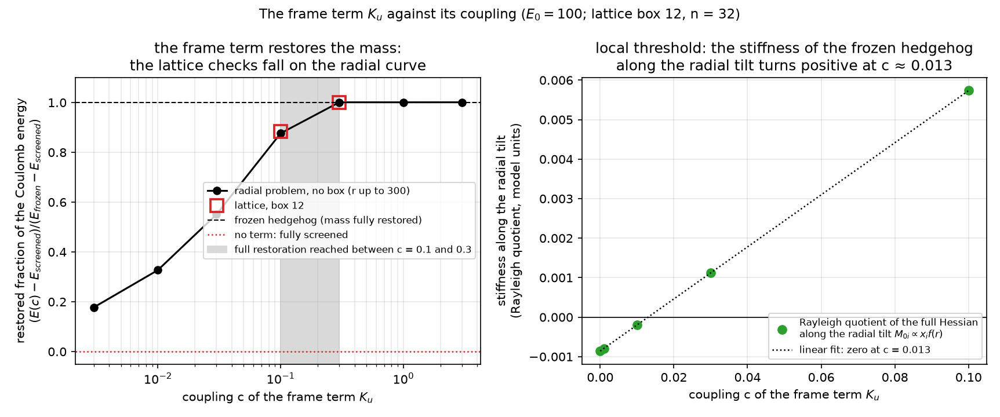

# Report 015 — The time sector of the electron: a radial tilt of the time axis screens the Coulomb energy, and a frame term stops it

*2026-09-10 · Maciej J. Mikulski (AI-assisted, see [METHOD](../../METHOD.md)) ·
the static electron of reports 004–013 was relaxed with its time sector
frozen; this report lets the time sector move and finds that the
hedgehog is not a minimum there: the far field sheds its Coulomb
energy by tilting the time axis toward the light cone, and only a
term that sees the eigenframe can prevent it.*

## Notation (self-contained)

Conventions of the development repository `new-duda-lagrangian`
(Jarek Duda's "new" Lagrangian): M is a real symmetric 4×4 field,
signature (+,−,−,−), N = ηM its operator form with η-eigenvalues
(e₀, e₁, e₂, e₃), e₀ timelike and e₁ the charge direction v₁;
L = −F·F − V(M) with F_{μν} = [∂_μN, ∂_νN], the Euclidean norm on the
matrix indices taken with the field's own metric δ_M = 2v₀v₀ᵀ − η
(the H-adjoint or "I_norm" form of reports 002–013),
V = Σ_a (e_a − E_a)², (E₀, E₁, E₂, E₃) = (100, 1, 0.01, 0.01),
Δ = E₁ − E₂ = 0.99. The **frozen sector** is M₀₀ = E₀, M₀ᵢ = 0: the
"3×3 sector" in which every static result of reports 004–013 was
obtained (there with the spectrum (−g, 1, δ, δ₄) = (−8, 1, 0.3, 0) of
N = Mη and η = diag(−1, 1, 1, 1); a full dictionary is in the
development repository's `results/duda_report_notes.md`). The
**tilt** is the time-sector component M₀ᵢ; on the hedgehog it is
parametrized as M₀ᵢ = m x̂ᵢ, or in the eigenframe as a boost of
rapidity χ mixing v₀ with v₁. The electron is the hedgehog v₁ → x̂,
relaxed on a cell-centred lattice (n = 32, box 12, spacing 0.375,
trilinear interpolant with four tetrahedral quadrature points per
cube) or as a radial problem (spherical ansatz with e₀(r), e₁(r),
e₂(r) = e₃(r), χ(r), cubic B-splines on log-spaced knots, r up to
300, no box). The **frame term** is
K_u = η^{μν}⟨A_μ, A_ν⟩ with A_μ = (1 − P₀) ∂_μN P₀, P₀ the projector on
v₀: the part of the jet that rotates the field's own time axis; it is
covariant, quadratic in the derivatives, and identically zero
wherever v₀ is constant. Energies are in units of E₁ = 1 with unit
coupling of F·F.

## Result

1. **The frozen hedgehog is stationary in the time sector but not a
   minimum.** Its energy does not depend on E₀ at all (the derivatives
   have no time row), its time-sector gradient is 10⁻¹³, and the full
   Hessian has exactly one negative direction among those tried: the
   radial tilt M₀ᵢ ∝ xᵢ f(r), with stiffness −0.0009 at E₀ = 100,
   −0.003 at 10 and −0.010 at 3, while rotational, uniform and random
   tilts and M₀₀ perturbations are stiff (`time_sector_check.py`).
2. **Relaxing the tilt removes the Coulomb energy.** In box 12 the
   energy falls from 27.29 to 22.0 (E₀ = 100; 20.4 at E₀ = 10, 22.1 at
   E₀ = 1000) with the radial tilt saturating at 0.96 ≈ Δ, a melted
   core, and a far field held above the Coulomb law only by the
   boundary (`field_diagnostics.py`). Without a box, the radial
   problem gives a frozen mass of 33.3 and a mass of 0.96 with the
   boost free — three percent, converged in the knots (0.99 at 240,
   0.96 at 480): a melted core of radius 0.6 wrapped in a thin wall
   where χ jumps to its screening value, outside of which the energy
   density vanishes (`radial_screened.py`, figure below).
3. **Why: the null-direction hedgehog.** At M₀ᵢ = Δ x̂ᵢ the operator is
   N = const − Δ ℓℓᵀη with ℓ = (1, x̂) null, ℓℓᵀη nilpotent and
   traceless; then [∂ᵢN, ∂ⱼN] ≡ 0 and tr(∂ᵢN ∂ⱼN) ≡ 0, so F and every
   Lorentz-invariant scalar polynomial in ∂N vanish, while the
   eigenvalues move by 0.01 (order Δ²/E₀) and the potential barely
   notices (`prop4_check.py`, exact). In the eigenframe the far-field
   density 4Δ⁴/r⁴ has an exact zero at sinh²χ = Δ²/((e₀−e₂)² − Δ²),
   i.e. χ ≈ Δ/E₀. Everything built from the spectrum or from the
   charge direction alone is blind to it: on the screened hedgehog the
   quartic, the sigma-model term tr(∂N∂N), tr(∂N∂N)², the eigenvalue
   gradients and the chiral twist are 10⁻¹⁵–10⁻³² of the Coulomb
   density, and only frame-sensitive objects (the Euclidean norm with
   δ_M, traces with N inserted, the aether gradient (∂u)², K_u) are
   not (`null_probe.py`).
4. **The frame term K_u restores the mass, with two thresholds.** K_u
   is 10⁻⁴¹ on the frozen hedgehog and by construction zero on the
   whole frozen record and on its rigid rotations; on the screened
   state it costs 2 sinh²χ (e₀−e₂)²/r², so its integral grows with the
   box while the Coulomb energy it saves is finite, and the break-even
   coupling at radius r is c* = 2Δ²/r² (exact to 2%, `null_probe.py`).
   The stiffness of the radial tilt is −0.00086 + 0.066c and turns
   positive at c ≈ 0.013 (local threshold); the tilted state stays the
   global minimum up to a coupling between 0.1 and 0.3, above which
   the minimiser returns to the frozen hedgehog: on the lattice to
   27.288124, seven digits, at c = 0.3 and 1; without a box to 33.32
   against the frozen 33.31 (figure below). At c = 0.1 a partially
   tilted core survives (lattice 26.66, radial 29.3) with the Coulomb
   tail back within 30%.
5. **The sector K_u opens.** Around the vacuum the base model has no
   linear dynamics at all (all ten kinetic eigenvalues zero); with K_u
   the three tilt components M₀ᵢ propagate at exactly the speed of
   light with a positive kinetic form — a massless vector with three
   polarizations, the aether mode, not the photon; the charge director
   still does not propagate. On the hedgehog background the kinetic
   form stays positive and every characteristic speed subluminal
   (r = 0.5–4), with and without K_u; two kinetic eigenvalues remain
   exactly zero everywhere, so the system is constrained
   (`tilt_sector.py`).





## What this means for reports 004–013

Every lattice static in that line was computed in the frozen sector,
and the boost tangents used for the clock were frozen dressings of
such statics. The present result says that in the H-adjoint form the
frozen electron is a saddle of the full energy, and that the
instability does not go away with the hierarchy E₀ → ∞ (the tilt
angle is Δ/E₀, the component M₀ᵢ stays of order Δ). The mechanism is
convention-free (a Kerr–Schild-type deformation along a null direction
makes the curvature vanish), but nothing here is measured at
(g, δ) = (8, 0.3), and whether the 32³ hedgehog of report 004 has the
same negative direction is a one-run check that is not made in this
report.

## What this report does not show

- Boxes larger than 12 are not regenerated here; the development
  repository records 17.25 (box 18, n = 48) and 13.9 (box 24, n = 64)
  for the screened energy, monotone toward the radial value 0.96, and
  the cure returning to the frozen value at box 18 as well. E₀ = 3 and
  30 are likewise not included (development records: 16.0 and 21.6).
- The radial problems end with gradient norms of order 1–10 on the
  spline coefficients (the wall at r ≈ 0.6 is thinner than the knot
  spacing there); the masses are quoted at the level of their
  convergence in the knots, a few percent.
- K_u is a candidate, not a derived term: nothing selects it beyond
  the requirement of seeing the frame; whether the model's author wants
  a term that gives the time axis dynamics is an author-gated choice.
  Its sector is checked only at the level of the linearised principal
  part; the constraint structure, the fate of the longitudinal mode
  and hyperbolicity on a core background are not settled.
- Rigid rotations of a frozen configuration have K_u = 0, so the
  rotational results of report 016 are unchanged by it; rotating states
  with a tilted time axis are not studied.
- One negative direction is exhibited, not a full spectrum of the
  time-sector Hessian; the local threshold c ≈ 0.013 is a linear
  interpolation of five Rayleigh quotients.
- Single lattice spacing at box 12; the development repository's
  h = 0.25 run (2% lower energy) is not reproduced here.

## Equation-to-artifact map

| object | artifact |
|---|---|
| null-direction hedgehog: F ≡ 0, tr(∂N∂N) ≡ 0, nilpotent structure; far-field zero at the screening rapidity; break-even c* | `prop4_check.py` → `results/prop4_check.json` |
| which invariants see the tilt; quartic vs tilt amplitude; c* by radius | `null_probe.py` → `results/null_probe.json` |
| E₀-independence, time-sector gradient, Rayleigh quotients vs E₀ and vs c | `time_sector_check.py` → `results/time_sector_check.json`, `results/time_sector_check_E0.json` |
| kinetic forms and characteristic speeds on the vacuum and on the hedgehog | `tilt_sector.py` → `results/tilt_sector.json` |
| energies, gradients, K_u, tilt and e₁ profiles, far-field ratios of the committed lattice endpoints | `field_diagnostics.py` → `results/field_diagnostics.json` |
| the endpoints: frozen hedgehog; time sector free at E₀ = 10, 100, 1000; with K_u at c = 0.03, 0.1, 0.3, 1 | `results/fields/*.pt` (GPU, `unfrozen_test.py`, `run_static.py`) |
| radial problem: frozen and screened masses (240 and 480 knots), the coupling scan of K_u | `radial_screened.py` → `results/radial_E0_100_nk*.json` |
| figures | `make_figures.py` → `results/fig_screening.png`, `results/fig_cure.png` |
| artifact-only assertions | `verify_artifacts.py` |

## Reproduction

```bash
pip install torch numpy scipy sympy matplotlib
bash reproduce.sh            # CPU; the radial problems run in parallel and take about an hour
M5_RUN_GPU=1 bash reproduce.sh   # also redoes the lattice endpoints (about an hour each on a GPU)
```

## Provenance

Development repository `new-duda-lagrangian`, commit `b757030`
(2026-09-09): `lagrangian.py`, `soliton.py`, `symbolic.py`,
`radial_screened.py`, `null_probe.py`, `tilt_sector.py`,
`unfrozen_test.py`, `run_static.py` are taken from there (paths and
JSON outputs added), the lattice endpoints from its `results/`;
`time_sector_check.py`, `prop4_check.py` and `field_diagnostics.py`
are written for this report. Lab notebook: `results/report_details.md`
of that repository, sections "Point 3: the time sector is not frozen"
through "The cure against its coupling". The Kerr–Schild and VSI
context of result 3 is discussed in its `results/literature.md`.
Companion: report 016 (the rotational sector of the same electron).
