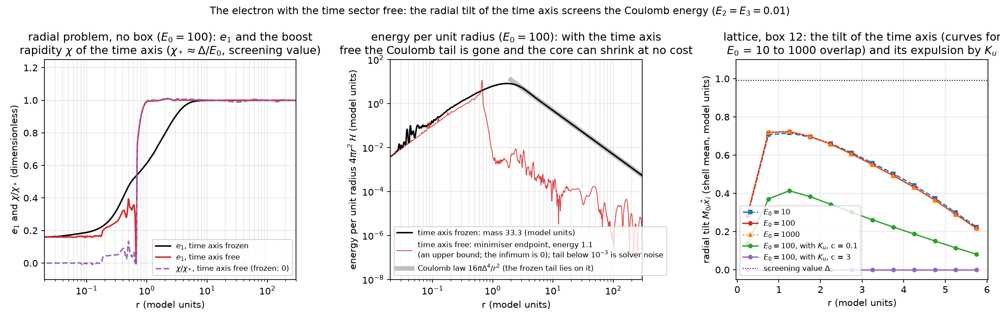
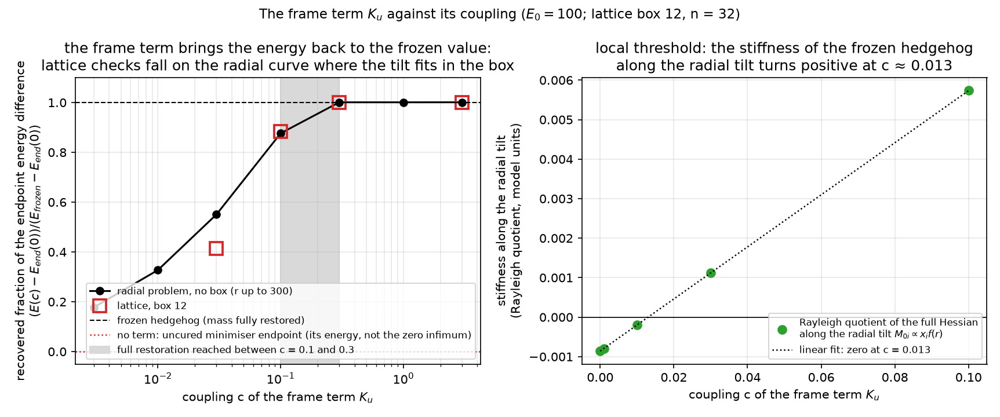

# Report 016 — The time sector of the electron: a radial tilt of the time axis screens the Coulomb energy, and a frame term stops it

*2026-09-10 · Maciej J. Mikulski (AI-assisted, see [METHOD](../../METHOD.md)) ·
the static electron of reports 004–013 was relaxed with its time sector
frozen; this report lets the time sector move and finds that the
hedgehog is not a minimum there: by tilting the time axis toward the
light cone the charged configuration sheds not only its Coulomb energy
but, without a box, all of its energy — the infimum at fixed charge is
zero — and of the terms tried only one that sees the eigenframe
prevents it.*

## Notation (self-contained)

Conventions of the development repository `new-duda-lagrangian`
(Jarek Duda's "new" Lagrangian), used throughout:

- M: real symmetric 4×4 field; signature (+,−,−,−); N = ηM its
  operator form, with η-eigenvalues (e₀, e₁, e₂, e₃) and
  η-orthonormal eigenvectors v₀ (timelike, the field's own time
  axis, also written u) and v₁ (the charge direction).
- L = −F·F − V(M), F_{μν} = [∂_μN, ∂_νN], the norm on the matrix
  indices taken with the field's metric δ_M = 2v₀v₀ᵀ − η (the same
  choice of norm as in reports 002–013); V = Σ_a (e_a − E_a)² with
  (E₀, E₁, E₂, E₃) = (100, 1, 0.01, 0.01); Δ = E₁ − E₂ = 0.99. Units
  E₁ = 1, unit coupling of F·F.
- Frozen sector: M₀₀ = E₀, M₀ᵢ = 0, so only the spatial 3×3 block
  moves. Every static of reports 004–013 was computed there
  (dictionary to those reports: their N = Mη with
  η = diag(−1, 1, 1, 1) and spectrum (−g, 1, δ, δ₄) = (−8, 1, 0.3, 0)
  corresponds to (E₀, 1, E₂, E₃) here; a full table is in the
  development repository's `results/duda_report_notes.md`).
- Tilt: the time-sector component M₀ᵢ; on the hedgehog M₀ᵢ = m x̂ᵢ
  with amplitude m, or in the eigenframe a boost of rapidity χ
  mixing v₀ with v₁.
- Electron: the hedgehog v₁ → x̂ at infinity, relaxed either on a
  cell-centred lattice (n = 32, box 12, spacing 0.375, trilinear
  interpolant with four tetrahedral quadrature points per cube) or as
  a radial problem without a box (spherical ansatz e₀(r), e₁(r),
  e₂(r) = e₃(r), χ(r); cubic B-splines on log-spaced knots, r up to
  300).
- Frame term: K_u = η^{μν}⟨A_μ, A_ν⟩ with A_μ = (1 − P₀) ∂_μN P₀, P₀
  the projector on v₀: the part of the jet that rotates the time axis.
  Covariant, quadratic in the derivatives, identically zero wherever
  v₀ is constant.

## Result

1. **The frozen hedgehog is stationary in the time sector but not a
   minimum.** Its energy does not depend on E₀ (the derivatives have
   no time row) and its time-sector gradient vanishes to machine
   precision. Among the perturbations tried, exactly one direction is
   unstable: the radial tilt M₀ᵢ ∝ xᵢ f(r), with stiffness −0.0009 at
   E₀ = 100, −0.003 at 10 and −0.010 at 3; rotational, uniform and
   random tilts and M₀₀ perturbations are stiff
   (`time_sector_check.py`).
2. **Relaxing the tilt removes the Coulomb energy.** In box 12 at
   E₀ = 100 the energy falls from 27.29 to 22.0 with the tilt
   amplitude m saturating at 0.96 ≈ Δ, a melted core, and a far field
   held above the Coulomb law only by the boundary
   (`field_diagnostics.py`; the minimisation from the frozen field,
   redone for this report, lands on the committed endpoint to six
   digits); the E₀ dependence is weak:

   | E₀ | 10 | 100 | 1000 |
   |---|---|---|---|
   | energy in box 12 (frozen: 27.29) | 20.4 | 22.0 | 22.1 |
   | maximal tilt amplitude m | 0.95 | 0.96 | 0.96 |

   Without a box the radial problem gives a frozen mass of 33.3, while
   the minimisation with the boost free ends at 1.1 (240 knots) and
   1.05 (480 knots): a melted core of radius 0.6 wrapped in a thin wall
   where χ jumps to its screening value, outside of which the energy
   density vanishes (`radial_screened.py`, figure below). These
   endpoints are upper bounds, not a mass: **the infimum is zero**
   (review round 1). The family N = C − a(r) ℓℓᵀη with ℓ = (1, x̂) null,
   C = diag(E₀+Δ, E₂, E₂, E₂) and a(r) rising smoothly from 0 at
   r ≤ R/2 to a* = (E₁−E₂)(E₀−E₂)/(E₀+E₁−2E₂) at r ≥ R has F ≡ 0
   everywhere (the derivatives of N commute for any profile), the
   exact vacuum spectrum (E₀, E₁, E₂, E₂) outside r = R, a potential
   bounded by 2Δ² inside, and the charge intact; hence
   E ≤ (8π/3)Δ²R³ → 0. Checked symbolically and by integrating the
   model's own density: E(R) ∝ R^3.00, E(0.1) = 0.003
   (`screened_infimum.py`). The spline minimiser stops near 1 with
   gradient norms of order 10 (that the knot spacing is what stops it is
   an interpretation, not a result); the statement that survives is
   that with the time sector free the charged configuration has zero
   energy infimum at fixed charge, which excludes a positive global
   minimum and says nothing about stationary or locally minimal
   branches.
3. **Why: the null-direction hedgehog.** At m = Δ the operator is
   N = const − Δ ℓℓᵀη with ℓ = (1, x̂) null, ℓℓᵀη nilpotent and
   traceless; then [∂ᵢN, ∂ⱼN] ≡ 0 and tr(∂ᵢN ∂ⱼN) ≡ 0, so F and every
   Lorentz-invariant scalar polynomial in ∂N vanish, while the
   eigenvalues move by 0.01 (order Δ²/E₀) and the potential barely
   notices (`prop4_check.py`, exact). In the eigenframe the far-field
   density 4Δ⁴/r⁴ has an exact zero at sinh²χ = Δ²/((e₀−e₂)² − Δ²),
   i.e. χ ≈ Δ/E₀. On this configuration the model's own F·F, the
   sigma-model term tr(∂N∂N), its square, and the gradients of the
   eigenvalues all vanish to machine precision: everything built from
   the spectrum or from the charge direction alone is blind to the
   tilt, and only objects that see the eigenframe (the Euclidean norm
   with δ_M, traces with N inserted, (∂u)², K_u) are not
   (`null_probe.py`).
4. **The frame term K_u restores the mass, with two thresholds.** K_u
   vanishes to machine precision on the frozen hedgehog and by
   construction on the whole frozen record and on its rigid rotations;
   on the screened state it costs 2 sinh²χ (e₀−e₂)²/r², so its integral
   grows with the box while the Coulomb energy it saves is finite, and
   the break-even coupling at radius r is c* = 2Δ²/r² (accurate to 2%
   over r = 1–30). In particular K_u excludes the zero-infimum family of
   result 2, whose tilt persists to infinity. The stiffness of the radial tilt is −0.00086 + 0.066c
   and turns positive at c ≈ 0.013 (local threshold); the tilted state
   stays the global minimum up to a coupling between 0.1 and 0.3, above
   which the minimiser returns to the frozen hedgehog: on the lattice to
   27.288 (the frozen value to the digits shown) at c = 0.3 and 3,
   without a box to the frozen 33.3 within 0.1% (figure below; its
   left panel plots the recovered fraction of the energy difference
   between the uncured minimiser endpoint and the frozen hedgehog). At
   c = 0.1 a partially tilted core survives (lattice 26.7 against the
   frozen 27.3, radial 29.3 against 33.3) with the far-field density
   back near the Coulomb law up to a residual excess toward the box
   boundary; at c = 0.03 the tilt extends beyond the box (half-value
   radius 12 in the radial problem against the box half-size 6), and
   the lattice restores less of the mass than the radial problem (0.41
   against 0.55 of the screened energy).
5. **The sector K_u opens.** Around the vacuum the base model has no
   linear dynamics at all (all ten kinetic eigenvalues zero); with K_u
   the three tilt components M₀ᵢ propagate at unit speed with a positive
   kinetic form, while the charge director still does not propagate. At
   the sampled hedgehog points (r = 0.5–4 on the z axis, propagation
   along z) the kinetic form is positive semidefinite with two null
   directions, with and without K_u, and the reported z-direction
   speeds are below 1; the system is constrained, and the polarization
   count and constraint structure are not settled here
   (`tilt_sector.py`).





## What this means for reports 004–013

Every lattice static in that line was computed in the frozen sector,
and the boost tangents used for the clock were frozen dressings of
such statics. The present result says that with the δ_M norm the
frozen electron is a saddle of the full energy, that the charged
configuration has zero energy infimum once the time sector is free,
and that neither goes away with the hierarchy E₀ → ∞ (the tilt angle
is Δ/E₀, the component M₀ᵢ stays of order Δ). The mechanism is
convention-free (a Kerr–Schild-type deformation along a null direction
makes the curvature vanish), but nothing here is measured at
(g, δ) = (8, 0.3), and whether the 32³ hedgehog of report 004 has the
same unstable direction is a one-run check that is not made here.

## What this report does not show

- Boxes larger than 12 are not regenerated here; the development
  repository records the cure returning to the frozen value at box 18
  as well. E₀ = 3 and 30 are
  likewise not included (development records: 16.0 and 21.6).
- The radial minimisations with the boost free end with gradient norms
  of order 10 on the spline coefficients and are quoted only as
  attained upper bounds (1.1 and 1.05; the development repository's
  runs of the same code gave 0.99 and 0.96); the infimum is zero and
  is not attained by any smooth configuration of finite core size. The
  lattice energies in a box (22.0 at box 12) are set by the frozen
  Dirichlet boundary and the spacing, and the development repository's
  box scan (17.25 at box 18, 13.9 at box 24) falls accordingly.
- K_u is a candidate, not a derived term: nothing selects it beyond
  the requirement of seeing the frame, and the list of probed
  invariants is finite; whether the model's author wants a term that
  gives the time axis dynamics is an author-gated choice. Its sector is
  checked only at the level of the linearised principal part.
- Rigid rotations of a frozen configuration have K_u = 0, so the
  rotational results of report 015 are unchanged by it; rotating states
  with a tilted time axis are not studied.
- One unstable direction is exhibited, not a full spectrum of the
  time-sector Hessian; the local threshold c ≈ 0.013 is a linear
  interpolation of five Rayleigh quotients.
- Single lattice spacing at box 12; the development repository's
  h = 0.25 run (2% lower energy) is not reproduced here.

## Artifacts and reproduction

`prop4_check.py` (null-direction hedgehog, far-field zero, c*),
`null_probe.py` (which invariants see the tilt), `time_sector_check.py`
(gradient and Rayleigh quotients vs E₀ and c), `tilt_sector.py`
(kinetic forms and speeds), `field_diagnostics.py` (energies, K_u,
profiles and far-field ratios of the committed lattice endpoints in
`results/fields/`: frozen; time sector free at E₀ = 10, 100, 1000 and
the E₀ = 100 minimisation redone here; with K_u at c = 0.03, 0.1, 0.3,
3), `radial_screened.py` (frozen mass and
screened upper bounds at 240 and 480 knots, the coupling scan),
`screened_infimum.py` (the zero-infimum family) — each writes
the JSON of the same name in `results/`; `make_figures.py` draws the
two figures from those JSONs and `verify_artifacts.py` asserts the
structure.

```bash
pip install torch numpy scipy sympy matplotlib
bash reproduce.sh                # CPU; the radial problems run in parallel, about an hour
M5_RUN_GPU=1 bash reproduce.sh   # also redoes the lattice endpoints (about an hour each on a GPU)
```

Provenance: development repository `new-duda-lagrangian`, commit
`b757030` (2026-09-09), for the model code, the radial solver, the
probes and the lattice endpoints; `time_sector_check.py`,
`prop4_check.py` and `field_diagnostics.py` are written for this
report. Companion: report 015 (the rotational sector of the same
electron).
