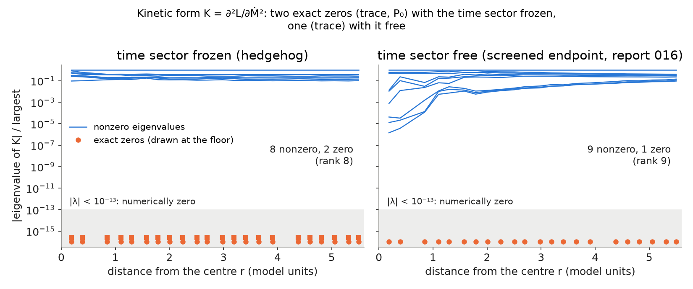
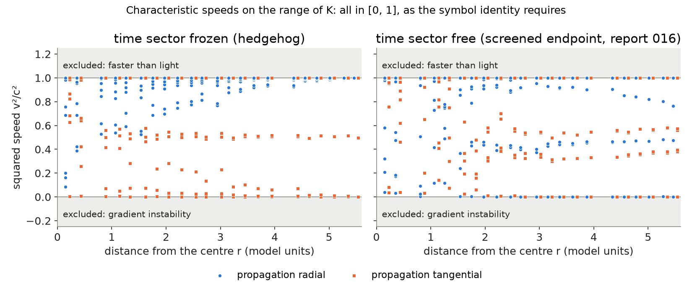

# Report 017 — Constraint structure of the field M: the trace is not a field, the kinetic form has rank 9 on generic backgrounds, and every static background has characteristic speeds in [0, 1]

*2026-09-24 · Maciej J. Mikulski (AI-assisted, see [METHOD](../../METHOD.md)) ·
report 016 left open "the polarization count and constraint structure";
the thread on substrate-framework discussion #186 now waits on the same
question (OpenWave M5.32 R25: the moment calculation "waits on the
constraint analysis of the time-space components"; J. Duda, 2026-09-22:
"the Legendre map is singular … needs a regulating inertia or a
constraint analysis"). This report does that analysis for the model of
reports 014–016. Pre-registration:
`duda-particle-model/notes/prereg_017_constraint_structure.md` (2026-09-13).*

## Notation (self-contained)

As in report 016 (conventions of Jarek Duda's "new" Lagrangian,
development repository `new-duda-lagrangian`):

- M: real symmetric 4×4 field, ten components; signature (+,−,−,−);
  N = ηM its operator form, with η-eigenvalues (e₀, e₁, e₂, e₃) and
  η-orthonormal eigenvectors; v₀ is the timelike one (the field's own
  time axis) and P₀ the projector on it.
- L = −F·F − V, F_{μν} = [∂_μN, ∂_νN], derivative indices contracted
  with η, matrix indices with the field's Euclidean norm
  ⟨A, B⟩ = Tr(A δ_M Bᵀ δ_M⁻¹), δ_M = 2v₀v₀ᵀ − η;
  V = Σ_a (e_a − E_a)² with (E₀, E₁, E₂, E₃) = (100, 1, 0.01, 0.01).
- Frame term (report 016): K_u = η^{μν}⟨A_μ, A_ν⟩ with
  A_μ = (1 − P₀)∂_μN P₀, added as L + c K_u.
- Frozen sector: M₀₀ = E₀, M₀ᵢ = 0; all statics of reports 004–016
  were computed there or started from there.
- Kinetic form K = ∂²L/∂Ṁ∂Ṁ (10×10); gradient form G(k) = −∂²L/∂(∂_kM)²
  for a unit wave vector k. A plane wave exp(i(k·x − ωt)) has, at
  principal (highest-derivative) order, det(ω²K − G(k)) = 0; ω²/|k|² are
  the squared characteristic speeds.
- Backgrounds: the vacuum; random point backgrounds (generic and
  frozen, 300 each); and 4000 random quadrature points of each of four
  committed lattice fields of report 016 (frozen hedgehog; time sector
  free at E₀ = 100; with K_u at c = 0.1 and c = 3), n = 32, box 12.

## Result

1. **The Lagrangian is exactly quadratic in the velocity.** The time
   derivative enters only through F₀ᵢ = [Ṅ, ∂ᵢN], and the η contraction
   has no F₀ᵢ·F_{jk} cross terms, so

   L = ½ Ṁᵀ K(M, ∂M) Ṁ − U(M, ∂M),  K = 4 Σᵢ WᵢᵀWᵢ + 2c YᵀY,

   with Wᵢ(X) = [ηX, ∂ᵢN] and Y(X) = (1 − P₀)ηX P₀ measured in the δ_M norm. K is a Gram matrix
   (positive semidefinite) and does not depend on Ṁ; H = ½ṀᵀKṀ + U ≥ 0.
   Two consequences: there is no term linear in Ṁ, so the mixed
   derivative ∂²L/∂Ṁ∂(∂M) vanishes on every static background (the
   caveat of report 016 about it is empty), and a rigid rotation has
   L(ω) = aω² + L(0) with no gyroscopic term (b = 0 exactly on the
   lattice for three generators; `symbolic.py`, check 1;
   `trace_constraint.py`).

2. **The trace is not a field: tr N = E₀ + E₁ + E₂ + E₃ is an algebraic
   equation of motion.** Under N → N + s(x)·1 every F_{μν}, the
   projectors, δ_M and K_u are unchanged, for any function s (symbolic,
   check 2; on all eight committed fields the quartic term and K_u change
   by ≤ 2·10⁻¹⁵ relative while the potential changes by 65–200%). Only V
   sees s, and it shifts every eigenvalue by s. Hence the canonical
   momentum of s vanishes identically (primary constraint π_s = 0), its
   preservation requires χ = tr N − ΣE = 0, since ∂V/∂s = 2χ
   (secondary), and {χ, π_s} = ∂χ/∂s = 4 ≠ 0: a second-class pair,
   not a gauge symmetry. The trace is fixed pointwise by the other nine
   components. The committed fields obey it to 10⁻⁸ (frozen) and
   10⁻¹⁰–10⁻¹³ (time sector free, with K_u) while e₁ varies from 0.15 to
   1.2 across the same points. For a potential that is not a function of
   the eigenvalues alone (e.g. traces of powers, as in OpenWave's
   certified action) the secondary constraint is a polynomial in s
   instead of a linear one; the structure is the same.

3. **The rank of K is set by the spatial gradients: 9 generically, 8 on
   the frozen sector, lower on special strata.** The kernel of K is the
   set of symmetric X with [ηX, ∂ᵢN] = 0 for i = 1, 2, 3 (and Y(X) = 0 when
   c > 0), the commutant of the three spatial gradients
   (`kinetic_rank.py`, figure 1):

   | background | rank of K | kernel | checked on |
   |---|---|---|---|
   | generic | 9 | trace | 600 random; 8000 lattice points (time sector free; c = 0.1) |
   | generic frozen (M₀₀ = E₀, M₀ᵢ = 0) | 8 | trace, P₀ | 600 random; 8000 lattice points (frozen hedgehog; c = 3) |
   | one gradient direction (twist along z), boost or rotation | 5 | commutant of ∂_zN | exact static solutions (review round 1) |
   | vacuum, base model | 0 | everything | — |
   | vacuum, with K_u | 3 | all but M₀ᵢ | the three tilts propagate at speed 1 |

   The rank depends on the gradient triple, not on whether the time axis
   varies: a pure twist along one axis is an exact static solution
   (F = 0) of rank 5 whether it twists a boost or a rotation, and in the
   rotation twist a time–space component (M₀₃) has no kinetic term. On
   the generic and generic-frozen backgrounds, which include every
   sampled point of the relaxed hedgehogs, M₀ᵢ are dynamical and what the
   frozen sector loses is the time–time direction P₀: around a frozen
   static M₀₀ enters the quadratic action only through V (an auxiliary
   field, pinned at linear order). Around the vacuum all ten components
   lose their kinetic term unless K_u is added. The same K with the
   indefinite matrix norm (η in place of δ_M, the ⟨·,·⟩_η of the thread)
   has negative directions at every point checked, three on the frozen
   hedgehog: positivity of the kinetic energy rests on the Euclidean
   norm. In the melted core of the screened field the smallest nonzero
   eigenvalue falls to 3·10⁻⁶ of the largest.

4. **The principal symbol is a Lagrange identity, so every static
   background has characteristic speeds in [0, 1].** With Wᵢ = [X, ∂ᵢN],

   ω²K − G(k) ∝ (ω² − |k|²) Σᵢ‖Wᵢ‖² + ‖Σᵢ kᵢWᵢ‖²  (+ c(ω² − |k|²)‖Y‖², Y = (1 − P₀)X P₀)

   exactly (symbolic, check 3, all entries symbolic). By Cauchy–Schwarz
   ‖k·W‖² ≤ |k|²Σ‖Wᵢ‖², so on the range of K the squared speeds lie in
   [0, 1]: no faster-than-light characteristic and no gradient
   instability at principal order, for any static background and any
   c ≥ 0. The lower end is attained: on the continuum uniaxial hedgehog
   X = diag(0, 2, −1, −1) at a point of the z axis, propagating along x,
   has K[X, X] > 0 and G(x̂)X = 0 exactly (review round 1; both routes).
   A dynamical direction with zero speed makes the first-order reduction
   a Jordan block, so the principal part is not strongly hyperbolic in
   the usual sense; the bound excludes superluminal and gradient
   instabilities, not loss of derivatives. On the kernel of K the whole symbol vanishes (Wᵢ = 0 implies
   k·W = 0), so those directions are fixed by lower-order terms, as
   item 2 does for the trace. The numbers follow: on 17 200 points the
   squared speeds span 4·10⁻¹⁰ to 1 + 10⁻¹² (figure 2), and the closed
   form agrees with the Hessians of the model code to 2·10⁻¹⁴. The speed
   is exactly 1 for modes with k·W = 0 and exactly 0 when Wᵢ ∝ kᵢ. For a single gradient direction C along z the identity
   reduces to J. Duda's L₂ = ½(ω² − k_x² − k_y²)|[Φ, C]|² (2026-09-22),
   which is thereby confirmed and extended to arbitrary static
   backgrounds. The structure is that of the quartic term of the Skyrme
   model.

5. **Counting.** Per point: ten components, one second-class pair
   removes the trace, so nine configuration variables and an
   18-dimensional phase space on the generic stratum. The rank of K is not
   constant on phase space, so the system is irregular in Dirac's sense:
   on the frozen sector one more direction (P₀) loses its kinetic term,
   on one-direction twists five do, and on the vacuum all do. General relativity,
   by contrast, removes eight of ten metric components by first-class
   constraints on every background; here there is no gauge symmetry and
   no background-independent reduction below nine.

6. **Rigid rotation of the frozen hedgehog.** The inertia a is 153 for
   the internal rotation (the generator acting on the matrix indices,
   δM = GᵀM + MG), 152 for the spatial rotation, and 1.4 for their sum,
   which is the physical rotation: on the uniaxial hedgehog the combined
   rotation is a symmetry, and the 1% residual is the lattice's cubic
   anisotropy. So the physical rotation of this electron carries no
   Noether charge, and any clock on it is the internal rotation, whose
   inertia grows with the box (report 015). With b = 0, J = 2aω, and the
   spin-½ condition proposed on #186, 2Jω/E = 1, becomes aω² = E_stat/3.





## What this means

- For the thread's question whether M₀ᵢ are constrained: not by any
  constraint. The only exact constraint is the trace; on the relaxed
  hedgehogs (generic frozen points) the only extra kinetic degeneracy is
  the time–time direction, while special backgrounds such as pure
  twists lose more, time–space directions included.
- Linear perturbation theory around any frozen static (reports 004–016,
  OpenWave's certified static sector) treats M₀₀ as auxiliary, has no
  superluminal or gradient-unstable characteristic, but has exact
  zero-speed directions; around the vacuum it is empty without K_u. A regulating inertia ε tr(∂ₜM ∂ₜM) would give the trace a
  kinetic term with a mass of order ε^{−1/2} that decouples as ε → 0,
  consistent with item 2; it is not needed for the principal part on
  backgrounds with gradients.
- The instabilities found so far (report 016's screening direction,
  report 014's cubic saddle of the vacuum) are therefore not principal-part
  pathologies: they sit in lower-order terms (V″, the δ_M variation) or
  beyond quadratic order.

## Pre-registered predictions

P1 (rank 9 where the time axis varies, 8 on frozen backgrounds, including
all endpoints of 016): confirmed on all sampled points, with the kernel
identified, but not as a classification: one-direction twists have
rank 5 whether or not the time axis varies. P2 (trace
constraint on the endpoints to ≤ 10⁻⁶): confirmed. P3 (squared speeds in
(0, 1], real characteristics with the mixed term): the interval [0, 1] is
proved and the mixed term vanishes, but 0 is attained, so the strict
lower bound fails. P4 (b = 0 in the base model): confirmed; b ≠ 0 for the linear-in-F
terms of report 014 not tested (they were defined only in the frozen static
sector). P5 (three propagating polarizations in the vacuum with K_u,
none without): confirmed.

## What this report does not show

- Only static backgrounds. On a rotating or otherwise time-dependent
  background W₀ = [X, Ṅ] ≠ 0 and the Cauchy–Schwarz bound no longer
  applies; the symbol of report 015's clocks is not computed.
- Principal order only. Lower-order terms (V″, the dependence of δ_M on
  M) decide the masses and the unstable directions; well-posedness is not
  claimed, and the zero-speed directions and the kernel of K argue
  against strong hyperbolicity.
- The strata of lower rank are not classified (only the ones in the
  table are exhibited); the Dirac analysis is pointwise and on the
  generic stratum; the
  behaviour of the constraint algebra where the rank of K jumps (frozen
  locus, vacuum) is only described, not resolved.
- The second variation of E − ωJ (gate 3 on #186, prereg Q6) is not
  computed.
- One lattice spacing and box (n = 32, box 12), the fields of report 016
  as committed; the rotation inertias are box-dependent and quoted only
  for their ratio.
- The comparison with the Skyrme model's causality is structural; no
  result from that literature is used.

## Artifacts and reproduction

`symbolic.py` (sympy: the velocity parity, the trace blindness, the symbol
identity, with all matrix entries symbolic), `forms.py` (K and G(k) by two
routes: autograd on the model's `lagrangian.py`, copied from report 016,
and the closed form in plain numpy), `kinetic_rank.py` (ranks, kernels,
speeds and the η-norm comparison on all backgrounds), `trace_constraint.py`
(trace blindness and the constraint on the committed fields, rotation
inertias), `radial_profile.py` (data for the figures) — each writes the
JSON of the same name in `results/`; `make_figures.py` draws the two
figures, `verify_artifacts.py` asserts the structure.

```bash
pip install torch numpy scipy sympy matplotlib
bash reproduce.sh      # CPU, about two minutes
```

Provenance: model code (`lagrangian.py`, `soliton.py`) and lattice fields
from report 016 as merged (commit `112bd1e`, which took them from
`new-duda-lagrangian` commit `b757030`); everything else is written for
this report.
