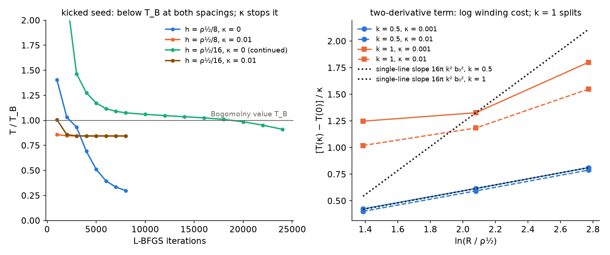

# Appendix — is the Bogomolny strand the lowest state, and what a two-derivative term changes

*Added 2026-09-27 under METHOD §7 (new material; no conclusion of the report
is withdrawn, one is qualified: result 3's tension is that of the smooth
local minimum). Prompted by substrate-framework discussion #186
(2026-09-25): OpenWave's R26 found that under its action the smooth-core
strand is a saddle and relaxes into π-jump walls of the pair anisotropy
("free under the commutator curvature along the wall"), and J. Duda
proposed a two-derivative term κ Tr(∂M ∂M) that would penalise the walls
and order the partitions of a charge's index by Σk². Both questions are
asked here for the potential of this report, V = Σ_a (e_a − E_a)², with
the 2D lattice of `strand2d.py` (β = 0.3; ρ½ is the Bogomolny core radius,
0.40 at k = ½). `strand_walls.py`; records `results/strand_walls_*.json`.*

## (a) Seeds that are not smooth

| seed (k = ½ unless stated) | h = ρ½/8 | h = ρ½/16 |
|---|---|---|
| smooth (the report's seed) | T_B (1.0001) | — |
| unmelted core: full splitting up to the line | starts at 260 T_B, relaxes to T_B | starts at 1030 T_B, relaxes to T_B |
| wedge: the winding in a thin sheet along a ray | 1.04 T_B, still falling (4000 iterations) | 1.21 T_B, still falling |
| kicked: smooth seed + random perturbation β/3 per node | **0.30 T_B** after 8000 iterations (0.20 after 20 000), still falling | **0.91 T_B** after 24 000, still falling |

The unmelted core costs ∝ 1/h² on the lattice (its line cell carries
gradients of order β/h) and melts back to the Bogomolny profile. The
same random perturbation (drawn once and interpolated) goes below T_B at
both spacings, later at the finer one. The states below T_B are built from
turns of the transverse frame by 1.2–1.5 rad **across a single cell**
while the charge direction and the eigenvalues stay near their vacuum
values (|e₁·ẑ| ≥ 0.88). The physical gradient of these jumps grows as h
falls (30 rad per unit length at ρ½/8, 47 at ρ½/16). A texture that
varies in one direction only has F_xy = 0 however sharp it is, so these
lattice-scale sheets are the discrete form of discontinuous, rank-one
textures that cost no quartic energy. At h = ρ½/8 the line also leaves
the centre of the box.

**So the quartic action with this potential has no tension floor
either.** T_B = (2√2π/3)kβ³ is the tension of the smooth, radially
symmetric local minimum, which every smooth or unmelted seed reaches. It
is not a lower bound on the energy of lattice fields, and in the continuum
it does not bound fields that are allowed to jump. This is R26's finding,
reproduced for the eigenvalue potential.

## (b) The two-derivative term κ Σᵢ Tr(∂ᵢN ∂ᵢN)

1. **The winding cost.** On the smooth k = ½ strand the term adds
   16πκk²b₀² ln(R/ξ) per unit length (b₀ = β/2). Between R = 4, 8 and
   16 ρ½ the added energy grows by (2.76–2.83)·10⁻⁴ per unit of ln R at
   κ = 10⁻³, against the predicted 2.83·10⁻⁴. The growth is linear in κ.
2. **The full strand splits.** At k = 1 the logarithmic growth is only
   1.9–2.4 times that of k = ½, not 4. The relaxed k = 1 field at κ = 10⁻²
   (R = 16 ρ½) shows why: it has split into two half strands of winding π
   each, pushed apart to y = ±4.45 in a box of half-size 6.5, with no
   winding left at the centre. With κ, like half strands repel
   logarithmically, and two halves (Σk² = ½) cost less than one full
   strand (Σk² = 1). This is the ordering by Σk² proposed on #186, seen in
   the field.
3. **The floor.** With κ = 10⁻² the kicked seed stops falling: at
   h = ρ½/8 it converges (gradient 8·10⁻⁷) to 0.845 T_B, with the line at
   the centre and no sheets. At h = ρ½/16 it reaches 0.843 T_B, the same
   to 0.2%: unlike the descent without κ, this state does not depend on the
   spacing. That state lies below
   the smooth radial strand with the same κ (about 1.15–1.19 T_B at these
   boxes), so with κ the lowest strand found has a non-radial core. Its
   dependence on β is not measured.

*Left: T/T_B against L-BFGS iterations for the kicked seed, at two
spacings, without κ and with κ = 10⁻². Right: the energy the κ term adds to the
smooth strand, divided by κ, against ln R, for k = ½ and 1, with the
slope 16πk²b₀² for each.*

## What this does not show

- No continuum limit is taken. Two spacings show descent below T_B at
  both, slower at the finer one; neither run has stopped, so the lowest
  lattice energy at either spacing is not known.
- One β (0.3) and one random perturbation. The κ-stabilised tension is
  measured at one κ (at two spacings), not as a function of β,
  so the β³ law of the report is not transferred to it.
- κ is the ungauged term. The gauge-covariant κ Tr(DM DM) of the 09-25
  proposal, with its connection, is not studied.
- 2D straight strands only; the 3D charge of the report is not rerun with
  κ.

## Reproduction

`python strand_walls.py seeds|kick|continue16|kick16kappa|kappa|split`
(GPU, hours each; `kick` and `continue16` about 2 and 4 hours on an RTX
4070) regenerates the records; `make_appendix_walls_figure.py` draws the
figure from them and `verify_appendix_walls.py` asserts their structure;
`reproduce_appendix_walls.sh` runs the last two (seconds) or everything
with `M5_RUN=1`. The relaxed 2D fields (`results/fields/*.npz`) are assets of
the `report-018-fields` release.
