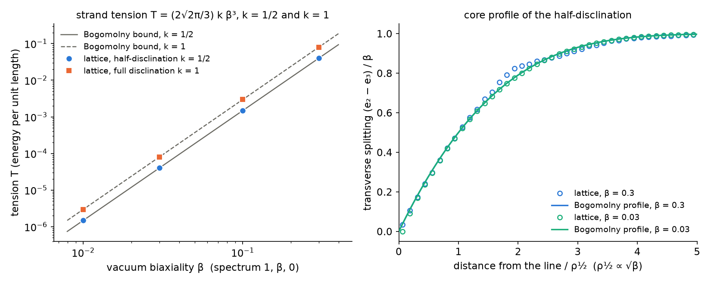
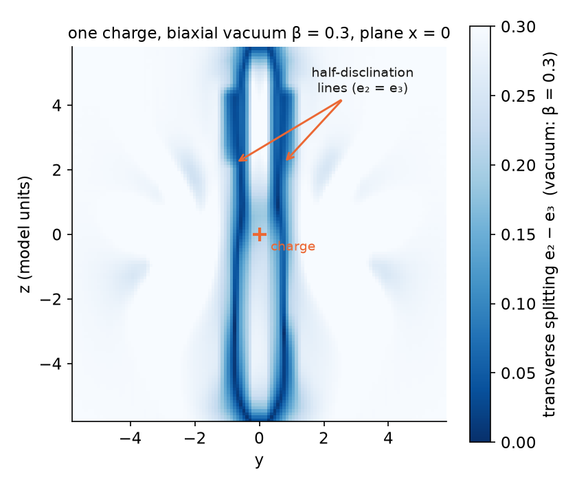
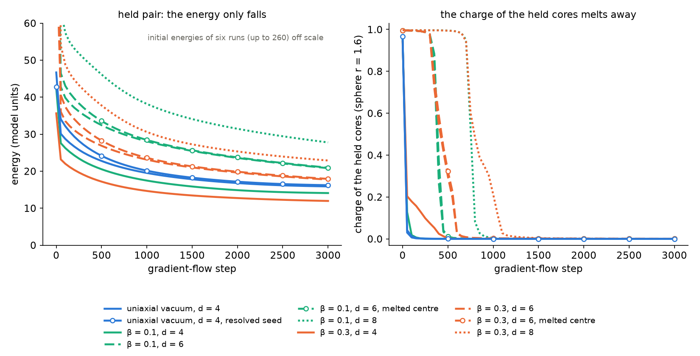

# Report 018 — The electron of the E₀ = 100 conventions: its static record, held charge pairs that find no barrier under gradient flow, and the strands of a biaxial vacuum

*2026-09-25 · Maciej J. Mikulski (AI-assisted, see [METHOD](../../METHOD.md)) ·
reports 014–017 use the charged hedgehog of the E₀ = 100 conventions
but never record it; this report does. It also asks the question the
thread on substrate-framework discussion #186 now centres on (J. Duda,
2026-09-22, "Packet A"): a physical vacuum should be weakly biaxial, so
that a charge drags strands whose tension confines charge pairs.
Pre-registration: `duda-particle-model/notes/prereg_018_electron_pair_biaxial.md`
(2026-09-24).*

## Notation (self-contained)

- M: real symmetric 4×4 field, N = ηM with signature (+,−,−,−); its
  η-eigenvalues e₀ > e₁ > e₂ ≥ e₃ and eigenvectors; e₁'s eigenvector is
  the charge direction, the pair (e₂, e₃) is called transverse.
- L = −F·F − V, F_{μν} = [∂_μN, ∂_νN], matrix indices in the field's
  Euclidean norm δ_M = 2v₀v₀ᵀ − η (the identity in the frozen sector),
  V = Σ_a (e_a − E_a)².
- Vacua: **uniaxial**, (E₀, E₁, E₂, E₃) = (100, 1, 0.01, 0.01), the
  vacuum of reports 014–017; **biaxial**, (100, 1, β, 0) with
  β ∈ {0.01, 0.03, 0.1, 0.3}. Δ = E₁ − E₂.
- Frozen sector: M₀₀ = E₀, M₀ᵢ = 0. Every computation here is in that
  sector, which report 016 shows is a saddle of the full energy (a tilt
  of the time axis screens the charge); the numbers below characterise
  the frozen branch, not a particle mass.
- Charge: the degree of the charge direction (a line field, lifted to a
  vector field) on a sphere around the core.
- Strand: a line around which the transverse pair turns by the angle 2πk (k = ½, a
  half-disclination, allowed because M is quadratic in its eigenvectors;
  k = 1, a full one). Its tension T is the energy per unit length.
- Lattices: the report-016 scheme (trilinear interpolant, four
  tetrahedral quadrature points per cube) in 3D; the bilinear
  interpolant with 2 × 2 Gauss points in 2D.

## Result

1. **The static electron (uniaxial vacuum).** At lattice spacing
   h = 0.375 the energy in boxes 12, 18 and 24 is 27.3, 29.4 and 30.5.
   Adding the hedgehog tail outside the inscribed sphere, 16πΔ⁴/R (R the
   half box; a convention, since the lattice already covers the cube's
   corners), gives 35.3, 34.8 and 34.5, which extrapolates in 1/R to 33.6–33.8. A finer
   spacing (h = 0.25, box 16) lowers this by 0.2. The mass of the frozen
   branch is therefore 33.4 ± 0.3. Report 016's radial problem without a
   box gives 33.3 independently. The charge is 0.997 on every sphere
   from r = 1 to 4 in every box (the lattice lift, not a fractional
   charge). The virial diagnostic (E₄ + tail)/(3E_V) in the same convention is
   1.04, 1.02 and 1.01 in the three boxes (`electron_record.py`).

2. **A held charge pair finds no barrier.** The two cores are held in
   Dirichlet balls of radius 1.2 that carry the relaxed single-hedgehog
   profile, and the rest follows a small-step gradient flow that never
   raises the energy (n = 48, box 16, separation d = 4, 3000 steps). The
   seed director of the development code (electrostatic analogy, pair.py)
   vanishes at the midpoint: a third, degree-0 defect that only the
   lattice cuts off, so the energy of a unit box around it grows like
   1/h (review round 1; `central_check.py`). The uniaxial run is
   therefore repeated from a resolved seed, in which that defect has a
   melted core and a finite unit-box energy that falls with h. From both
   seeds the energy falls monotonically and the charge on a sphere of
   radius 1.6 around each held core drops below 0.1 within 50 steps. The
   eigenvalues melt in a shell outside the balls and the charge direction
   stops being defined there. This is a statement about gradient flow
   from these seeds, not a proof that no metastable pair exists
   (`pair_flow.py`; figure 3).

3. **The straight strand: T = (2√2π/3)·k·β³, a Bogomolny bound.** Far
   from the line the texture is a pure rotation of the transverse block,
   so ∂ₓN ∥ ∂ᵧN and F_xy = 0: the far field costs nothing, and the
   tension comes from the core, where the transverse pair melts. With the
   transverse block s₀1 + b(ρ)(cos 2kφ σ_z + sin 2kφ σ_x), the energy
   density is 64k²(bb′/ρ)² + 2(b − β/2)² (checked symbolically). A
   first-order bound then gives

   T ≥ (2√2π/3)·k·β³,

   attained by a profile whose half-splitting radius grows as √β
   (`strand_bogomolny.py`). The 2D lattice attains the bound for
   k = ½ and k = 1 at every β from 0.01 to 0.3 (T/T_B = 1.000 to 1.002),
   and its core profile lies on the Bogomolny profile, which in units of ρ½ does not depend on β (figure 1;
   `strand2d.py`). The charge direction stays along the line and does
   not escape, so a full strand costs exactly two half strands. The
   power of β is set by the potential: V here is quadratic in the
   eigenvalue deviations. The trace-power potential of the 09-22
   paper is quartic in b near b = 0 and gives β⁴ instead (its
   T ∝ δ⁴). The choice of potential belongs to the model's author.

4. **One charge in the biaxial vacuum carries two π lines through its
   core.** On the hedgehog boundary with the spherical frame (β = 0.3,
   box 12, relaxed to ‖g‖ = 6·10⁻⁶) the Euler number of the sphere
   forces transverse index 2 around the charge. The relaxed field puts
   it in two half-disclination lines that run from pole to pole, parallel
   to the charge's axis at 0.55–0.7 from it, passing on either side of
   the core. Every sphere from r = 1.5 to 4.5 is pierced exactly four
   times (`single_strands.py`, figure 2). In the classification proposed
   on #186 (09-24) this is the {1,1,1,1} partition, realised as two π
   lines through the core.

5. **In the biaxial vacuum the held pair melts all the same.** With the
   same held cores and flow (3000 steps), the charge of the held cores
   falls below 0.1 in every run and the energy falls monotonically. The
   runs marked "melted centre" start from seeds whose uniaxial part is
   melted at the midpoint but whose transverse splitting is not, so their
   midpoint is only partly resolved:

   | vacuum | d = 4 | d = 6 | d = 8 |
   |---|---|---|---|
   | uniaxial | step 50 (resolved seed: 50) | — | — |
   | β = 0.1 | step 100 | step 450 (melted centre: 450) | step 800 |
   | β = 0.3 | step 400 | step 600 (melted centre: 600) | step 1100 |

   The charge survives more flow steps at larger separation and larger β,
   which suggests the strands slow the melting, but it leaves in every
   case. The step counts are those of an adaptive descent, not a time,
   and compare runs only roughly. The strands do not protect the pair:
   the charge melts before any linear confinement can act. So no σ(d)
   can be read, and the prediction σ = 4T_½ is not tested here.







## What this means

- For the thread's Packet A: in this model a biaxial vacuum does give
  every charge strands, of the predicted topology and with a tension
  that is exactly computable. That tension scales as β³, not β⁴, so any
  bound on β drawn from L* = m/σ changes its power from ¼ to ⅓.
- In these flows the strands do not create a barrier between opposite
  charges held apart: the charge melts outside the held cores as in the
  uniaxial vacuum. Measuring linear confinement needs a pair whose
  charge survives, and none of the seeds tried here gives one.
- Report 016's saddle stays unresolved here. Every number above belongs
  to the frozen branch.

## What this report does not show

- No free (unheld) pair and no configuration where the charge survives;
  the linear confinement slope σ is therefore not measured. Gradient flow
  from two families of seeds is not a proof that no metastable pair
  exists; a seed that keeps its charge in a barrier would refute point 2.
- The strand tension of the 3D charge is not extracted from the 3D
  field. The box (12) is too small to separate it from the Coulomb
  exterior, so only its topology is read.
- The biaxial runs use one box and one spacing each (pairs n = 48 box
  16, 3000 flow steps each; single charge n = 32 box 12).
- The constant-vacuum (hopfion) sector and the seven physical tests of
  the development repository, listed in the pre-registration's
  predecessor, are not part of this report.
- A time sector free to move (report 016) or the frame term K_u is not
  combined with any of these runs.

## Artifacts and reproduction

`electron_record.py` (energies, tail, virial and charge of four committed
fields), `strand_bogomolny.py` (the bound and the symbolic density check),
`strand2d.py` (the 2D strand, with box and grid checks), `single_biaxial.py`
and `single_strands.py` (one charge in the biaxial vacuum and its strands),
`pair_flow.py` (the held pair); each writes the JSON of the same name in
`results/`. `make_figures.py` draws the three figures,
`verify_artifacts.py` asserts the structure.

```bash
pip install torch numpy scipy sympy matplotlib
bash reproduce.sh              # CPU: records, bound, figures, assertions (minutes)
M5_RUN=1 bash reproduce.sh     # also the 2D scan (CPU, hours) and the 3D runs (GPU, about a day)
```

Provenance: `lagrangian.py`, `soliton.py` and `pair.py` from the development
repository `new-duda-lagrangian`, commit `b757030` (identical to the copies in
report 016); the n = 48 and n = 64 electron fields from the same commit
(release assets of this report); everything else is written for this report.
